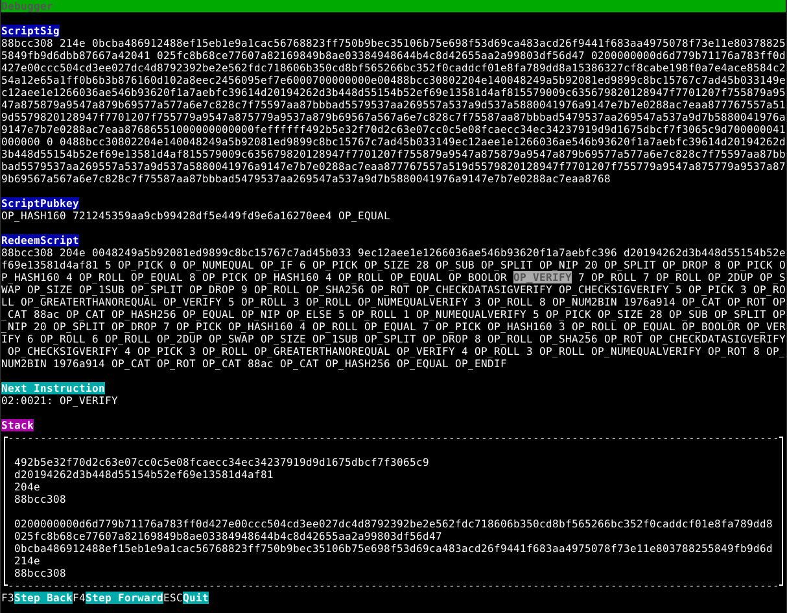

# JavaScript (client wallets)

## Introduction

Our Javascript library is designed so you can rapidly and easily provide secure financial services to your users using 
standard web development knowledge. You no longer have to be a blockchain wizard to give the powers of magic internet 
money to your customers.

With this library you will be able to create advanced, non-custodial, in-browser wallets.

<p style="font-size: 90%;">The mainnet library is currently in a <span style="background-color: #fffdbf; padding: 0 5px 0 5px;">beta stage</span>.
Things may change randomly. There is no backward compatibility guarantee yet,
even though we try not to break things too often.</p>

<!-- Your stack: Browser + IndexedDB PHP Other -->

## Let's get programming

Note that this tutorial mostly describes `Browser + IndexedDB` approach, which means that the wallets will be created
and persisted inside of a user browser. 

See [calling the REST API](/tutorial/rest.html) or [Other programming languages](/tutorial/other-languages.html) for other approaches.

### node.js / webpack

Install using:

```sh
npm install mainnet-js
```

::: tip

If you are bundling a production webapp, see [detailed notes](./shipping-mainnet.md) on using mainnet-js in a webapp. 

:::

### &lt;script> tag in HTML

To get started using Bitcoin Cash on your site, include these tags in your `<head>` and `<body>` sections:

```html
<head>
  <script src="https://cdn.mainnet.cash/mainnet-2.3.2.js"
   integrity="sha384-+XnInNgfkGhTLLM2fHci8wlE0jrdim3SG+6qRD7TITvGWv+5s1NxBbbyg2s+5+BF"
   crossorigin="anonymous"></script>
</head>
<body>
  <script>
    document.addEventListener("DOMContentLoaded", async (event) => {
      globalThis.exports = globalThis.exports || {};
      Object.assign(globalThis, await __mainnetPromise);

      // your code
    });
  </script>
</body>
```

<!--
you can generate the integrity sha like in the following example:
echo sha384-`curl https://cdn.mainnet.cash/mainnet-2.3.2.js | openssl dgst -sha384 -binary | openssl base64 -A`
-->

Note that the `integrity` part guarantees that the script haven't been tampered with. So if a hacker replaces it,
the user's browser will not run the script. Or you can download the library and serve it locally.

Now, you can create a test wallet:

```js
const wallet = await TestNetWallet.newRandom();
```

This wallet will not be persisted, if a user closes his browser, it's gone forever. See below for persistent wallets.

This creates a **TestNet** wallet.

::: tip What is TestNet? Where to get TestNet money and a wallet?

`TestNet` is where you test your application. TestNet money has no price. Opposite of TestNet is `MainNet`, 
which is what people usually mean when they talk about Bitcoin Cash network.  You can get free TestNet money using 
the `getTestnetSatoshis()` call (see below) or [here](https://faucet.fullstack.cash/).

If you need a wallet that supports the TestNet, download [Electron Cash](https://electroncash.org/) and
run it using `electron-cash --testnet` flag. For example, on MacOS that would be:

`/Applications/Electron-Cash.app/Contents/MacOS/Electron-Cash --testnet`

:::

To create a MainNet wallet (Bitcoin Cash production network):

```js
const wallet = await Wallet.newRandom();
```

If you want to create a wallet from a mnemonic seed phrase, use this call:

```js
const wallet = await Wallet.fromSeed('.....');
```

::: tip
Seed phrase wallets use the derivation path `m/44'/0'/0'/0/0` by default (Bitcoin.com wallet compatibility)
:::

Optionally, a [BIP44](https://github.com/bitcoin/bips/blob/master/bip-0044.mediawiki) derivation path may be added as a second argument.

```js
const wallet = await Wallet.fromSeed("horse duck stapler...", "m/44'/1'/145'/0/0");
```

If you want to create a wallet from a WIF (private key), use this call:

```js
const wallet = await Wallet.fromWIF('.....');
```

::: danger Keep the private key and the seed phrase secret

Remember to keep the private key (in "WIF" form) and/or the seed phrase (aka "mnemonic") secret as they allow spending money from this wallet.
You can access them using `wallet.privateKeyWif` and `wallet.mnemonic` (you'll also need the derivation path from `wallet.derivationPath`)

:::

Available networks: 

- mainnet: `Wallet`
- Testnet: `TestNetWallet`
- RegTest: `RegTestWallet` ([see below](#regtest-wallets))

::: tip

You can see a working demo [here](https://jsfiddle.net/5oc2uw9a/) and a video of it [here](https://www.youtube.com/watch?v=6Z4ef2Isod4)

:::

## Named wallets (persistent)

::: warning Named wallet support became a plugin since v2.1.0

See the [note](#basewallet-storageprovider) below regarding migration.

:::

Named wallets are used to save the private key generated by the browser, so that you
can run ```await Wallet.named(`user`)``` and always get the same wallet back.

Note that it's better to run something like ```await Wallet.named(`user:${id}`)```, i.e. use some ID of the user,
so that if the same browser has multiple users, they'll all get their own wallet. (Like, if a user has multiple accounts on your site)

To create a persistent wallet (saved to the IndexedDB of user's browser):

```js
const wallet = await TestNetWallet.named('user:1234');
```

`user:1234` is an optional name for the wallet. The wallet is saved in user's browser for future re-use.

To check if a named wallet already exists in the storage, you can invoke:

```js
const walletExists = await TestNetWallet.namedExists('user:1234');
```

Say a user of your application has wiped the website data and his IndexedDB is now empty. But they still has the seed and derivation path info. A named wallet can be replaced (recovered) with the existing `walletId`:

```js
const seed = "diary caution almost ...";
const derivationPath = "m/44'/0'/0'/0/0";
const walletId = `seed:testnet:${seed}:${derivationPath}`;
const wallet = await TestNetWallet.replaceNamed('user:1234', walletId);
```

If the wallet entry does not exist in the DB, it will be created. If it does - it will be replaced without exception.

### BaseWallet.StorageProvider

Since mainnet.cash v2.1.0 the wallet's storage providers became a plugin and were split out of the core package into separate packages. This was an action to assess the size of the core package as well reduce the amount of platform-specific dependencies. This means that all `named` functions will throw errors unless you import `mainnet-cash/indexed-storage` or `mainnet-cash/postgresql-storage` packages and configure your code with the following statements at the most top code of your app:

In browsers:
```js
<head>
  <script src="https://cdn.mainnet.cash/indexeddb-storage/indexeddb-storage-2.3.2.js"
   integrity="sha384-qqVFgmZr8EaZywDSVt4zYf435HWx1HNwmQlqIvIoMDLI/4shAMmHrr/FQooKY75N"
   crossorigin="anonymous"></script>
</head>

...

BaseWallet.StorageProvider = IndexedDBProvider;
```

In node.js:

```ts
import { BaseWallet } from 'mainnet-js';
import { SqlProvider } from '@mainnet-cash/postgresql-storage';

BaseWallet.StorageProvider = SqlProvider;
```

### Watch-only wallets

Watch-only wallets do not have private keys and unable to send funds, however they are very useful to keep track of address' balances, subscribe to its incoming and outgoing transactions, etc.

They are constructed from a cashaddress as follows:

```js
const wallet = await TestNetWallet.watchOnly('bchtest:qq1234567...');
```

## Getting the balance

To get the balance of the wallet you can use `getBalance` method:

```js
await wallet.getBalance() // { bch: 0.20682058, sat: 20682058, usd: 91.04 }
```

If you want to receive balance as number denominated in a unit of your choice, you can call `getBalance` with an argument:

```js
await wallet.getBalance('usd') // 91.04
await wallet.getBalance('bch') // 0.20682058
await wallet.getBalance('sat') // 20682058
```

You can ask for `usd`, `sat`, `bch` (or `satoshi`, `satoshis`, `sats` - just in case you forget the exact name).

- 1 satoshi = 0.000 000 01 Bitcoin Cash
- 1 Bitcoin Cash = 100,000,000 satoshis

`usd` returns the amount at the current exchange rate, fetched from CoinGecko or Bitcoin.com.

## Sending money

Let's create another wallet and send some of our money there:

```js
const seller = await TestNetWallet.named('seller');

const txData = await wallet.send([
  {
    cashaddr: seller.getDepositAddress(),
    value: 0.01,
    unit: 'usd',
  }
]);

// or alternatively
const txData = await wallet.send([seller.getDepositAddress(), 0.01, 'usd']);
```

... which returns an object containing the remaining balance and the transaction ID:

```js
{
  txId: "2fc2...af",
  balance: {bch: 1.0, sat: 100000000, usd: 1000.00}
}
```


Note that you can send to many addresses at once.

If your address holds <span style="background-color: #fffdbf; padding: 0 5px 0 5px;">SLP tokens</span>,
you have to use the `wallet.slpSemiAware().send([...])` method to prevent accidental token burning.
It skips all UTXOs with 546 sats when counting balance and sending funds.

#### Options

There is also an `options` parameter that specifies how money is spent.

* `utxoIds` holds an array of strings and controls which UTXOs can be spent in this operation. Format is `["txid:vout",...]` , e.g., `["1e6442a0d3548bb4f917721184ac1cb163ddf324e2c09f55c46ff0ba521cb89f:0"]`
* `slpSemiAware` is a boolean flag (defaulting to `false`) which requires an UTXO to have more than 546 sats to be spendable and counted in the balance. It protects you from spending SLP-like UTXOs without using an external SLP indexer.
* `changeAddress` cash address to receive change to
* `queryBalance` is a boolean flag (defaulting to `true`) to include the wallet balance after the successful `send` operation to the returned result. If set to false, the balance will not be queried and returned, making the `send` call faster.
* `awaitTransactionPropagation` is a boolean flag (defaulting to `true`) to wait for transaction to propagate through the network and be registered in the bitcoind and indexer. If set to false, the `send` call will be very fast, but the wallet UTXO state might be invalid for some 500ms.
* `feePaidBy` Fee allocation strategy. Convenience option to subtract fees from outputs if change is not sufficient to cover transaction costs. Options are as follows:
  
  - `change` - pay the fees from change or error
  - `firstOutput` - pay the fee from the first output or error
  - `lastOutput` - pay the fee from the last output or error
  - `anyOutput` - pay the fee from dust outputs or divide across all remaining non-dust outputs.
  - `changeThenFirst` - Use change then first output or error.
  - `changeThenLast` - Use change then last output or error.
  - `changeThenAny` - Use change then any output strategy or error. 

#### Building transactions

An advanced way to send funds around is to build the transaction manually. To do so we expose the `encodeTransaction` method which has the same call signature as `send` method. It hides all the weightlifting from the user: UTXO selection, fee calculation, signing, etc. and produces the binary transaction data ready to be broadcasted to the network with the `submitTransaction` method:

```js
const encodedTransaction = await wallet.encodeTransaction(
  requests, // send requests as in `send` method
  false, // discard change
  options // options as described above
);

const txId = await wallet.submitTransaction(
  encodedTransaction,
  awaitTransactionPropagation // as in options.awaitTransactionPropagation
);
```

#### Getting balance

Let's print the balance of the seller's wallet:

```js
console.log(await seller.getBalance('USD'));
// 0.01
```

Great! You've just made your first transaction!

Now you can send all of your money somewhere else:

```js
const txData = await seller.sendMax(wallet.getDepositAddress());
```

... which also supports `options` object and returns:

```js
{
  txId: "2fc2...af",
  balance: {bch: 0, sat: 0, usd: 0}
}
```

If you want to know the maximum amount of available funds to send, e.g. your balance minus the network fees, you can use:
```js
const sendRequestOptions = { slpSemiAware: true, utxoIds: [] };
const options = { outputCount: 1, options: sendRequestOptions };
const maxAmount = await wallet.getMaxAmountToSend(options);
```

This method returns a balance response object. The `options` object allows for fine-grained fee calculation based on the output count, slp awareness and specific UTXOs you are willing to spend. By default the method will target to spend all UTXOs into one output.

## Watching/Waiting methods

### QR codes

Let's say you want to display a QR code for you user to pay you money and show an alert when money arrives?

Let's display a QR code first. Create a placeholder first:

```html
<p style="text-align: center;">
    
</p>
```

Then you can replace it with an actual QR code of the deposit address:

```js
document.querySelector('#deposit').src = wallet.getDepositQr().src;
```

### Watching/Waiting for transaction

You can watch for incoming wallet transaction with `watchAddress` and `watchAddressTransactions` methods with the difference that the former will monitor transaction hashes and the latter will receive the decoded transactions in verbose format as per [specification](https://electrum-cash-protocol.readthedocs.io/en/latest/protocol-methods.html#blockchain-transaction-get). Both methods return an async function which when evaluated will cancel watching.

```js
wallet.watchAddress((txHash) => {
  console.log(txHash);
});

const cancelWatch = wallet.watchAddressTransactions((tx) => {
  if (tx.hash === someHash) {
    await cancelWatch();
  }
});
```

You can also wait for a wallet transaction and halt the program execution until it arrives:

```js
const options = {
  getTransactionInfo: true,
  getBalance: false,
  txHash: undefined
}
const response = await wallet.waitForTransaction(options);
```

If `txHash` is supplied method will wait for a transaction with this exact hash to be propagated through and registered in the network by the Fulcrum indexer, otherwise any address transaction will trigger a response.

Response: Object {transactionInfo: any, balance: any} depending on the options supplied.

`transactionInfo` Raw transaction in verbose format as per [specification](https://electrum-cash-protocol.readthedocs.io/en/latest/protocol-methods.html#blockchain-transaction-get)

`balance`: balance response object as per `getBalance` request.

If you are willing to ~~spy on~~ monitor transactions of an address you do not own, you can create a [watchOnly wallet](#watch-only-wallets).

### Watching/Waiting for balance

You can watch for wallet balance changes with `watchBalance` method (which also returns a cancellation function). The balance object sent to the callback has the same type as returned from `getBalance` method.

```js
const cancelWatch = wallet.watchBalance((balance) => {
  console.log(balance);
  await cancelWatch();
});
```

You can watch for wallet balance changes which are also sensitive to BCH/USD rate changes. The callback will be fired even if there are no actual transactions happening. You can change the polling interval by setting `usdPriceRefreshInterval` parameter, which defaults to 30000 milliseconds.

```js
const cancelWatch = wallet.watchBalanceUsd((balance) => {
  console.log(balance);
  await cancelWatch();
}, 5000);
```

You can wait for a certain minimal balance on the wallet using the `waitForBalance` function.

```js
const balance = await wallet.waitForBalance(1.0, 'usd');
```

The `balance` variable contains the actual balance of the wallet.

### Watching/Waiting for block

You can watch for incoming blocks with `watchBlocks` method:

```js
const cancelWatch = wallet.watchBlocks((block) => {
  console.log(block);
  await cancelWatch();
});
```

If you want to wait for the next block or wait for blockhain to reach certain block height you can use the following method:

```js
const nextBlockInfo = await wallet.waitForBlock();

const futureBlockInfo = await wallet.waitForBlock(770000);
```

The [response object's schema](https://electrum-cash-protocol.readthedocs.io/en/latest/protocol-methods.html#blockchain-headers-subscribe) is simple:

```json
{
  height: number;
  hex: string;
}
```

### Sending data with OP_RETURN

You can store arbitrary data on blockchain using the OP_RETURN opcode. It is useful not only to store simple text messages, many protocols such as MEMO and SLP are utilizing it to build complex applications.

You can send OP_RETURN messages as simple strings (supporting UTF8) or binary buffers as follows:

```js
await wallet.send([ OpReturnData.from("MEMO\x10LÖL😅") ]);
await wallet.send([ OpReturnData.from(Buffer.from([0x4c, 0x4f, 0x4c])) ]);

// or alternatively

await wallet.send([ ["OP_RETURN", "MEMO\x10LÖL😅"] ]);
await wallet.send([ ["OP_RETURN", Buffer.from([0x4c, 0x4f, 0x4c])] ]);
```

You can simply pass raw buffer containing your opcodes. If your buffer lacks the OP_RETURN and OP_PUSHDATA (followed by the length of the message) opcodes, they will be prepended.

Sending funds and OP_RETURN messages can be mixed together, the output order will be preserved:

```js
await wallet.send([
  OpReturnData.from("MEMO\x10LÖL😅"),
  { cashaddr: otherWallet.cashaddr!, value: 546, unit: "sats" },
]);
```

## CashTokens

Since release 1.0.0, mainnet-js supports [CashTokens](https://github.com/bitjson/cashtokens#readme) and [BitcoinCash Metadata Registries (BCMR)](https://github.com/bitjson/chip-bcmr).

::: tip  Javascript builders take note.

To support CashTokens, mainnet-js upgraded to libauth **^v2**, which required converting the library as an ESM module.

There are minimal, react and vue sample configurations for numerous web apps in the [demo directory](https://github.com/mainnet-cash/mainnet-js/tree/master/demo) on github.

:::


All token related methods are available from `Wallet` class directly. This means that you can send BCH and CashTokens in the same transaction.

Furthermore, both fungible and non-fungible (NFT) tokens of the same category (tokenId) can share the same UTXO. Pure NFT just has its fungible token `amount` being 0n.

Each token UTXO may or may not contain the following attributes:

*  `amount: bigint;` - fungible token amount. [Note: After genesis the total amount of fungible tokens can not be increased. Max amount is `9223372036854775807`]
*  `tokenId: string;` - the category Id of the token, this is a 32 bytes hex encoded transaction hash which was spent in the token genesis process
*  `commitment?: string;` - 0 to 40 bytes long hex encoded string representing the token commitment message. This can be a serial number of an NFT in the group or any other user defined data.
*  `capability?: NFTCapability;` - Non-fungible token capability.
    - `none`: token is immutable (can not change its commitment) and can not mint new NFTs
    - `mutable`: token can be spent to create a singular new NFT token with different commitment and optionally `mutable` capability
    - `minting`: token can be spent to create any amount of new NFT tokens with different commitment and any capability

Also token carrying utxos do have a BCH value which can not be lower than 798 satoshi for p2pkh token outputs (dust limit), otherwise these inputs would be unspendable. For simplicity mainnet allows to omit the BCH value for token UTXOs. If new token UTXOs are created the value for them will be set to 1000 satoshi. If a singular token UTXO is spent to a single new UTXO its BCH value will be carried over to the new one.

By the specification the token aware wallets should signal to the user that they can handle the CashTokens. `Wallet` class received new property `tokenaddr`, and new methods `getTokenDepositAddress` and `getTokenDepositQr` which should be used and presented to the end-user.

### Token creation - Genesis

It is very easy to create new token category:

```js
const genesisResponse = await wallet.tokenGenesis({
      cashaddr: alice.cashaddr!,      // token UTXO recipient, if not specified will default to sender's address
      amount: 5n,                      // fungible token amount
      commitment: "abcd",             // NFT Commitment message
      capability: NFTCapability.none, // NFT capability
      value: 1000,                    // Satoshi value
    });
const tokenId = genesisResponse.tokenIds![0];
```

### Looking up token information

If you want to get the BCMR information about your token (given you have imported it), you can invoke `getTokenInfo` method.

```js
const info: IdentitySnapshot | undefined = wallet.getTokenInfo(tokenId);
```

Please refer to the [BCMR specification](https://github.com/bitjson/chip-bcmr) to learn more about identity snapshots and how to get the detailed token information.

### Additional token creation - Minting

If you decide to mint new NFT tokens or to mutate the existing token, you would need to use `tokenMint` method.

In the following example we mint 2 new NFTS:

```js
// mint 2 NFTs, amount reducing
const response = await wallet.tokenMint(
  tokenId,
  [
    new TokenMintRequest({
      cashaddr: wallet.cashaddr!,
      commitment: "01",
      capability: NFTCapability.none,
      value: 1000,
    }),
    new TokenMintRequest({
      cashaddr: wallet.cashaddr!,
      commitment: "02",
      capability: NFTCapability.mutable,
      value: 1000,
    }),
  ],
  true, // reduce FT amount
);
```

The last boolean parameter might come handy in the case you want to track the amount of tokens left to be minted - for example you have created the token category with 1000 fungible tokens and if you will mint 2 new NFT tokens while this parameter being set to `true`, the minting token will have its FT amount reduced to 998. Note, that will not prevent you to mint more tokens when FT amount reaches 0.

### Sending tokens

Sending tokens around is easy and can be combined with sending BCH! You can include many token send requests in one call, even different token categories:

```js
const sendResponse = await wallet.send([
  new TokenSendRequest({
    cashaddr: alice.cashaddr!,
    amount: 100n,
    tokenId: tokenId,
    value: 1500,
  }),
  new TokenSendRequest({
    cashaddr: bob.cashaddr!,
    tokenId: tokenId2,
    commitment: "abcd",
    capability: NFTCapability.none,
  }),
  new SendRequest({
    cashaddr: charlie.cashaddr!,
    value: 100000,
    unit: "satoshis",
  }),
]);
```

### Token burning

To explicitly burn the CashTokens they must be sent to an OP_RETURN output. `tokenBurn` method does this:

```js
// burn 1 FT
const burnResponse = await wallet.tokenBurn(
  {
    tokenId: tokenId,
    amount: 1n,
    capability: NFTCapability.minting,
    commitment: "abcd",
  },
  "burn", // optional OP_RETURN message
);
```

If token has fungible amount, the burning mechanism will reduce the token amount. If no fungible amount is left, the NFT will be burnt, effectively destroying the token category.

There is a way to implicitly burn fungible tokens without sending them to an OP_RETURN, just ensure that you send less tokens than you have, while setting the `checkTokenQuantities` of SendRequestOptions object to false:

```js
const sendAndBurnResponse = await wallet.send([...], { checkTokenQuantities: false });
```

### Token UTXOs

If you want to get the information about CashToken UTXOs of an address, look up the locked satoshi values, etc., you can do the following call:

```js
const tokenId = undefined;
const utxos = wallet.getTokenUtxos(tokenId);
```

If `tokenId` is undefined UTXOs of all token categories will be returned. If `tokenId` is set, only tokens of this category will be returned.

### Token balances

You can get all fungible token balances of your wallet or a balance of a specific token with the following methods:

```js
const tokenBalance = wallet.getTokenBalance(tokenId);
const allBalances = wallet.getAllTokenBalances();
```

To get the total amount of NFT tokens use the following methods:

```js
const nftTokenBalance = wallet.getNftTokenBalance(tokenId);
const allNftBalances = wallet.getAllNftTokenBalances();
```

### Watching/waiting for fungible token balance

Similarly a to BCH transaction watching/waiting we provide the convenient methods to watch/wait for fungible token balance.

```js
const cancelFn = wallet.watchTokenBalance(tokenId, (balance) => {
  ...
});
```

You can wait for the wallet to reach a certain minimal fungible token balance:

```js
const actualBalance = await wallet.waitForBalance(tokenId, 10);
```

This will halt the program execution until the balance reaches the target value.

## BCMR - BitcoinCash Metadata Registries

::: warning
BCMR implementation in mainnet.cash is in alpha phase.

BCMR CHIP might still be changed.
:::

We implement [BCMR](https://github.com/bitjson/chip-bcmr/tree/5b24b0ec93cf9316222ab2ea2e2ffe8a9f390b12) CHIP to support on-chain CashToken metadata resolution employing zeroth-descendant transaction chain (ZDTC), which authenticates and publishes all registry updates.

To add metadata registry to the list of tracked ones use one of the following methods:

1. Direct: use `BCMR.addMetadataRegistry` to add the [`Registry`](https://github.com/bitjson/chip-bcmr/blob/5b24b0ec93cf9316222ab2ea2e2ffe8a9f390b12/bcmr-v1.schema.ts#L103) object to the list of tracked
2. Using HTTPS or IPFS endpoint: use `addMetadataRegistryFromUri` to download a JSON file containing the `Registry` and add it to the list of tracked, optionally enforcing the content hash verification.
3. Using authchain resolution to optionally follow to the head of the authchain and fetching data from HTTPS or IPFS Publication Outputs

```js
const authChain = await BCMR.addMetadataRegistryAuthChain({
  transactionHash: txHash,
  followToHead: false
});
```

In this example we resolve the exact metadata registry stored in the transaction findable by its transaction hash `txHash`. If we'd wanted to resolve the latest version, we'd set `followToHead` to `true`.

After adding the registry, we will have access to token info with either `wallet.getTokenInfo` or a static `BCMR.getTokenInfo`:

```js
const info: IdentitySnapshot | undefined = BCMR.getTokenInfo(tokenId);
```

Note, that token info resolution will prioritize the most recently added registries and return the info about first found token with matching `tokenId`.

To get a copy of all tracked registries, use `getRegistries`, to purge the list use `resetRegistries`.

### BCMR authchain resolution

If you want to partially or fully resolve a BCMR authchain, you can use the following method:

```js
const authChain: AuthChainElement[] = await BCMR.buildAuthChain(options);
```

where AuthChainElement is defined as:
```js
interface AuthChainElement {
  txHash: string;
  contentHash: string;
  uri: string;
}
```

The options object allows you to specify the resolution process:

* `transactionHash` is a required field, and specifies the hash of a transaction from which the resolution should start
* `resolveBase` is a boolean flag which specifies if we should resolve all authchain elements towards the first element called "authbase"
* `followToHead` is a boolean flag which specifies if we should resolve all authchain elements towards the last and most recent element called "authhead". Authhead always resides in UTXO set.

So if you set both `resolveBase` and `followToHead` to true, the full authchain will be resolved.


## TestNet faucet

You can have some TestNet satoshi for your convenience. Visit our ~~faucet~~ refilling station at [https://rest-unstable.mainnet.cash/faucet.html](https://rest-unstable.mainnet.cash/faucet.html)

Your address will be refilled up to 10000 TestNet satoshi upon a call. There are request rate limiters set up to prevent abuse.

We've integrated the faucet into the library so that you can do easy calls like the following:

```js
const txid = await wallet.getTestnetSatoshis();
...
const sendResponse = await wallet.returnTestnetSatoshis();
```

## Escrow contracts

::: warning 
Alpha release
:::

### Getting the mainnet-cash Contract package

To keep the size of the packages small, both CashScript contract and Ethereum style functionality have been broken out into separate add-on packages (@mainnet-cash/contract). 

#### Via npm / yarn

If you are developing in node or for a webapp, import or require from `@mainnet-cash/contract` after installing the separate package using:

```sh
npm install @mainnet-cash/contract
# or 
yarn add @mainnet-cash/contract

```

#### &lt;script> tag in HTML

To get started using CashScript Contracts on your site, include this tag in your `<head>` section:

```html
<script src="https://cdn.mainnet.cash/contract/contract-2.3.2.js"
 integrity="sha384-XWOSWhwfQxEcesH3oKykdyGPlupYnQ2uxGmPc4dR+DmZpWRSqtd+pOvA3Gmbac1W"
 crossorigin="anonymous"></script>
```

<!--
you can generate the integrity sha like in the following example:
echo sha384-`curl https://cdn.mainnet.cash/contract-2.2.5.js | openssl dgst -sha384 -binary | openssl base64 -A`
-->

This will enable code required for Cashscript in the global scope of your browser.

Note that the `integrity` part guarantees that the script haven't been tampered with. So if a hacker replaces it,
the user's browser will not run the script. Or you can download the library and serve it locally.

### Using the pre-defined contract

Ok, let's now assume that you are building a service where you want to connect a buyer and a seller (a freelance marketplace 
or a non-custodial exchange), but at the same time you don't want to hold anyone's money, 
but only act as an arbiter in case something goes wrong. It's possible in Bitcoin Cash and it's called "an escrow contract".

You'll need three addresses for this: `buyer`, `seller` and `arbiter`. 

Note: The source for the contract is [here](https://github.com/mainnet-cash/mainnet-js/blob/c1c80889b8c211231326ab8537e20e85658239fa/src/contract/escrow/EscrowContract.ts#L123-L144). 

1) Buyer sends the money to the contract and could then release the money to the seller 
2) The seller could refund the buyer
3) Arbiter can either complete the transaction to the seller or refund to the buyer, but cannot steal the money 

```js
let escrow = new EscrowContract({
  arbiterAddr: arbiter.getDepositAddress(),
  buyerAddr: buyer.getDepositAddress(),
  sellerAddr: seller.getDepositAddress(),
  amount: 5000n
});
```

You can now send money to the contract:

```js
await buyer.send([ [ escrow.getAddress(), 8700n, "satoshis" ], ]);
``` 

Check the balance of the contract (in satoshis):

```js
await escrow.getBalance()
// 8700
```

Note: Escrow contract is big (in bytes) and requires a big fee, so the minimum what you can send to it is about 3700 satoshis. 

Now, we can execute the necessary functions:

1) Buyer releases the funds
```js
await escrow.call(buyer.privateKeyWif, "spend");
```

2) Seller refunds
```js
await escrow.call(seller.privateKeyWif, "refund");
```

3) Arbiter releases the funds or refunds
```js
await escrow.call(arbiter.privateKeyWif, "spend");
await escrow.call(arbiter.privateKeyWif, "refund");
```

### Saving the contract to the database

The arbiter needs to save the contract somewhere (in a database or some other storage), so that when the time comes,
he could execute the necessary functions:

Save:

```js
const escrowContractId = escrow.toString();
```

Restore it later:

```js
const restoredEscrow = EscrowContract.fromId(escrowContractId);
```

The escrow object implements a CashScript contract from a stock template, but if the template doesn't suit your needs, it is also possible to use any contract written in [CashScript](https://cashscript.org/).  

```solidity
pragma cashscript ^0.7.0;
contract escrow(bytes20 sellerPkh, bytes20 buyerPkh, bytes20 arbiterPkh, int contractAmount, int contractNonce) {

    function spend(pubkey signingPk, sig s, int amount, int nonce) {
        require(hash160(signingPk) == arbiterPkh || hash160(signingPk) == buyerPkh);
        require(checkSig(s, signingPk));
        require(amount >= contractAmount);
        require(nonce == contractNonce);
        bytes25 lockingCode = new LockingBytecodeP2PKH(sellerPkh);
        bool sendsToSeller = tx.outputs[0].lockingBytecode == lockingCode;
        require(tx.outputs[0].value == amount);
        require(sendsToSeller);
    }

    function refund(pubkey signingPk, sig s, int amount, int nonce) {
        require(hash160(signingPk) == arbiterPkh||hash160(signingPk) == sellerPkh);
        require(checkSig(s, signingPk));
        require(amount >= contractAmount);
        require(nonce == contractNonce);
        bytes25 lockingCode = new LockingBytecodeP2PKH(buyerPkh);
        bool sendsToSeller = tx.outputs[0].lockingBytecode == lockingCode;
        require(tx.outputs[0].value == amount);
        require(sendsToSeller);
    }
}
```

## Generic CashScript

::: warning 
Alpha release
:::

::: tip What is CashScript?

*From CashScript.org:*

[CashScript](https://cashscript.org/) is a high-level programming language for smart contracts on Bitcoin Cash. It offers a strong abstraction layer over Bitcoin Cash' native virtual machine, Bitcoin Script. Its syntax is based on Ethereum's smart contract language Solidity, but its functionality is very different since smart contracts on Bitcoin Cash differ greatly from smart contracts on Ethereum. For a detailed comparison of them, refer to the blog post [Smart Contracts on Ethereum, Bitcoin and Bitcoin Cash](https://kalis.me/smart-contracts-eth-btc-bch/). 


:::

In the `EscrowContract` example in the previous section, the contract source is hardcoded. But with a generic `Contract`, the full script is defined by the user. 

`Contracts` are objects that simply wrap a CashScript Contract, with utilities to serialize and deserialize them. In addition, there are some functions on wallets to facilitate sending arguments to the contract. 

For example, taking a simple pay with timeout example from the [CashScript playground](https://playground.cashscript.org/):


```solidity
pragma cashscript ^0.7.0;

contract TransferWithTimeout(pubkey sender, pubkey recipient, int timeout) {
    // Require recipient's signature to match
    function transfer(sig recipientSig) {
        require(checkSig(recipientSig, recipient));
    }

    // Require timeout time to be reached and sender's signature to match
    function timeout(sig senderSig) {
        require(checkSig(senderSig, sender));
        require(tx.time >= timeout);
    }
}
```

This can be loaded up by passing the script, constructor arguments and network to a new Contract. 

::: tip Before you dive in, it might be a good time to consider using RegTest?

The below code is for TestNet, but it's highly recommended to develop and test your contracts on `RegTest`. Besides the ability to give yourself free coins, it's also possible to mine blocks to test your contract functioning over different time conditions.

:::

```js

const script = `contract TransferWithTimeout(pubkey sender, pubkey recipient, int timeout) {
    // Require recipient's signature to match
    function transfer(sig recipientSig) {
        require(checkSig(recipientSig, recipient));
    }

    // Require timeout time to be reached and sender's signature to match
    function timeout(sig senderSig) {
        require(checkSig(senderSig, sender));
        require(tx.time >= timeout);
    }
}`
```

```js
const alice = await TestNetWallet.newRandom();

```


In the case that you only have Charlie's cashaddr, 
it won't be possible to get the full public key,
but a public key hash may be used in the contract instead
```js
const charlie = await TestNetWallet.watchOnly("bchtest:qqz52tne6ny78tltw82f0tufcum0752zg5tnwcf0v9")
```
In javascript, the contract can take a binary argument as a Uint8Array or 
hexadecimal strings just like CashScript, but passing passing `true`
here causes getPublicKey() to return hex, 
(in case you wanted to paste into the data into CashScript playground.)
the default is a Uint8Array.

```js
const alicePk = alice.getPublicKey(true);
const charliePk = charlie.getPublicKey(true);
```

Next pass the script, arguments and network to create a new Contract.
```js
// Some block height very far in the past.
const after = 215;

let contract = new Contract(
  script,
  [alicePk, charliePk, after],
  Network.TESTNET
);

```


::: tip `Contract is not a function` got you down?

See the note at the top of the [previous section](#getting-the-mainnet-cash-contract-package) about getting the @mainnet-cash/contract package.

:::


This will give you a contract object that can be serialized and deserialized just like a wallet:

```js
// serialized to a string
let contractStr = contract.toString()
//contract:testnet:TURSa05EV...nPT06TWpFMQ==:cHJhZ...gfQp9:61149027"

// recreate the Contract object from a string
let contractCopy = Contract.fromId(contractStr)
```

The deposit address is available with the same interface as a wallet.

```js
contract.getDepositAddress()
//"bchtest:pzpt6y6ganwagvr6far4pe82yvtflx60zstdyhlzld"
```

The interface to list utxos is identical to wallets as well...

```js
await contract.getUtxos()
// [
//  {
//   txid: "8806ef4f1185f268a5083fbd651d974b939d2c68afa2be28652c4ccce06703c4", 
//   vout: 0, 
//   satoshis: 1000, 
//   height: 0
//  }
// ]
```

Once the contract is funded, contract functions may be called just like in CashScript:

```js
let transferFn = contract.getContractFunction("transfer");

// the signature template for charlie is available on the wallet
const sig = charlie.getSignatureTemplate();
const charlieAddr = charlie.getDepositAddress()

// The function may be called by passing the arguments to the function
// specifying a `to` destination and a CashScript function method, i.e. send
let txn = await transferFn(sig).to(charlieAddr, 7000n).send();  
```

Wallets have the following convenience methods for passing data to CashScript:

| Wallet Method | Returns | CashScript Type | 
| ----------- | ----------- | ----------- |  
| `getSignatureTemplate()` | SignatureTemplate | `sig` |
| `getPublicKeyCompressed()` | Hex String or Uint8Array | `pubkey` |
| `getPublicKeyHash()` | Hex String or Uint8Array |`bytes20` |

In Javascript, passing either hex or a Uint8Array to CashScript will work.

In the case that a contractId is stored, or received from another party, a convenience method exists to list information contained in a contractId, the `info()` interface is available to return the parsed data.

The return should be an object with the same contractId, deposit cashaddr, script source, input parameters and a contract nonce that is added for uniqueness.

```js
contract.info()
// {
//   "contractId": "contract:testnet:TURRellXWTNabVF5WmpVeVpUa3dNVFEzTldOa1pEUXhPRFZoWWpWa1ptVmlZamMyTXpNM09EQTVNV0psTVRrd1lXUXlOMkZrTXpRM1lUZGtPR1kwTmpOa1pqSXlaVE5sT0dKbFlUaGtaRGcwTldKaE1XUXlNR00xWmpCbFl6QTJNek13WmpNM01ETTFZbUpsTkdFME1UZzNPVEUzTVRCaVlUbGpNakUxWkRaa05RPT06TURSbE9EZGtOV1ZrTlRCbU16VXdZVFZtTjJFMk16aG1abVkyT0RFek5HTTNOekJsT1RGaVlUUTFNV0l4TXpSaVlqTTVOVEJqTUdVMk9ETTJNR0poWW1JNE0ySTJOMlF3TnpSaU16WTFOVFl4WVdVMU0ySmxaVEV6TXpBNFl6TTFPVEF6TnpOaU5qTm1aV1F6TVRKallXVTNNMlk0TXpWaE56SmlaR00xWldFek53PT06TWpFMQ==:Y29udHJhY3QgVHJhbnNmZXJXaXRoVGltZW91dChwdWJrZXkgc2VuZGVyLCBwdWJrZXkgcmVjaXBpZW50LCBpbnQgdGltZW91dCkgewogICAgLy8gUmVxdWlyZSByZWNpcGllbnQncyBzaWduYXR1cmUgdG8gbWF0Y2gKICAgIGZ1bmN0aW9uIHRyYW5zZmVyKHNpZyByZWNpcGllbnRTaWcpIHsKICAgICAgICByZXF1aXJlKGNoZWNrU2lnKHJlY2lwaWVudFNpZywgcmVjaXBpZW50KSk7CiAgICB9CgogICAgLy8gUmVxdWlyZSB0aW1lb3V0IHRpbWUgdG8gYmUgcmVhY2hlZCBhbmQgc2VuZGVyJ3Mgc2lnbmF0dXJlIHRvIG1hdGNoCiAgICBmdW5jdGlvbiB0aW1lb3V0KHNpZyBzZW5kZXJTaWcpIHsKICAgICAgICByZXF1aXJlKGNoZWNrU2lnKHNlbmRlclNpZywgc2VuZGVyKSk7CiAgICAgICAgcmVxdWlyZSh0eC50aW1lID49IHRpbWVvdXQpOwogICAgfQp9:544951395",
//   "cashaddr": "bchtest:ppv649rmxcd9fpwgk78pq0yek30krgwreva8unzm0x",
//   "script": "contract TransferWithTimeout(pubkey sender, pubkey recipient, int timeout) {\n    // Require recipient's signature to match\n    function transfer(sig recipientSig) {\n        require(checkSig(recipientSig, recipient));\n    }\n\n    // Require timeout time to be reached and sender's signature to match\n    function timeout(sig senderSig) {\n        require(checkSig(senderSig, sender));\n        require(tx.time >= timeout);\n    }\n}",
//   "parameters": [
//     "043af7fd2f52e901475cdd4185ab5dfebb763378091be190ad27ad347a7d8f463df22e3e8bea8dd845ba1d20c5f0ec06330f37035bbe4a418791710ba9c215d6d5",
//     "04e87d5ed50f350a5f7a638fff68134c770e91ba451b134bb3950c0e68360babb83b67d074b365561ae53bee13308c3590373b63fed312cae73f835a72bdc5ea37",
//     "215"
//   ],
//   "nonce": 544951395
// }
```

Combined with the `getPublicKeyHash()` method described above, another party could verify that the script of the contract matched an agreement and that the counter-party's public key hash was indeed a parameter to the contract.

## Debugging Contracts

For developing, testing, or debugging contracts, it's useful to run your script on a [local regtest "network"](/tutorial/#regtest-wallets). 

In this section, we'll revisit the escrow contract and see ways to cause the contract not to release funds and how to debug why that is happening.

### Before you begin

1. Have docker-compose installed
2. Have the [`meep`](https://github.com/gcash/meep) Bitcoin Cash debugger installed, and the go language if necessary.
2. See the [regtest wallets](/tutorial/#regtest-wallets) section below.
3. Checkout a copy of the mainnet-js repository.
4. From the mainnet-js project root, run:

```shell
yarn regtest:up 
```

This should give you all the services used by mainnet-js in the background configured in regtest mode, which you may check with `docker ps`.  

When you want to shut regtest down, use:

```shell
yarn regtest:down 
```

### Step 1, "Neglect the fees"

Small transaction fees are currently used on Bitcoin Cash to make the cost of a large spam attack non-trivial to the attacker. There are other finite measures, such as coindays (or the age of coins being spent). However, for a the time being, Bitcoin Cash software largely agrees to use 1 sat/byte, because the mechanism was simple to implement across a lot of diverse and interconnected software.

So a common way to break the escrow transaction flow is to neglect the fees, which we'll do below.

Let's create our contract parties again. 

You can do this by importing mainnet into nodejs, using a live coding tool or the console of web browser using `yarn reload` at localhost:8080.

```js
seller = await RegTestWallet.newRandom()
buyer = await RegTestWallet.newRandom()
arbiter = await RegTestWallet.newRandom()
```

Next we need the buyer to have some funds. Luckily we know an address on your regtest network with lots of bitcoin mined to it when docker starts.  

```js

miner = await RegTestWallet.fromWIF("cNfsPtqN2bMRS7vH5qd8tR8GMvgXyL5BjnGAKgZ8DYEiCrCCQcP6")
await miner.send([
  {
    cashaddr: buyer.getDepositAddress(),
    value: 100000,
    unit: "satoshis",
  },
]);
```

Next, let's create a contract between our parties:

```js
escrow = new EscrowContract({
  arbiterAddr: arbiter.getDepositAddress(),
  buyerAddr: buyer.getDepositAddress(),
  sellerAddr: seller.getDepositAddress(),
  amount: 20000
});
```
Next the buyer sends funds for the transaction to the contract address, and checks the balance:

```js
await buyer.send({cashaddr:escrow.getDepositAddress(), value: 20000, unit:'sat'})
await escrow.getBalance()
// 20000
```

Since the contract is funded for the full amount, let's try to release funds to the seller using the buyer's private key:

```js
await escrow.call(buyer.privateKeyWif, "spend");
```

But instead of sending the funds successfully, this returns an error:

```
Uncaught (in promise) Error: Error: The contract amount (20000) could not be submitted for a tx fee (836) with the available with contract balance (20000)
```

In the above case, we attempted to spend 20,000 sat using the unlocking script, from an address with only 20,000 sat, we neglected to include enough to cover the transaction fee of 836 sats. 

If we send another input to the contract address...

```js
await buyer.send({cashaddr:escrow.getDepositAddress(), value: 836, unit:'sat'})
await escrow.getBalance()
/// 20836
await escrow.call(buyer.privateKeyWif, "spend");
```

... we'll be greeted with another error: 

```
Uncaught (in promise) Error: Error: The contract amount (20000) could not be submitted for a tx fee (1596) with the available with contract balance (20836)
```

The fees went up to 1596 sats!

This error occurred because funds are now being spent from two inputs (20,000 & 836), so the resulting transaction is larger and requires a larger fee. Although the fee we added would have been enough to spend the first output, it's not enough to spend two outputs.

Since the unlocking script is included for each input, we can double the amount needed to spend from one unspent transaction output and should be able to spend the full amount from three inputs:

```js
await buyer.send({cashaddr:escrow.getDepositAddress(), value: 1656, unit:'sat'})
await escrow.getBalance()
/// 22492
```

If the buyer attempts to `spend` funds now, the transaction will succeed.

```js
await escrow.call(buyer.privateKeyWif, "spend");

// ​Object { inputs: (3) […], locktime: 645, outputs: (1) […], version: 2, txid: "612ca1da16492503d9fea53106800073fa8b3f573d7663aed1ab92e41d38d979",
// hex: "0200000003a5e92065f28ba406b0ac020b961caba285fcb438535775978524ebe5c9d1b92800000000fdcf020488bcc30802a84e41020424b6ede0258de98a4d77770a7282878634ba348e3ef520853cfc13c0987d979d6f5574e49ba04f65d74003ac43da837a5ce7edd111b17b3ecdce0a223b7941210384ddcc77b7177d8fe61b9a5b8c8ee3d1c225e525ac986d249e2c9b4a26920c8b4d7d01020000009e..."

```

### Step 2, Rejection by network rules.

A library can handle some common errors around a static contract, but if you develop your own contract (or have issues with the builtin escrow contract), a transaction may be rejected by the network because the rules of the contract don't authorize funds to be spent.

Let's do this with the same escrow contract from above and see how to figure out what happened.


Let's fund the contract address, with enough fee to spend...

```js
await buyer.send({cashaddr:escrow.getDepositAddress(), value: 20837, unit:'sat'})
await escrow.getBalance()
// 20837
```

Now lets attempt to break the rules by `spend`ing to the seller's address, with the seller's key


```js
await escrow.call(seller.privateKeyWif, "spend");

Uncaught (in promise) Error: Error: Transaction failed with reason: the transaction was rejected by network rules.

mandatory-script-verify-flag-failed (Script failed an OP_VERIFY operation) (code 16)

meep debug --tx=0200000001f0a7e4ace8584c254a12e65a1ff0b6b3b876160d102a8eec2456095ef7e6000700000000fdcf020488bcc30802214e410bcba486912488ef15eb1e9a1cac56768823ff750b9bec35106b75e698f53d69ca483acd26f9441f683aa4975078f73e11e803788255849fb9d6dbb87667a4204121025fc8b68ce77607a82169849b8ae03384948644b4c8d42655aa2a99803df56d474d7d010200000000d6d779b71176a783ff0d427e00ccc504cd3ee027dc4d8792392be2e562fdc718606b350cd8bf565266bc352f0caddcf01e8fa789dd8a15386327cf8cabe198f0a7e4ace8584c254a12e65a1ff0b6b3b876160d102a8eec2456095ef7e6000700000000e00488bcc30802204e140048249a5b92081ed9899c8bc15767c7ad45b033149ec12aee1e1266036ae546b93620f1a7aebfc39614d20194262d3b448d55154b52ef69e13581d4af815579009c635679820128947f7701207f755879a9547a875879a9547a879b69577a577a6e7c828c7f75597aa87bbbad5579537aa269557a537a9d537a5880041976a9147e7b7e0288ac7eaa877767557a519d5579820128947f7701207f755779a9547a875779a9537a879b69567a567a6e7c828c7f75587aa87bbbad5479537aa269547a537a9d7b5880041976a9147e7b7e0288ac7eaa87686551000000000000feffffff492b5e32f70d2c63e07cc0c5e08fcaecc34ec34237919d9d1675dbcf7f3065c9d700000041000000004ce00488bcc30802204e140048249a5b92081ed9899c8bc15767c7ad45b033149ec12aee1e1266036ae546b93620f1a7aebfc39614d20194262d3b448d55154b52ef69e13581d4af815579009c635679820128947f7701207f755879a9547a875879a9547a879b69577a577a6e7c828c7f75597aa87bbbad5579537aa269557a537a9d537a5880041976a9147e7b7e0288ac7eaa877767557a519d5579820128947f7701207f755779a9547a875779a9537a879b69567a567a6e7c828c7f75587aa87bbbad5479537aa269547a537a9d7b5880041976a9147e7b7e0288ac7eaa8768feffffff01214e0000000000001976a914d20194262d3b448d55154b52ef69e13581d4af8188acd7000000 --idx=0 --amt=20837 --pkscript=a914721245359aa9cb99428df5e449fd9e6a16270ee487
    _sendMax webpack://mainnet-js/./src/contract/escrow/EscrowContract.ts?:245
```

In the above error output, we see the operation that failed was `OP_VERIFY` and we're provided with the `meep` debug command to step through this specific transaction.

[`meep`](https://github.com/gcash/meep) is a Bitcoin Cash script debugger written in golang. After ensuring you have it installed, and it's callable on your computer, you may use the above supplied command to see where exactly in execution of the unlock script OP_VERIFY failed.



Stepping through the Bitcoin Script in `meep`, we can see the translation of the CashScript contract to Bitcoin Script. The contract repeats the same pattern with the `spend` and `refund` blocks in an `if,else,endif` structure. And that the failure occurs on an `OP_VERIFY` in the first or `spend` block.

We can also see in the `RedeemScript` section that the nonce (`88bcc308`), amount (`204e`), as well as the public key hashes for the arbiter (`0048...b033`), buyer and seller.  These are the arguments to our CashScript function, but in reversed order.  

Walking through the contract with `meep`, we can see that there are two `OP_HASH160` operations performed and then the contract fails on `OP_VERIFY`.  Looking at the escrow contract, it should be clear that this corresponds to the highlighted line in the `spend` function, where the contract requires that either the `arbiterPkh` or `buyerPkh` match the `signingPkh` provided.  


```solidity{5}
pragma cashscript ^0.7.0;
  contract escrow(bytes20 sellerPkh, bytes20 buyerPkh, bytes20 arbiterPkh, int contractAmount, int contractNonce) {

      function spend(pubkey signingPk, sig s, int amount, int nonce) {
          require(hash160(signingPk) == arbiterPkh || hash160(signingPk) == buyerPkh);
          require(checkSig(s, signingPk));
          require(amount >= contractAmount);
          require(nonce == contractNonce);
          bytes25 lockingCode = new LockingBytecodeP2PKH(sellerPkh);
          bool sendsToSeller = tx.outputs[0].lockingBytecode == lockingCode;
          require(tx.outputs[0].value == amount);
          require(sendsToSeller);
      }

      function refund(pubkey signingPk, sig s, int amount, int nonce) {
          require(hash160(signingPk) == arbiterPkh||hash160(signingPk) == sellerPkh);
          require(checkSig(s, signingPk));
          require(amount >= contractAmount);
          require(nonce == contractNonce);
          bytes25 lockingCode = new LockingBytecodeP2PKH(buyerPkh);
          bool sendsToSeller = tx.outputs[0].lockingBytecode == lockingCode;
          require(tx.outputs[0].value == amount);
          require(sendsToSeller);
      }
}
```

The above process can be repeated to trace back which particular step the contract was rejected on, and what the state of the stack was when that rejection occurred.

To examine the execution of a transaction that would succeed, we can call a the escrow function with getHexOnly set to true:

```js
await escrow.call(buyer.privateKeyWif, "spend", undefined, true);
```

This will return the hex of the transaction with the buyer spending the funds.

```json
{
  "hex": "020000000191eb6277d54c659a5683822667a2e7cc0b23140e993af8c6e999348e15b3e4cc00000000fdcf020437dd393402214e41863b47e9de111d43b48c4dc4f7d87fa8c07daab8cf3ee45753a1eba31d71933c2088f1716c8f9b1b0f3f123137c656d55bf5721af754dd418b063d3fb267c3f4412103a7ca01e2f5eaaa30e36d2d6687a88dae3cb4531ec6573f2793bcf37d1cb200e34d7d0102000000af4e505b95af3b69f119865b3e1f81bad1ba191e4adc2c61bd5fa450359eda9618606b350cd8bf565266bc352f0caddcf01e8fa789dd8a15386327cf8cabe19891eb6277d54c659a5683822667a2e7cc0b23140e993af8c6e999348e15b3e4cc00000000e00437dd393402204e149592c19950bf410418469916583e3b99ec74ab0314b7cada9cde2ace5cc17dca136fc2ba7c9d58d1de141136f7ac42b3d65345906b2228d5644f0f1c7c3b5579009c635679820128947f7701207f755879a9547a875879a9547a879b69577a577a6e7c828c7f75597aa87bbbad5579537aa269557a537a9d537a5880041976a9147e7b7e0288ac7eaa877767557a519d5579820128947f7701207f755779a9547a875779a9537a879b69567a567a6e7c828c7f75587aa87bbbad5479537aa269547a537a9d7b5880041976a9147e7b7e0288ac7eaa87686551000000000000feffffff947dfa2869621f5af52e85b6c88641f864c9e36791808a8db94b6491f0dc443f8502000041000000004ce00437dd393402204e149592c19950bf410418469916583e3b99ec74ab0314b7cada9cde2ace5cc17dca136fc2ba7c9d58d1de141136f7ac42b3d65345906b2228d5644f0f1c7c3b5579009c635679820128947f7701207f755879a9547a875879a9547a879b69577a577a6e7c828c7f75597aa87bbbad5579537aa269557a537a9d537a5880041976a9147e7b7e0288ac7eaa877767557a519d5579820128947f7701207f755779a9547a875779a9537a879b69567a567a6e7c828c7f75587aa87bbbad5479537aa269547a537a9d7b5880041976a9147e7b7e0288ac7eaa8768feffffff01214e0000000000001976a9141136f7ac42b3d65345906b2228d5644f0f1c7c3b88ac85020000"
}
```

This can be passed to `meep` to see how the Bitcoin Script would be executed.

```shell
meep debug --tx=020000000191eb6277d54c659a5683822667a2e7cc0b23140e993af8c6e999348e15b3e4cc00000000fdcf020437dd393402214e41863b47e9de111d43b48c4dc4f7d87fa8c07daab8cf3ee45753a1eba31d71933c2088f1716c8f9b1b0f3f123137c656d55bf5721af754dd418b063d3fb267c3f4412103a7ca01e2f5eaaa30e36d2d6687a88dae3cb4531ec6573f2793bcf37d1cb200e34d7d0102000000af4e505b95af3b69f119865b3e1f81bad1ba191e4adc2c61bd5fa450359eda9618606b350cd8bf565266bc352f0caddcf01e8fa789dd8a15386327cf8cabe19891eb6277d54c659a5683822667a2e7cc0b23140e993af8c6e999348e15b3e4cc00000000e00437dd393402204e149592c19950bf410418469916583e3b99ec74ab0314b7cada9cde2ace5cc17dca136fc2ba7c9d58d1de141136f7ac42b3d65345906b2228d5644f0f1c7c3b5579009c635679820128947f7701207f755879a9547a875879a9547a879b69577a577a6e7c828c7f75597aa87bbbad5579537aa269557a537a9d537a5880041976a9147e7b7e0288ac7eaa877767557a519d5579820128947f7701207f755779a9547a875779a9537a879b69567a567a6e7c828c7f75587aa87bbbad5479537aa269547a537a9d7b5880041976a9147e7b7e0288ac7eaa87686551000000000000feffffff947dfa2869621f5af52e85b6c88641f864c9e36791808a8db94b6491f0dc443f8502000041000000004ce00437dd393402204e149592c19950bf410418469916583e3b99ec74ab0314b7cada9cde2ace5cc17dca136fc2ba7c9d58d1de141136f7ac42b3d65345906b2228d5644f0f1c7c3b5579009c635679820128947f7701207f755879a9547a875879a9547a879b69577a577a6e7c828c7f75597aa87bbbad5579537aa269557a537a9d537a5880041976a9147e7b7e0288ac7eaa877767557a519d5579820128947f7701207f755779a9547a875779a9537a879b69567a567a6e7c828c7f75587aa87bbbad5479537aa269547a537a9d7b5880041976a9147e7b7e0288ac7eaa8768feffffff01214e0000000000001976a9141136f7ac42b3d65345906b2228d5644f0f1c7c3b88ac85020000 --idx=0 --amt=20837 --pkscript=a91430392b5580c38e409fec5810045d59a62531ef2f87
```

Passing the hex with appropriate arguments will show the execution stack for your Bitcoin Script at each stage, using the above command, it should finish without error.


## Utilities

### Decoding transactions

You can decode a transaction by its hash (if it *already exists* on the blockchain) or full raw contents in hex format using the following snippet:

```js
  const decoded = await Wallet.util.decodeTransaction("36a3692a41a8ac60b73f7f41ee23f5c917413e5b2fad9e44b34865bd0d601a3d", true);
```

The returned object is compatible with [this specification](https://electrum-cash-protocol.readthedocs.io/en/latest/protocol-methods.html#blockchain-transaction-get) with extra information about input values and cash addresses if `loadInputValues` parameter is specified and set to `true`.

### Currency conversions

Need to find out how many BCH are there currently in 1 USD, or find out how many satoshis are there in 100 USD? Easy!

```js
await convert(100, "usd", "sat")
// 28067024
```


### Extended Public Key Derivation

By default a `seed` type wallet derives and uses the cashaddr for the first non-hardened address in the `m/44'/0'/0'` path, so `m/44'/0'/0'/0/0`.

```js
const wallet = await TestNetWallet.newRandom();
wallet.derivationPath
// "m/44'/0'/0'/0/0"
```

If you wanted to check different xPubKey paths for funds, 

```js
await wallet.getXPubKeys()
```

<!-- cSpell:disable -->
```json
[
  {
    "path": "m/0",
    "xPubKey": "tpubD8GnQw6feyPpQAa7Y2Zwp7LJxg9uAKwVYnVHd1okqkTkmcSheiGzcrygbJxf6xsTUxJk4Vx1SdJZvZTdfPgP8JLyne52nqMsiLTckkZUiyV"
  },
  {
    "path": "m/0'",
    "xPubKey": "tpubD8GnQw6ozdvnaPzEgcpRcdYsDgDrmmC3PDVUBXqngM26WtnMg3gUV6qjwHWK2LqPrnMmZx9gRCkSdEH352fG6wbcsabpPXB6xPdJCXJ7sir"
  },
 ... some paths omitted ...
  {
    "path": "m/44'/245'/0'",
    "xPubKey": "tpubDDnJ2bvR5UhBYUAMGKiT78Cm8C9cR5BVB24Y9qWbz6qfc7NAGFkD1bAvcETofmHmtwwYtC4Yz7pqECvnEnZb3QuNpXBtsbbSTNWY6eXuMnN"
  },
  {
    "path": "m/44'/245'/0'/0",
    "xPubKey": "tpubDFSeg9a8jxVqi9FuCuTXY5e7vRUHYFkEKCVuGcpvkhf7sGqTLc6esVMoJK7hzs6weGcCT9T3nCsuhrqvRxHaBF2fjbhk2bdxHjVmSewYDBs"
  }
]
```
<!-- cSpell:enable -->

To derive the public addresses from a given xpubkey, a `getAddrsByXpubKey()` utility.

<!-- cSpell:disable -->
```js
await Mainnet.getAddrsByXpubKey("tpubDDfazrbXYF84Xxq7XqnakjAwVyCFVUGEWrsuQY3VqzpV8QgH2X2cczoZbEAyMdRmcra4nLhf67vEZ1jSnQ2KKcq5USoTGtFGaVTsXx7XsG7","0/0",5)
```


```json
[
  "bchtest:qqncw6u2duejwku54cgg74r25r2894ar6vtpr2mye5",
  "bchtest:qzxhvrkthxtk33f9tnurz5k2h5v36ve7uqfu8mvvjz",
  "bchtest:qpvc5t4tp3nule8gv53ln9j38n36795hnc20u9wj4v",
  "bchtest:qzc826sf3mvvmnlkg7sr32d2jxt6stu84u70nqelfu",
  "bchtest:qqgd46e75y3flz6vy3vn0tfrnkzmjtnw5v42573hs7"
]
```
<!-- cSpell:enable -->

So the above addresses correspond to the cashaddrs for the paths `m/44'/0'/0'/0/0-4`.

This will allow you to check for the existence of funds on alternate child or parent derivation paths, however full hierarchical deterministic (HD) wallets are not supported at this time.

## History

Suppose your app or use case needed a list of transactions associated with an address, this is a bit more complicated than it sounds because an address may send change back to itself when sending funds, it may receive inputs from multiple outputs at once, or send funds to multiple addresses at once, etc. 

The `getHistory` function aims to simplify this for app developers by providing a list of all material changes in the balance of an address, in a linear format where every input and output are itemized to show a running tabulation. 

So for the simple case of a watch only wallet: 

<!-- cSpell:disable -->
```javascript
let eaterWallet = Wallet.watchOnly("qp6e6enhpy0fwwu7nkvlr8rgl06ru0c9lywalz8st5")
// getHistory(unit, start, count, collapseChange)
await eaterWallet.getHistory(
  'sat', // unit
  0,     // start in reverse chronological order, most recent first
  2,     // number of transactions to return
  true   // collapse "change" returned back to the address
  )
```
<!-- cSpell:enable -->

The above call would return the last two transactions received by the address in question.

<!-- cSpell:disable -->
```json
[
    {
        "from": "a35a0ef10445acb5686d04ee6f8bbcc203c973a6cf064145961eca2428c248b8:o:1;3c76effe9efaceca5845ef1edc3c6aff0746d94aef3559b858cff89fbad280ff:o:3",
        "to": "bitcoincash:qp6e6enhpy0fwwu7nkvlr8rgl06ru0c9lywalz8st5",
        "unit": "sat",
        "index": 1,
        "blockheight": 775276,
        "txn": "e4a41792b8ea19a114e031c87fb8cedffc989a0f58cb4a0d387e27c0b00f0200",
        "txId": "e4a41792b8ea19a114e031c87fb8cedffc989a0f58cb4a0d387e27c0b00f0200:o:1",
        "value": 546,
        "fee": 0,
        "balance": 1313652003
    },
    {
        "from": "e4a41792b8ea19a114e031c87fb8cedffc989a0f58cb4a0d387e27c0b00f0200:o:2;e4a41792b8ea19a114e031c87fb8cedffc989a0f58cb4a0d387e27c0b00f0200:o:3",
        "to": "bitcoincash:qp6e6enhpy0fwwu7nkvlr8rgl06ru0c9lywalz8st5",
        "unit": "sat",
        "index": 1,
        "blockheight": 775276,
        "txn": "578bbd76a87eed1d468c033efdf32d330f8fa854048d1b9768064384603a2963",
        "txId": "578bbd76a87eed1d468c033efdf32d330f8fa854048d1b9768064384603a2963:o:1",
        "value": 546,
        "fee": 0,
        "balance": 1313651457
    }
]
```
<!-- cSpell:enable -->

Alternatively, to get history formatted similar to the ElectrumX protocol, the raw history of transactions can be accessed with `getRawHistory()`

```javascript
await eater.getRawHistory()
```

The above call will return the full history, as provided by the indexer, in **chronological order**, oldest **first**:

<!-- cSpell:disable -->
```json
[
    {
        "height": 132184,
        "tx_hash": "369d241af595fc253479abe394e2f21fda05820a0416942f63266dd793035cf1"
    },
    {
        "height": 132187,
        "tx_hash": "456b21f80179f59f519ff170afd390a4474610f4a9de7368fb3a778a7f84939f"
    },
    // .... [2-535]
    {
        "height": 775276,
        "tx_hash": "578bbd76a87eed1d468c033efdf32d330f8fa854048d1b9768064384603a2963"
    },
    {
        "height": 775276,
        "tx_hash": "e4a41792b8ea19a114e031c87fb8cedffc989a0f58cb4a0d387e27c0b00f0200"
    }
]
```
<!-- cSpell:enable -->

With the `getRawHistory` version of the call, it's possible to parse (or cache) transactions locally with your own logic and present it to users as you see fit. 

## Signed Messages

One of the perks of having a wallet is the ability to sign message text or verify the signatures of other parties using their public key.

Full-nodes and SPV wallets often include this feature as standard. 

### Signing a message with a wallet

Let's try signing with an example from a common test case:

<!-- cSpell:disable -->
```js
message = "Chancellor on brink of second bailout for banks"
francisWallet = await Wallet.fromWIF(
      `L1TnU2zbNaAqMoVh65Cyvmcjzbrj41Gs9iTLcWbpJCMynXuap6UN`
    );

francisWallet.cashaddr
// "bitcoincash:qqehccy89v7ftlfgr9v0zvhjzyy7eatdkqt05lt3nw"

signature = (await francisWallet.sign(message)).signature;
// H/9jMOnj4MFbH3d7t4yCQ9i7DgZU/VZ278w3+ySv2F4yIsdqjsc5ng3kmN8OZAThgyfCZOQxZCWza9V5XzlVY0Y=

// or 

sigResult = await francisWallet.sign(message);
```
<!-- cSpell:enable -->

Where the full `sigResult` result is:

<!-- cSpell:disable -->
```json

{
  "raw": {
    "ecdsa": "/2Mw6ePgwVsfd3u3jIJD2LsOBlT9VnbvzDf7JK/YXjIix2qOxzmeDeSY3w5kBOGDJ8Jk5DFkJbNr1XlfOVVjRg==",
    "schnorr": "rSeWfhxN6tI+3hNQpHwU6E+pZC34rk6gR/h8hqxS0YjUd6mxsOd4OCmMkGJXsqNvVZ1F/Fs/Y81dyzSDBhxp9w==",
    "der": "MEUCIQD/YzDp4+DBWx93e7eMgkPYuw4GVP1Wdu/MN/skr9heMgIgIsdqjsc5ng3kmN8OZAThgyfCZOQxZCWza9V5XzlVY0Y="
  },
  "details": {
    "recoveryId": 0,
    "compressed": true,
    "messageHash": "gE9BDBFAOqW+yoOzABjnM+LQRWHd4dvUVrsTR+sIWsU="
  },
  "signature": "H/9jMOnj4MFbH3d7t4yCQ9i7DgZU/VZ278w3+ySv2F4yIsdqjsc5ng3kmN8OZAThgyfCZOQxZCWza9V5XzlVY0Y="
}
```
<!-- cSpell:enable -->

::: danger Please be aware
 The above contains both ECDSA and Schnorr signatures. If they had been created using the same random nonce, an attacker could derive the private key. To avoid this risk, the underlying library ([libauth](https://libauth.org/interfaces/secp256k1.html#signmessagehashschnorr)) uses nonces for Schorr signatures with the additional data field set to `Schnorr+SHA256`. Such measures are an important security requirement for any financial software producing both types of signatures. 
:::

For most cases, the relevant information here is the `"signature"` field, which can be used in an SPV wallet such as electron cash or with [bitcoin.com's verify tool](https://tools.bitcoin.com/verify-message/). The following signature will validate as belonging to Francis' address:


**Bitcoin Address:**  bitcoincash:qqehccy89v7ftlfgr9v0zvhjzyy7eatdkqt05lt3nw

**Message:**          Chancellor on brink of second bailout for banks

**Signature:**        H/9jMOnj4MFbH3d7t4yCQ9i7DgZU/VZ278w3+ySv2F4yIsdqjsc5ng3kmN8OZAThgyfCZOQxZCWza9V5XzlVY0Y=

It should also be noted that the signature is "recoverable", meaning the `publicKey` can be derived from it and the message.  This is important when validating against a `cashaddr`, because only a `publicKeyHash` can be derived from a `cashaddr`.

If one of the `"raw"` signatures are used instead, the `publicKey` may have to be passed manually.

### Verifying a message with a wallet

To verify the above signature (without having access to the private key), by using a `watchOnly` wallet to represent the party in the example above.


```js

francisPublic = await Wallet.watchOnly("bitcoincash:qqehccy89v7ftlfgr9v0zvhjzyy7eatdkqt05lt3nw")

message = "Chancellor on brink of second bailout for banks"
sig = "H/9jMOnj4MFbH3d7t4yCQ9i7DgZU/VZ278w3+ySv2F4yIsdqjsc5ng3kmN8OZAThgyfCZOQxZCWza9V5XzlVY0Y="

verifyResult = await francisPublic.verify(message, sig);
```

where `verifyResult` is

```json
{
  "valid": true,
  "details": {
    "signatureValid": true,
    "signatureType": "recoverable",
    "messageHash": "gE9BDBFAOqW+yoOzABjnM+LQRWHd4dvUVrsTR+sIWsU=",
    "publicKeyHashMatch": true
  }
}
```

In the default case, with a `"signatureType"` of `"recoverable"`, the cashaddr `publicKeyHash` has been checked against the hashed `publicKey`, which is recovered from the provided message and signature.

Under the hood, all signature types, the message is serialized or formatted in four parts before hashing:

```
\x18                       // 1) length the prefix
Bitcoin Signed Message:\n  // 2) A prefix w/newline
<\x???>                    // 3) length of the message
<message>                  // 4) the message string as utf8 encoded binary 
```

The above message formatting is typically handled automatically by the signing software (i.e. wallet.sign(...)), and the `messageHash` is the double sha256 of the above as binary. For verification, only if the signature itself is valid **and** the recovered `publicKey` is valid for the provided `cashaddr` will the response have `"valid":true`, and the additional details given may be safely ignored in most cases.

## RegTest wallets

During the local development and testing, you might not want to use TestNet coins, so you can use so-called "RegTest wallets". 

::: tip What is RegTest?

Regression testing is the practice of testing software after a change to ensure previous code still works. Bitcoin full node software can be started in `RegTest` mode, which you can use to run your Bitcoin Cash node locally, and you can get as many test coins as you need, but they exist on your machine only. RegTest wallets are supported by the mainnet library. 

:::

A full Bitcoin node, an Electrum server and open Postgres server configuration is available for testing in a 
Docker Compose file at `jest/regtest-docker-compose.yml`

It can be brought up with:

```bash
yarn regtest:up
```

To stop it:

```bash
yarn regtest:down
```

The Electrum server (Fulcrum) is available at `ws://127.0.0.1:60003` on your local machine.  
The regtest BCHN node is on port `18443` available with RPC using credentials in `.env.regtest`. 
An open Postgres server is also available on port `15432`

A wallet is configured with the rewards from the first 215 blocks of the regtest network, you can get an instance of the wallet with this code:

```javascript
//
// configured in your testing environment ...
// ALICE_ID="wif:regtest:cNfsPtqN2bMRS7vH5qd8tR8GMvgXyL5BjnGAKgZ8DYEiCrCCQcP6"
//
const alice = await RegTestWallet.fromId(process.env["ALICE_ID"]!);
```

## WebSockets

We provide some functionality over websockets where traditional REST servers would timeout. Examples are waiting for transactions and watching balances .
Websockets allow to subscribe to server events, sending responses and notifications asynchronously.

Check out the jsfiddle [demo](https://jsfiddle.net/ahq6eyd3/1/)

Websockets are supported by all major browsers and using them is easy, no external libraries are needed:

```js
let socket = new WebSocket("wss://rest-unstable.mainnet.cash/api/v1/wallet");
socket.onopen = (event) => {
  const request = {method: "watchBalance", data: {cashaddr: address}};
  socket.send(JSON.stringify(request));
};

socket.onmessage = (event) => {
  const balance = JSON.parse(event.data);
  // do something
};
```

The output of this code snippet will look like this:

```json
{
  bch: 0.00009383,
  sat: 9383,
  usd: 0.029358468699999998
}
```

See [websocket API reference](/tutorial/rest.html#websocket-api-reference)

## Changing Electrum Servers

By default, creating a new wallet will use a common connection
to a single server communicating with the [electrum cash protocol](https://bitcoincash.network/electrum/). 

These connections are stored on `globalThis` under a variable matching ticker for the network (`BCH`, `tBCH`, `rBCH`).

If you need to create a new connection manually, it can be done by 
passing the network and servers, where servers is either a single
url or an array of urls.

```js
let conn = new Connection(
  "mainnet",
  "wss://bch.imaginary.cash:50004" 
  )
await conn.networkProvider.getBlockHeight()
// 669347
```

This connection can be used to replace the common provider on `globalThis.BCH` or assigned to a particular wallet by overwriting the `provider` object of the wallet:

```js
globalThis.BCH = conn.networkProvider;
// or
wallet.provider = conn.networkProvider;
```
