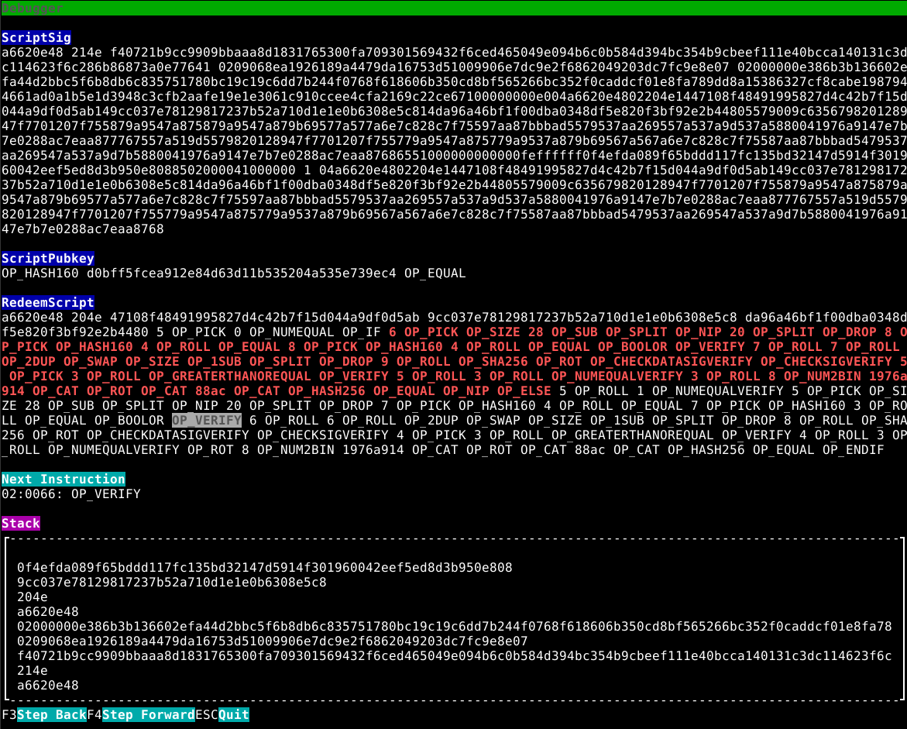

# REST API (backend wallets)

## Introduction

Our REST API allows you to create advanced, performant, and secure financial applications without the usual complexity of blockchain development.

By deploying our REST API on your server, creating enterprise-level cryptocurrency applications becomes effortless.

<b style="color: #af3e3e;">Important!</b> This tutorial shows calls to `https://rest-unstable.mainnet.cash` to ease the learning process.
You can use it to learn, but <span style="background-color: #fffdbf; padding: 0 5px 0 5px;">for production use you are expected to</span> [run your own service](/tutorial/running-rest.md) (it's very lightweight, just one docker call),
because
otherwise you actually send us your _private keys_, which is absolutely insecure. Run your own service, you'll be ok.

This REST API is in production use on noise.cash and creates hundreds of thousands of transactions daily, it's pretty stable, but...

<p style="font-size: 90%;">...this server is currently in a <span style="background-color: #fffdbf; padding: 0 5px 0 5px;">beta stage</span>. 
Things may change randomly. There is no backward compatibility guarantee yet, 
even though we try not to break things too often.</p> 

## Let's get programming


Let's first create a test wallet:

```bash
curl -X POST https://rest-unstable.mainnet.cash/wallet/create \
    -H "Content-Type: application/json" \
    -d '{"type": "seed", "network": "testnet"}'
```

See also: Full [REST server API reference](https://rest-unstable.mainnet.cash/api-docs/).

Response:

<!-- cSpell:disable -->
```json
{
  "cashaddr": "bchtest:qrau3n8tzcv2a4yqsr603unhxx4vp9ph0yg2g9449d",
  "walletId": "seed:testnet:table later ... stove kitten pluck:m/44'/0'/0'/0/0",
  "network": "testnet"
}
```
<!-- cSpell:enable -->

This creates a **TestNet** wallet.  This has the cashaddress of the wallet, where you can send money, and the `walletId`.
Note the `walletId` - we're going to need it later. This wallet will not be persisted. See below for persistent wallets.

::: danger walletId contains the private key

Keep `walletId` a secret as it contains the private key that allows spending from this wallet. WalletId, Seed phrase, WIF - all
these are a form of a private key.

:::

::: tip What is TestNet? Where to get TestNet money and a wallet?

`TestNet` is where you test your application. TestNet money has no price. Opposite of TestNet is `MainNet`,
which is what people usually mean when they talk about Bitcoin Cash network.

You can get free TestNet money using our TestNet faucet (see below) or [here](https://faucet.fullstack.cash/).

If you need a wallet that supports the TestNet, download [Electron Cash](https://electroncash.org/) and
run it using `electron-cash --testnet` flag. For example, on MacOS that would be:

`/Applications/Electron-Cash.app/Contents/MacOS/Electron-Cash --testnet`


:::

To create a MainNet wallet (Bitcoin Cash production network):

```bash
curl -X POST https://rest-unstable.mainnet.cash/wallet/create \
    -H "Content-Type: application/json" \
    -d '{"type": "seed", "network": "mainnet"}'
```

Response:

<!-- cSpell:disable -->
```json
{
  "name": "",
  "cashaddr": "bitcoincash:qr70hzy3sfmrcknd7apksmxhhf48cwkuavckm7lt8f",
  "walletId": "seed:mainnet:cave blue ... skill shoot faculty:m/44'/0'/0'/0/0",
  "network": "mainnet"
}
```
<!-- cSpell:enable -->

Seed phrase wallets use the derivation path `m/44'/0'/0'/0/0` by default (Bitcoin.com wallet compatibility)

If you want to manually construct a walletId from a WIF (a private key), just build a string like this:

```
wif:mainnet:WIFHERE
```

Similarly, from a seed and a derivation path:

```
seed:mainnet:SEED WORDS HERE:m/DERIVATION/PATH
```

Networks: `mainnet`, `testnet`, `regtest` ([see below](#regtest-wallets))

Note: we generate bindings and packages for some programming languages, so that you don't have
to do the REST calls manually, see [here](/tutorial/other-languages.html). You can generate bindings for nearly
every other programming language easily.

## Named wallets (persistent)

Named wallets are used to save the private key inside the REST API server, so that you 
can refer to it by name and always get the same wallet.

To create a persistent wallet:

```bash
curl -X POST https://rest-unstable.mainnet.cash/wallet/create \
    -H "Content-Type: application/json" \
    -d '{"type": "seed", "network": "testnet", "name": "wallet_1"}'
```

Response:

```json
{
  "name": "wallet_1",
  "cashaddr": "bchtest:qp3wsgxkeezy3rumwzja0yxlmgra2jt74ymtrmayyl",
  "walletId": "named:testnet:wallet_1",
  "seed": {
    "seed": "parade vocal foil key orchard pact mansion arena bounce caught perfect true",
    "derivationPath": "m/44'/1'/0'/0/0"
  },
  "network": "testnet"
}
```

The wallet's private key will be stored in the PostgreSQL database of the REST API server.

Note that `rest-unstable.mainnet.cash` will not allow you to store mainnet private keys,
you need to [run your own service](/tutorial/rest.md) for that. We really don't want to store your private keys!

To check if a named wallet already exists in the storage, you can invoke:

```bash
curl -X POST https://rest-unstable.mainnet.cash/wallet/named_exists \
    -H "Content-Type: application/json" \
    -d '{"type": "seed", "network": "testnet", "name": "wallet_1"}'
```

Response:

```json
{"result":true}
```

Say a user of your application wants to change the wallet info to a new seed. Their wallet on the REST server can be replaced (recovered) with the existing `walletId`:

```bash
curl -X POST https://rest-unstable.mainnet.cash/wallet/replace_named \
    -H "Content-Type: application/json" \
    -d '{"name": "wallet_1", "walletId": "seed:testnet:diary caution almost ...:m/44'\''/0'\''/0'\''/0/0", "type": "seed", "network": "testnet"}'
```

Response:

```json
{"result":true}
```

If the wallet entry does not exist in the DB, it will be created. If it does - it will be replaced without exception.


### Watch-only wallets

Watch-only wallets do not have private keys and unable to send funds, however they are very useful to keep track of address' balances, subscribe to its incoming and outgoing transactions, etc.

They are constructed from a cashaddress by building a `walletId` like this:

```
watch:testnet:bchtest:qq1234567
```

...and then doing the regular wallet querues like `wallet/balance`.

## Getting the balance

To get the balance of your wallet you can do this (use the `walletId` that you got previously):

```bash
curl -X POST https://rest-unstable.mainnet.cash/wallet/balance \
  -H "Content-Type: application/json" \
  -d '{
    "walletId": "named:testnet:wallet_1"
  }'
```

Response:

```json
{"bch": 0.20682058, "sat": 20682058, "usd": 91.04}
```

Or you can use `unit` in the call to get just the number:

```bash
curl -X POST https://rest-unstable.mainnet.cash/wallet/balance \
  -H "Content-Type: application/json" \
  -d '{
    "walletId": "named:testnet:wallet_1",
    "unit": "sat"
  }'
```

Response:

```
0
```

You can ask for `usd`, `sat`, `bch` (or `satoshi`, `satoshis`, `sats` - just in case you forget the exact name).

- 1 satoshi = 0.00000001 Bitcoin Cash (1/100,000,000th)
- 1 Bitcoin Cash = 100,000,000 satoshis

`usd` returns the amount at the current exchange rate, fetched from CoinGecko or Bitcoin.com.

## Sending money

Let's create another wallet and send some of our money there.

Remember, that first you need to send some satoshis to the cashaddr of your original wallet (see the TestNet note above).

Check that the balance is there in the original wallet:

```bash
curl -X POST https://rest-unstable.mainnet.cash/wallet/balance \
-H "Content-Type: application/json" \
-d '{"walletId": "wif:testnet:cRqxZECspKgkuBbdCnnWrRsMsYLUeTWULYRRW3VgHKedSMbM6SXB"}'
```

```json
{"bch": 0.000100000, "sat": 10000, "usd": 0.02}
```

Now, we can send 100 satoshis to the `...z2pu` address

```bash
curl -X POST https://rest-unstable.mainnet.cash/wallet/send \
  -H "Content-Type: application/json" \
  -d '{
    "walletId": "wif:testnet:cRqxZECspKgkuBbdCnnWrRsMsYLUeTWULYRRW3VgHKedSMbM6SXB",
    "to": [
      {
        "cashaddr": "bchtest:qz73ul3zy8mvpjt4upw64n58t8gt2ru735qn0dz2pu",
        "value": 100,
        "unit": "sat"
      }
    ],
    "options": {
      "slpSemiAware": true
    }
  }'
```

Note that you can send to many addresses at once. It is also possible to specify which unspent outputs are used to send funds from by specifying a list of `utxoIds` in `options`.

Response:

```json
{
  "txId": "316f923a1f4c47ac6562779fe6870943eec4f98a622a931f2cc1acd0790ebd69",
  "balance": {"bch": 0.00009680, "sat": 9680, "usd": 0.02}
}
```

#### Options

There is also an `options` parameter that specifies how money is spent.

* `utxoIds` holds an array of strings and controls which UTXOs can be spent in this operation. Format is `["txid:vout",...]` , e.g., `["1e6442a0d3548bb4f917721184ac1cb163ddf324e2c09f55c46ff0ba521cb89f:0"]`
* `slpSemiAware` is a boolean flag (defaulting to `false`) which requires an UTXO to have more than 546 sats to be spendable and counted in the balance. It protects you from spending SLP-like UTXOs without using an external SLP indexer.
* `changeAddress` cash address to receive change to
* `queryBalance` is a boolean flag (defaulting to `true`) to include the wallet balance after the successful `send` operation to the returned result. If set to false, the balance will not be queried and returned, making the `send` call faster.
* `awaitTransactionPropagation` is a boolean flag (defaulting to `true`) to wait for transaction to propagate through the network and be registered in the bitcoind and indexer. If set to false, the `send` call will be very fast, but the wallet UTXO state might be invalid for some 500ms.
* `feePaidBy` Fee allocation strategy. Convenience option to subtract fees from outputs if change is not sufficient to cover transaction costs. Options are as follows:
  
  - `change` - pay the fees from change or error
  - `firstOutput` - pay the fee from the first output or error
  - `lastOutput` - pay the fee from the last output or error
  - `anyOutput` - pay the fee from dust outputs or divide across all remaining non-dust outputs.
  - `changeThenFirst` - Use change then first output or error.
  - `changeThenLast` - Use change then last output or error.
  - `changeThenAny` - Use change then any output strategy or error. 


<span style="background-color: #fffdbf; padding: 0 5px 0 5px;">If your address holds SLP tokens</span>, you have to add `"slpSemiAware": true` to your request `options` to prevent accidental token burning. It skips all UTXOs with 546 sats when counting balance and sending funds.

You get the transaction ID (txid) that [you can see on the TestNet block explorer](https://www.blockchain.com/bch-testnet/tx/316f923a1f4c47ac6562779fe6870943eec4f98a622a931f2cc1acd0790ebd69)
and the balance left in the original wallet.

#### Building transactions

An advanced way to send funds around is to build the transaction manually. To do so we expose the `wallet/encode_transaction` endpoint which has the same call signature as `wallet/send` method. It hides all the weightlifting from the user: UTXO selection, fee calculation, signing, etc. and produces the binary transaction data ready to be broadcasted to the network with the `wallet/submit_transaction` method:

```bash
curl -X POST https://rest-unstable.mainnet.cash/wallet/encode_transaction \
  -H "Content-Type: application/json" \
  -d '{
      "walletId": "wif:regtest:cNfsPtqN2bMRS7vH5qd8tR8GMvgXyL5BjnGAKgZ8DYEiCrCCQcP6",
      "to": [
        {
          "cashaddr": "bchreg:qp9ecptsetu05hunem6ry38m0l54zsqf0u50ay3453",
          "unit": "satoshis",
          "value": 2000
        }
      ]
    }'
```

Response:

```json
{
  "transactionHex": "020000000142f857ccf48dea9bdb26ce6965f87e57f7ca60535573088dd35e67eeee75f25c000000006441c400d5010ad61e1b8b862ed13ce7e531e1e07f22020815cf27955508f1231e265bf576c28f1d3ec2fc0256835ffca38828e34eeb3db5640413261e054aa6170e412103410ef048b3da351793f6ed14cc2fde460becc5b658d9138443b9a3000707a6a70000000002d0070000000000001976a9144b9c0570caf8fa5f93cef43244fb7fe95140097f88ac54e9052a010000001976a91456b6b22042b90dd67bf2fbfb9aff7d37fbee112488ac00000000"
}
```

```bash
curl -X POST https://rest-unstable.mainnet.cash/wallet/encode_transaction \
  -H "Content-Type: application/json" \
  -d '{
      "walletId": "wif:regtest:cNfsPtqN2bMRS7vH5qd8tR8GMvgXyL5BjnGAKgZ8DYEiCrCCQcP6",
      "transactionHex": "020000000142f857ccf48dea9bdb26ce6965f87e57f7ca60535573088dd35e67eeee75f25c000000006441c400d5010ad61e1b8b862ed13ce7e531e1e07f22020815cf27955508f1231e265bf576c28f1d3ec2fc0256835ffca38828e34eeb3db5640413261e054aa6170e412103410ef048b3da351793f6ed14cc2fde460becc5b658d9138443b9a3000707a6a70000000002d0070000000000001976a9144b9c0570caf8fa5f93cef43244fb7fe95140097f88ac54e9052a010000001976a91456b6b22042b90dd67bf2fbfb9aff7d37fbee112488ac00000000"
    }'
```

Response:

```json
{
  "txId": "da9c2230ad8adb0a6a6fc6f1a65a4c08ee272558cc2f0a6965e2302aa5db6c63"
}
```

#### Getting balance

Let's print the balance of `...z2pu` wallet:

```bash
{"bch": 0.00000100, "sat": 100, "usd": 0.00}
```

Great! You've just made your first transaction!

Now you can send all of your money somewhere else:

```bash
curl -X POST https://rest-unstable.mainnet.cash/wallet/send_max \
  -H "Content-Type: application/json" \
  -d '{
    "walletId": "wif:testnet:cRqxZECspKgkuBbdCnnWrRsMsYLUeTWULYRRW3VgHKedSMbM6SXB",
    "cashaddr": "bchtest:qz73ul3zy8mvpjt4upw64n58t8gt2ru735qn0dz2pu"
  }'
```

This will send the maximum amount (minus the transaction fees of 1 satoshi per byte, there are usually 200-300 bytes per transaction). Note, that you can also use here the optional parameter `options` to ensure the spending of certain UTXOs, SLP awareness and others (see above).

### Sending data with OP_RETURN

You can store arbitrary data on blockchain using the OP_RETURN opcode. It is useful not only to store simple text messages, many protocols such as MEMO and SLP are utilizing it to build complex applications.

You can send OP_RETURN messages as simple strings (supporting UTF8) or binary buffers as follows:

```bash
curl -X POST https://rest-unstable.mainnet.cash/wallet/send \
  -H "Content-Type: application/json" \
  -d '{
    "walletId": "wif:testnet:cRqxZECspKgkuBbdCnnWrRsMsYLUeTWULYRRW3VgHKedSMbM6SXB",
    "to": [
      { "dataString": "MEMO\x10LÖL😅" },
      { "dataBuffer": "TUVNTxBMw5ZM8J+YhQ==" }
    ]
  }'

# or alternatively

curl -X POST https://rest-unstable.mainnet.cash/wallet/send \
  -H "Content-Type: application/json" \
  -d '{
    "walletId": "wif:testnet:cRqxZECspKgkuBbdCnnWrRsMsYLUeTWULYRRW3VgHKedSMbM6SXB",
    "to": [
      ["OP_RETURN", "MEMO\x10LÖL😅"],
      ["OP_RETURNB64": "TUVNTxBMw5ZM8J+YhQ=="]
    ]
  }'
```

`dataBuffer` and `OP_RETURNB64` contain Base64 encoded binary data arrays.

You can simply pass raw buffer containing your opcodes. If your buffer lacks the OP_RETURN and OP_PUSHDATA (followed by the length of the message) opcodes, they will be prepended.

Sending funds and OP_RETURN messages can be mixed together, the output order will be preserved:

```bash
curl -X POST https://rest-unstable.mainnet.cash/wallet/send \
  -H "Content-Type: application/json" \
  -d '{
    "walletId": "wif:testnet:cRqxZECspKgkuBbdCnnWrRsMsYLUeTWULYRRW3VgHKedSMbM6SXB",
    "to": [
      ["bchtest:qqm4gsaa2gvk7flvsvj7f0w4rlq32vqhkq27mxesg8", 546, "sats"],
      ["OP_RETURNB64": "TUVNTxBMw5ZM8J+YhQ=="]
    ]
  }'
```

### QR codes

Let's say you want to display a QR code for you user to pay you money and show an alert when money arrives?

Let's display a QR code:

```shell script
curl -X POST https://rest-unstable.mainnet.cash/wallet/deposit_qr \
  -H "Content-Type: application/json" \
  -d '{
    "walletId": "wif:testnet:cRqxZECspKgkuBbdCnnWrRsMsYLUeTWULYRRW3VgHKedSMbM6SXB"
  }'
```

Response:

```json
{"src":"data:image/svg+xml;base64,PD94bWwgdmVyc2...."}
```

You can use this `src` directly in the image tag:

```html
<p style="text-align: center;">
    
</p>
```

### Waiting for blockchain events

See [WebSockets](#websocket-api-reference) and [WebHooks](#webhooks).

## CashTokens

Since the release 1.0.0, mainnet.cash supports [CashTokens](https://github.com/bitjson/cashtokens#readme) and [BCMR](https://github.com/bitjson/chip-bcmr) - BitcoinCash Metadata Registries.

All token related methods are available from `Wallet` class directly. This means that you can send BCH and CashTokens in the same transaction.

Both fungible and non-fungible (NFT) tokens of the same category (tokenId) can share the same UTXO. Pure NFT just has its fungible token `amount` being 0.

Each token UTXO may or may not contain the following attributes:

*  `amount: number;` - fungible token amount. N.B. After genesis the total amount of fungible tokens can not be increased. Max amount is `9223372036854775807`
*  `tokenId: string;` - the category Id of the token, this is a 32 bytes hex encoded transaction hash which was spent in the token genesis process
*  `commitment?: string;` - 0 to 40 bytes long hex encoded string representing the token commitment message. This can be a serial number of an NFT in the group or any other user defined data.
*  `capability?: NFTCapability;` - Non-fungible token capability.
    - `none`: token is immutable (can not change its commitment) and can not mint new NFTs
    - `mutable`: token can be spent to create a singular new NFT token with different commitment and optionally `mutable` capability
    - `minting`: token can be spent to create any amount of new NFT tokens with different commitment and any capability

Also token carrying utxos do have a BCH value which can not be lower than 798 satoshi for p2pkh token outputs (dust limit), otherwise these inputs would be unspendable. For simplicity mainnet allows to omit the BCH value for token UTXOs. If new token UTXOs are created the value for them will be set to 1000 satoshi. If a singular token UTXO is spent to a single new UTXO its BCH value will be carried over to the new one.

By the specification the token aware wallets should signal to the user that they can handle the CashTokens. `Wallet` class received new property `tokenaddr`, and new methods `getTokenDepositAddress` and `getTokenDepositQr` which should be used and presented to the end-user.

### Token creation - Genesis

It is very easy to create new token category:

```shell script
curl -X POST https://rest-unstable.mainnet.cash/wallet/token_genesis \
  -H "Content-Type: application/json" \
  -d '{
        "walletId": "wif:testnet:cRqxZECspKgkuBbdCnnWrRsMsYLUeTWULYRRW3VgHKedSMbM6SXB",
        "cashaddr": "bchtest:qqm4gsaa2gvk7flvsvj7f0w4rlq32vqhkq27mxesg8",
        "amount": 5,
        "commitment": "abcd",
        "capability": "none",
        "value": 1000,
      }'
```

Response:

```json
{
  "txId": "641c56cb980437f93932421dc7f162a3b0ff1d3cba26d21a3c8b577384d0445a",
  "balance": {},
  "explorerUrl": "641c56cb980437f93932421dc7f162a3b0ff1d3cba26d21a3c8b577384d0445a",
  "tokenIds": [
    "219f792ebf5019ad82ceb911dd7fc35fee862bf9db56e2324d6d23634a176f1f"
  ]
}
```

### Looking up token information

If you want to get the BCMR information about your token (given you have imported it), you can invoke [`wallet/bcmr/get_token_info`](/tutorial/rest.html#bcmr-bitcoincash-metadata-registries) method .

Please refer to BCMR specification to learn more about identity snapshots and how to get the detailed token information.

### Additional token creation - Minting

If you decide to mint new NFT tokens or to mutate the existing token, you would need to use `wallet/token_mint` method.

In the following example we mint 2 new NFTS:

```shell script
# mint 2 NFTs, amount reducing
curl -X POST https://rest-unstable.mainnet.cash/wallet/token_genesis \
  -H "Content-Type: application/json" \
  -d '{
        "walletId": "wif:testnet:cRqxZECspKgkuBbdCnnWrRsMsYLUeTWULYRRW3VgHKedSMbM6SXB",
        "tokenId": "219f792ebf5019ad82ceb911dd7fc35fee862bf9db56e2324d6d23634a176f1f",
        "requests": [{
          "cashaddr": "bchtest:qqm4gsaa2gvk7flvsvj7f0w4rlq32vqhkq27mxesg8",
          "commitment": "01",
          "capability": "none",
          "value": 1000,
        }, {
          "cashaddr": "bchtest:qqm4gsaa2gvk7flvsvj7f0w4rlq32vqhkq27mxesg8",
          "commitment": "02",
          "capability": "mutable",
          "value": 1000,
        }],
        "deductTokenAmount": true,
      }'
```

Response:

```json
{
  "txId": "431a8ffd1d4d22b98d376091f540c2fda70490d879c26237933242299d3bbc51",
  "balance": {},
  "explorerUrl": "431a8ffd1d4d22b98d376091f540c2fda70490d879c26237933242299d3bbc51",
  "tokenIds": [
    "219f792ebf5019ad82ceb911dd7fc35fee862bf9db56e2324d6d23634a176f1f"
  ]
}
```

The last boolean parameter might come handy in the case you want to track the amount of tokens left to be minted - for example you have created the token category with 1000 fungible tokens and if you will mint 2 new NFT tokens while this parameter being set to `true`, the minting token will have its FT amount reduced to 998. Note, that will not prevent you to mint more tokens when FT amount reaches 0.

### Sending tokens

Sending tokens around is easy and can be combined with sending BCH! You can include many token send requests in one call, even different token categories:

```shell script
curl -X POST https://rest-unstable.mainnet.cash/wallet/send \
  -H "Content-Type: application/json" \
  -d '{
        "walletId": "wif:testnet:cRqxZECspKgkuBbdCnnWrRsMsYLUeTWULYRRW3VgHKedSMbM6SXB",
        "requests": [{
          "cashaddr": "bchtest:qqm4gsaa2gvk7flvsvj7f0w4rlq32vqhkq27mxesg8",
          "amount": 100,
          "tokenId": "219f792ebf5019ad82ceb911dd7fc35fee862bf9db56e2324d6d23634a176f1f",
          "value": 1000,
        }, {
          "cashaddr": "bchtest:qrnluuge56ahxsy6pplq43rva7k6s9dknu4p5278ah",
          "tokenId": "01092b7b61d8b377eb84ff0131d7c4146b51088bf246a01dd12a8029d1a2d17c",
          "commitment": "abcd",
          "capability": "none",
          "value": 1000,
        }, {
          "cashaddr": "bchtest:qzspcywxmm4fqhf9kjrknrc3grsv2vukeqyjqla0nt",
          "value": 100000,
          "unit": "satoshis",
        }],
      }'
```

Response:

```json
{
  "txId": "1e6442a0d3548bb4f917721184ac1cb163ddf324e2c09f55c46ff0ba521cb89f",
  "balance": {},
  "explorerUrl": "1e6442a0d3548bb4f917721184ac1cb163ddf324e2c09f55c46ff0ba521cb89f",
  "tokenIds": [
    "219f792ebf5019ad82ceb911dd7fc35fee862bf9db56e2324d6d23634a176f1f",
    "01092b7b61d8b377eb84ff0131d7c4146b51088bf246a01dd12a8029d1a2d17c"
  ]
}
```

### Token burning

To explicitly burn the CashTokens they must be sent to an OP_RETURN output. `wallet/token_burn` method does this:

```shell script
# burn 1 FT
curl -X POST https://rest-unstable.mainnet.cash/wallet/token_burn \
  -H "Content-Type: application/json" \
  -d '{
        "walletId": "wif:testnet:cRqxZECspKgkuBbdCnnWrRsMsYLUeTWULYRRW3VgHKedSMbM6SXB",
        "tokenId": "219f792ebf5019ad82ceb911dd7fc35fee862bf9db56e2324d6d23634a176f1f",
        "amount": 1,
        "capability": "minting",
        "commitment": "abcd",
        "message": "burn",
      }'
```

Response:

```json
{
  "txId": "132731d90ac4c88a79d55eae2ad92709b415de886329e958cf35fdd81ba34c15",
  "balance": {},
  "explorerUrl": "132731d90ac4c88a79d55eae2ad92709b415de886329e958cf35fdd81ba34c15",
  "tokenIds": [
    "219f792ebf5019ad82ceb911dd7fc35fee862bf9db56e2324d6d23634a176f1f"
  ]
}
```

If token has fungible amount, the burning mechanism will reduce the token amount. If no fungible amount is left, the NFT will be burnt, effectively destroying the token category.

There is a way to implicitly burn fungible tokens without sending them to an OP_RETURN, just ensure that you send less tokens than you have, while setting the `checkTokenQuantities` of SendRequestOptions object to false:

```shell script
# send and burn
curl -X POST https://rest-unstable.mainnet.cash/wallet/send \
  -H "Content-Type: application/json" \
  -d '{
        "walletId": "wif:testnet:cRqxZECspKgkuBbdCnnWrRsMsYLUeTWULYRRW3VgHKedSMbM6SXB",
        "requests": [...],
        "options": {
          "checkTokenQuantities": false
        }
      }'
```

### Token UTXOs

If you want to get the information about CashToken UTXOs of an address, look up the locked satoshi values, etc., you can do the following call:

```shell script
# tokenId can be omitted
curl -X POST https://rest-unstable.mainnet.cash/wallet/get_token_utxos \
  -H "Content-Type: application/json" \
  -d '{
        "walletId": "wif:testnet:cRqxZECspKgkuBbdCnnWrRsMsYLUeTWULYRRW3VgHKedSMbM6SXB",
        "tokenId": "219f792ebf5019ad82ceb911dd7fc35fee862bf9db56e2324d6d23634a176f1f"
      }'
```

Response:

```json
{
  "utxos": [
    {
      "txid": "cf0c0685cefd25329fb360ce21adec2257c414e41ad3fc9e91adb3db0b89a55d",
      "vout": 0,
      "satoshis": 1000,
      "height": 0,
      "token": {
        "amount": 2,
        "tokenId": "abe08e8936abecefec78fb8bd8461f23f533a1729c27194ba8272be0494f3d56",
        "capability": "minting",
        "commitment": "abcd"
      }
    }
  ]
}
```

If `tokenId` is undefined UTXOs of all token categories will be returned. If `tokenId` is set, only tokens of this category will be returned.

### Token balances

You can get all fungible token balances of your wallet or a balance of a specific token with the following methods:

```shell script
curl -X POST https://rest-unstable.mainnet.cash/wallet/get_token_balance \
  -H "Content-Type: application/json" \
  -d '{
        "walletId": "wif:testnet:cRqxZECspKgkuBbdCnnWrRsMsYLUeTWULYRRW3VgHKedSMbM6SXB",
        "tokenId": "219f792ebf5019ad82ceb911dd7fc35fee862bf9db56e2324d6d23634a176f1f"
      }'
```

Response:

```json
{ "balance": 4 }
```

```shell script
curl -X POST https://rest-unstable.mainnet.cash/wallet/get_all_token_balances \
  -H "Content-Type: application/json" \
  -d '{
        "walletId": "wif:testnet:cRqxZECspKgkuBbdCnnWrRsMsYLUeTWULYRRW3VgHKedSMbM6SXB"
      }'
```

Response:

```json
{
  "219f792ebf5019ad82ceb911dd7fc35fee862bf9db56e2324d6d23634a176f1f": 555,
  "01092b7b61d8b377eb84ff0131d7c4146b51088bf246a01dd12a8029d1a2d17c": 666
}
```

To get the total amount of NFT tokens use the following methods:

```shell script
curl -X POST https://rest-unstable.mainnet.cash/wallet/get_nft_token_balance \
  -H "Content-Type: application/json" \
  -d '{
        "walletId": "wif:testnet:cRqxZECspKgkuBbdCnnWrRsMsYLUeTWULYRRW3VgHKedSMbM6SXB",
        "tokenId": "219f792ebf5019ad82ceb911dd7fc35fee862bf9db56e2324d6d23634a176f1f"
      }'
```

Response:

```json
{ "balance": 4 }
```

```shell script
curl -X POST https://rest-unstable.mainnet.cash/wallet/get_all_nft_token_balances \
  -H "Content-Type: application/json" \
  -d '{
        "walletId": "wif:testnet:cRqxZECspKgkuBbdCnnWrRsMsYLUeTWULYRRW3VgHKedSMbM6SXB"
      }'
```

Response:

```json
{
  "219f792ebf5019ad82ceb911dd7fc35fee862bf9db56e2324d6d23634a176f1f": 2,
  "01092b7b61d8b377eb84ff0131d7c4146b51088bf246a01dd12a8029d1a2d17c": 1
}
```

## BCMR - BitcoinCash Metadata Registries

::: warning
BCMR implementation in mainnet.cash is in alpha phase.

BCMR CHIP might still be changed.
:::

We implement [BCMR](https://github.com/bitjson/chip-bcmr) CHIP to support on-chain CashToken metadata resolution employing zeroth-descendant transaction chain (ZDTC), which authenticates and publishes all registry updates.

To add metadata registry to the list of tracked ones use one of the following methods:

1. Direct: use `/wallet/bcmr/add_registry` to add the [`Registry`](https://github.com/bitjson/chip-bcmr/blob/5b24b0ec93cf9316222ab2ea2e2ffe8a9f390b12/bcmr-v1.schema.ts#L103) object to the list of tracked
2. Using HTTPS or IPFS endpoint: use `/wallet/bcmr/add_registry_from_uri` to download a JSON file containing the `Registry` and add it to the list of tracked, optionally enforcing the content hash verification.
3. Using authchain resolution to optionally follow to the head of the auth chain and fetching data from HTTPS or IPFS Publication Outputs

    const chain = (await request(app).post("/wallet/bcmr/add_registry_authchain").send({
      transactionHash: response.txId,
      followToHead: false    }));

```shell script
curl -X POST https://rest-unstable.mainnet.cash/wallet/bcmr/add_registry_authchain \
  -H "Content-Type: application/json" \
  -d '{
        "transactionHash": "d275459ea2cdd7044cafcf81ad0875b7f080033922582009d07b821b907489bc",
        "followToHead": false
      }'
```

Response:

```json
[
  {
    "txHash": "d275459ea2cdd7044cafcf81ad0875b7f080033922582009d07b821b907489bc",
    "contentHash": "658119177b9574133f4a9ea4ebb297661027ebc5dff269baabdb4ac2cc1f0c53",
    "uri": "https://mainnet.cash/.well-known/bitcoin-cash-metadata-registry_v3.json"
  }
]
```

In this example we resolve the exact metadata registry stored in the transaction findable by its transaction hash `txHash`. If we'd wanted to resolve the latest version, we'd set `followToHead` to `true`.

After adding the registry, we will have access to token info with `/wallet/bcmr/get_token_info`:

```shell script
curl -X POST https://rest-unstable.mainnet.cash/wallet/bcmr/get_token_info \
  -H "Content-Type: application/json" \
  -d '{
        "tokenId": "219f792ebf5019ad82ceb911dd7fc35fee862bf9db56e2324d6d23634a176f1f",
      }'
```

"/wallet/bcmr/get_token_info").send({
      tokenId: "0000000000000000000000000000000000000000000000000000000000000000"
    })
Response:

```json
{
  "tokenInfo": {
    "name": "Test token registry",
    "time": {
      "begin": 1671284836967
    },
    "token": {
      "category": "219f792ebf5019ad82ceb911dd7fc35fee862bf9db56e2324d6d23634a176f1f",
      "symbol": "TOK",
      "decimals": 8
    }
  }
}
```

Note, that token info resolution will prioritize the most recently added registries and return the info about first found token with matching `tokenId`.

To get all tracked registries, use `/wallet/bcmr/get_registries`, to purge the list use `/wallet/bcmr/reset_registries`.

## TestNet faucet

You can have some TestNet satoshi for your convenience. Visit our ~~faucet~~ refilling station at [https://rest-unstable.mainnet.cash/faucet.html](https://rest-unstable.mainnet.cash/faucet.html)

Your address will be refilled up to 10000 TestNet satoshi upon a call. There are request rate limiters set up to prevent abuse.

We've integrated the faucet into the library so that you can do easy calls like the following.

### Get TestNet satoshis

```shell script
curl -X POST https://rest-unstable.mainnet.cash/faucet/get_testnet_bch \
  -H "Content-Type: application/json" \
  -d '{
  "cashaddr": "bchtest:qqm4gsaa2gvk7flvsvj7f0w4rlq32vqhkq27mxesg8"
}'
```

Response:

```json
{
  "txId": "132731d90ac4c88a79d55eae2ad92709b415de886329e958cf35fdd81ba34c15"
}
```

## Escrow contracts

::: warning 
Alpha release
:::

Ok, let's now assume that you are building a service where you want to connect a buyer and a seller (a freelance marketplace 
or a non-custodial exchange), but at the same time you don't want to hold anyone's money, 
but only act as an arbiter in case something goes wrong. It's possible in Bitcoin Cash and it's called "an escrow contract".

You'll need three addresses for this: `buyer`, `seller` and `arbiter`. 

Note: The source for the contract is [here](https://github.com/mainnet-cash/mainnet-js/blob/a35c3ff9590eb04e03b122d7bb2d4bbb12150d66/src/contract/escrow/EscrowContract.ts#L98-L118). 

1) Buyer sends the money to the contract and could then release the money to the seller 
2) The seller could refund the buyer
3) Arbiter can either complete the transaction to the seller or refund to the buyer, but cannot steal the money 

```bash
curl -X POST https://rest-unstable.mainnet.cash/contract/escrow/create \
  -H "Content-Type: application/json" \
  -d '{
  "buyerAddr": "bchtest:qrnluuge56ahxsy6pplq43rva7k6s9dknu4p5278ah",
  "arbiterAddr": "bchtest:qzspcywxmm4fqhf9kjrknrc3grsv2vukeqyjqla0nt",
  "sellerAddr": "bchtest:qz00pk9lfs0k9f5vf3j8h66qfmqagk8nc56elq4dv2",
  "amount": 10000,
  "nonce":1075184727
}'
```

Response:

```json
{
    "escrowContractId": "escrowContract:testnet:WW1Ob2RHVnpkRHB4ZWpBd2NHczViR1p6TUdzNVpqVjJaak5xT0dnMk5uRm1iWEZoWjJzNGJtTTFObVZzY1RSa2RqST06WW1Ob2RHVnpkRHB4Y201c2RYVm5aVFUyWVdoNGMzazJjSEJzY1RRemNuWmhOMnMyY3psa2EyNTFOSEExTWpjNFlXZz06WW1Ob2RHVnpkRHB4ZW5Od1kzbDNlRzF0TkdaeGFHWTVhMnB5YTI1eVl6Tm5jbk4yTW5aMWEyVnhlV3B4YkdFd2JuUT06TVRBd01EQT0=:TVRVNExESTBNQ3d5TVRZc01Ua3hMRGMyTERNeExEazRMREUyTml3eE5EQXNOellzTVRBd0xERXlNeXd5TXpVc05qUXNOemdzTVRrekxESXhNaXc0T0N3eU5ETXNNVGszOk1qTXhMREkxTkN3eE1UTXNNalVzTVRZMkxERTROeXd4TVRVc05qUXNNVFUwTERnc01USTJMREV3TERFNU5pd3hNRGdzTWpNNUxERTNNeXd4Tmpnc01qRXNNVGd5TERFMU9RPT06TVRZd0xESTRMREUzTERFNU9Dd3lNaklzTWpNMExERTBOQ3c1TXl3ek55d3hPREFzTVRNMUxERXdOU3d4TkRNc01UY3NOalFzTWpJMExERTVOeXcxTVN3eE5UQXNNakF3Ok1UQXdNREE9Ok1UYzVNRGt4TURrME9RPT0=:cHJhZ21hIGNhc2hzY3JpcHQgXjAuNi4xOwogICAgICAgICAgICBjb250cmFjdCBlc2Nyb3coYnl0ZXMyMCBzZWxsZXJQa2gsIGJ5dGVzMjAgYnV5ZXJQa2gsIGJ5dGVzMjAgYXJiaXRlclBraCwgaW50IGNvbnRyYWN0QW1vdW50LCBpbnQgY29udHJhY3ROb25jZSkgewoKICAgICAgICAgICAgICAgIGZ1bmN0aW9uIHNwZW5kKHB1YmtleSBzaWduaW5nUGssIHNpZyBzLCBpbnQgYW1vdW50LCBpbnQgbm9uY2UpIHsKICAgICAgICAgICAgICAgICAgICByZXF1aXJlKGhhc2gxNjAoc2lnbmluZ1BrKSA9PSBhcmJpdGVyUGtoIHx8IGhhc2gxNjAoc2lnbmluZ1BrKSA9PSBidXllclBraCk7CiAgICAgICAgICAgICAgICAgICAgcmVxdWlyZShjaGVja1NpZyhzLCBzaWduaW5nUGspKTsKICAgICAgICAgICAgICAgICAgICByZXF1aXJlKGFtb3VudCA+PSBjb250cmFjdEFtb3VudCk7CiAgICAgICAgICAgICAgICAgICAgcmVxdWlyZShub25jZSA9PSBjb250cmFjdE5vbmNlKTsKICAgICAgICAgICAgICAgICAgICBieXRlczM0IG91dHB1dCA9IG5ldyBPdXRwdXRQMlBLSChieXRlczgoYW1vdW50KSwgc2VsbGVyUGtoKTsKICAgICAgICAgICAgICAgICAgICByZXF1aXJlKGhhc2gyNTYob3V0cHV0KSA9PSB0eC5oYXNoT3V0cHV0cyk7CiAgICAgICAgICAgICAgICB9CgogICAgICAgICAgICAgICAgZnVuY3Rpb24gcmVmdW5kKHB1YmtleSBzaWduaW5nUGssIHNpZyBzLCBpbnQgYW1vdW50LCBpbnQgbm9uY2UpIHsKICAgICAgICAgICAgICAgICAgICByZXF1aXJlKGhhc2gxNjAoc2lnbmluZ1BrKSA9PSBhcmJpdGVyUGtofHxoYXNoMTYwKHNpZ25pbmdQaykgPT0gc2VsbGVyUGtoKTsKICAgICAgICAgICAgICAgICAgICByZXF1aXJlKGNoZWNrU2lnKHMsIHNpZ25pbmdQaykpOwogICAgICAgICAgICAgICAgICAgIHJlcXVpcmUoYW1vdW50ID49IGNvbnRyYWN0QW1vdW50KTsKICAgICAgICAgICAgICAgICAgICByZXF1aXJlKG5vbmNlID09IGNvbnRyYWN0Tm9uY2UpOwogICAgICAgICAgICAgICAgICAgIGJ5dGVzMzQgb3V0cHV0ID0gbmV3IE91dHB1dFAyUEtIKGJ5dGVzOChhbW91bnQpLCBidXllclBraCk7CiAgICAgICAgICAgICAgICAgICAgcmVxdWlyZShoYXNoMjU2KG91dHB1dCkgPT0gdHguaGFzaE91dHB1dHMpOwogICAgICAgICAgICAgICAgfQogICAgICAgICAgICB9CiAgICAgICAg:1790910949",
  "cashaddr": "bchtest:pqjqp8gca556cn5k6d4hwyf9zhmlpy68mcwlupfpe7"
}
```

The `escrowContractId` has all the data needed about the escrow contract. Store it in your database, so
that you can execute all the necessary functions later.

You can now send money to the escrow contract (just use the `cashaddr` from the response) and check the balance of the contract.

Note: Escrow contract is big (in bytes) and requires a big fee, so the minimum that you can send to it is about 3700 satoshis. 

Now, we can execute the necessary functions:

1) Buyer releases the funds
```bash
curl -X POST https://rest-unstable.mainnet.cash/contract/escrow/call \
  -H "Content-Type: application/json" \
  -d '{
    "escrowContractId": "escrowContract:testnet:WW1Ob2RHVnpkRHB4ZWpBd2NHczViR1p6TUdzNVpqVjJaak5xT0dnMk5uRm1iWEZoWjJzNGJtTTFObVZzY1RSa2RqST06WW1Ob2RHVnpkRHB4Y201c2RYVm5aVFUyWVdoNGMzazJjSEJzY1RRemNuWmhOMnMyY3psa2EyNTFOSEExTWpjNFlXZz06WW1Ob2RHVnpkRHB4ZW5Od1kzbDNlRzF0TkdaeGFHWTVhMnB5YTI1eVl6Tm5jbk4yTW5aMWEyVnhlV3B4YkdFd2JuUT06TVRBd01EQT0=:TVRVNExESTBNQ3d5TVRZc01Ua3hMRGMyTERNeExEazRMREUyTml3eE5EQXNOellzTVRBd0xERXlNeXd5TXpVc05qUXNOemdzTVRrekxESXhNaXc0T0N3eU5ETXNNVGszOk1qTXhMREkxTkN3eE1UTXNNalVzTVRZMkxERTROeXd4TVRVc05qUXNNVFUwTERnc01USTJMREV3TERFNU5pd3hNRGdzTWpNNUxERTNNeXd4Tmpnc01qRXNNVGd5TERFMU9RPT06TVRZd0xESTRMREUzTERFNU9Dd3lNaklzTWpNMExERTBOQ3c1TXl3ek55d3hPREFzTVRNMUxERXdOU3d4TkRNc01UY3NOalFzTWpJMExERTVOeXcxTVN3eE5UQXNNakF3Ok1UQXdNREE9Ok1UQTNOVEU0TkRjeU53PT0=:cHJhZ21hIGNhc2hzY3JpcHQgXjAuNi4xOwogICAgICAgICAgICBjb250cmFjdCBlc2Nyb3coYnl0ZXMyMCBzZWxsZXJQa2gsIGJ5dGVzMjAgYnV5ZXJQa2gsIGJ5dGVzMjAgYXJiaXRlclBraCwgaW50IGNvbnRyYWN0QW1vdW50LCBpbnQgY29udHJhY3ROb25jZSkgewoKICAgICAgICAgICAgICAgIGZ1bmN0aW9uIHNwZW5kKHB1YmtleSBzaWduaW5nUGssIHNpZyBzLCBpbnQgYW1vdW50LCBpbnQgbm9uY2UpIHsKICAgICAgICAgICAgICAgICAgICByZXF1aXJlKGhhc2gxNjAoc2lnbmluZ1BrKSA9PSBhcmJpdGVyUGtoIHx8IGhhc2gxNjAoc2lnbmluZ1BrKSA9PSBidXllclBraCk7CiAgICAgICAgICAgICAgICAgICAgcmVxdWlyZShjaGVja1NpZyhzLCBzaWduaW5nUGspKTsKICAgICAgICAgICAgICAgICAgICByZXF1aXJlKGFtb3VudCA+PSBjb250cmFjdEFtb3VudCk7CiAgICAgICAgICAgICAgICAgICAgcmVxdWlyZShub25jZSA9PSBjb250cmFjdE5vbmNlKTsKICAgICAgICAgICAgICAgICAgICBieXRlczM0IG91dHB1dCA9IG5ldyBPdXRwdXRQMlBLSChieXRlczgoYW1vdW50KSwgc2VsbGVyUGtoKTsKICAgICAgICAgICAgICAgICAgICByZXF1aXJlKGhhc2gyNTYob3V0cHV0KSA9PSB0eC5oYXNoT3V0cHV0cyk7CiAgICAgICAgICAgICAgICB9CgogICAgICAgICAgICAgICAgZnVuY3Rpb24gcmVmdW5kKHB1YmtleSBzaWduaW5nUGssIHNpZyBzLCBpbnQgYW1vdW50LCBpbnQgbm9uY2UpIHsKICAgICAgICAgICAgICAgICAgICByZXF1aXJlKGhhc2gxNjAoc2lnbmluZ1BrKSA9PSBhcmJpdGVyUGtofHxoYXNoMTYwKHNpZ25pbmdQaykgPT0gc2VsbGVyUGtoKTsKICAgICAgICAgICAgICAgICAgICByZXF1aXJlKGNoZWNrU2lnKHMsIHNpZ25pbmdQaykpOwogICAgICAgICAgICAgICAgICAgIHJlcXVpcmUoYW1vdW50ID49IGNvbnRyYWN0QW1vdW50KTsKICAgICAgICAgICAgICAgICAgICByZXF1aXJlKG5vbmNlID09IGNvbnRyYWN0Tm9uY2UpOwogICAgICAgICAgICAgICAgICAgIGJ5dGVzMzQgb3V0cHV0ID0gbmV3IE91dHB1dFAyUEtIKGJ5dGVzOChhbW91bnQpLCBidXllclBraCk7CiAgICAgICAgICAgICAgICAgICAgcmVxdWlyZShoYXNoMjU2KG91dHB1dCkgPT0gdHguaGFzaE91dHB1dHMpOwogICAgICAgICAgICAgICAgfQogICAgICAgICAgICB9CiAgICAgICAg:1075184727",
    "walletId": "seed:testnet:....",
    "function": "spend"
  }'
```

By *default* the above command will build and transmit the transaction.  To **only** build the transaction hex, (without transmitting) and inspect the hex or transmit the hex manually, simply pass `"action": "build"` and the hex will be returned on the `"hex"` field.  In addition, to inspect the contract in the Bitcoin Script debugger, as a `meep` action may be passed, `"action": "meep"`.

You can also specify the exact UTXO IDs to spend 
(you can use [utxos call](https://rest-unstable.mainnet.cash/api-docs/#/contract/escrow/utxos) to list them):

```
...
"utxoIds": [ 
    "1e6442a0d3548bb4f917721184ac1cb163ddf324e2c09f55c46ff0ba521cb89f:0" 
]
...
```

2) Seller refunds

```bash
curl -X POST https://rest-unstable.mainnet.cash/contract/escrow/call \
  -H "Content-Type: application/json" \
  -d '{
      "escrowContractId": "....",
      "walletId": "seed:testnet:....",
      "function": "refund"
    }'
```

3) Arbiter releases the funds or refunds 

(the same: spend or refund, just replace the walletId with the arbiter's one)

## Generic CashScript

::: warning 
Alpha release
:::

::: tip What is CashScript?

*From CashScript.org:*

[CashScript](https://cashscript.org/) is a high-level programming language for smart contracts on Bitcoin Cash. It offers a strong abstraction layer over Bitcoin Cash' native virtual machine, Bitcoin Script. Its syntax is based on Ethereum's smart contract language Solidity, but its functionality is very different since smart contracts on Bitcoin Cash differ greatly from smart contracts on Ethereum. For a detailed comparison of them, refer to the blog post [Smart Contracts on Ethereum, Bitcoin and Bitcoin Cash](https://kalis.me/smart-contracts-eth-btc-bch/). 


:::

In the `EscrowContract` example in the previous section, the contract source is hardcoded. But with a generic `Contract`, the full script is defined by the user.

`Contracts` are objects that simply wrap a CashScript Contract, with utilities to serialize and deserialize them. In addition, there are some functions on wallets to facilitate sending arguments to the contract.

For example, taking a simple pay with timeout example from the [CashScript playground](https://playground.cashscript.org/):


```solidity
pragma cashscript ^0.5.0;

contract TransferWithTimeout(pubkey sender, pubkey recipient, int timeout) {
    // Require recipient's signature to match
    function transfer(sig recipientSig) {
        require(checkSig(recipientSig, recipient));
    }

    // Require timeout time to be reached and sender's signature to match
    function timeout(sig senderSig) {
        require(checkSig(senderSig, sender));
        require(tx.time >= timeout);
    }
}
```

### Creating a contract

This contract may be used over the REST interface by passing the contract script, parameters and network to the `contract/create` endpoint.

::: tip 
All byte arguments to the constructor or function should be passed as hexidecimal. Byte arguments can only be passed as Uint8Arrays with the native javascript.
:::

```bash
curl -X POST https://rest-unstable.mainnet.cash/contract/create \
  -H  "Content-Type: application/json" \
  -d '{
  "network": "testnet",
  "script": "contract TransferWithTimeout(pubkey sender, pubkey recipient, int timeout) {\n    function transfer(sig recipientSig) {\n        require(checkSig(recipientSig, recipient));\n    }\n\n    function timeout(sig senderSig) {\n        require(checkSig(senderSig, sender));\n        require(tx.time >= timeout);\n    }\n}\n",
  "parameters": [
    "03410ef048b3da351793f6ed14cc2fde460becc5b658d9138443b9a3000707a6a7",
    "034978ac464f358b235f11212eb6e017af90215b90b1ff7471d9ae2abb5e09263b",
    215
  ]
}'

```
Response:

The response is a serialized contract, (storing the network, raw script, and constructor parameters), as well as the deposit cashaddr for the contract.

```json
{
  "contractId": "testnet:TURNME1UQmxaakEwT0dJelpHRXpOVEUzT1RObU5tVmtNVFJqWXpKbVpHVTBOakJpWldOak5XSTJOVGhrT1RFek9EUTBNMkk1WVRNd01EQTNNRGRoTm1FMzpNRE0wT1RjNFlXTTBOalJtTXpVNFlqSXpOV1l4TVRJeE1tVmlObVV3TVRkaFpqa3dNakUxWWprd1lqRm1aamMwTnpGa09XRmxNbUZpWWpWbE1Ea3lOak5pOk1qRTE=:Y29udHJhY3QgVHJhbnNmZXJXaXRoVGltZW91dChwdWJrZXkgc2VuZGVyLCBwdWJrZXkgcmVjaXBpZW50LCBpbnQgdGltZW91dCkgewogICAgZnVuY3Rpb24gdHJhbnNmZXIoc2lnIHJlY2lwaWVudFNpZykgewogICAgICAgIHJlcXVpcmUoY2hlY2tTaWcocmVjaXBpZW50U2lnLCByZWNpcGllbnQpKTsKICAgIH0KCiAgICBmdW5jdGlvbiB0aW1lb3V0KHNpZyBzZW5kZXJTaWcpIHsKICAgICAgICByZXF1aXJlKGNoZWNrU2lnKHNlbmRlclNpZywgc2VuZGVyKSk7CiAgICAgICAgcmVxdWlyZSh0eC50aW1lID49IHRpbWVvdXQpOwogICAgfQp9Cg==:310978053",
  "cashaddr": "bchtest:pz29r0fy4q50ctszguqlze9e9cxh3etdqqnpdn4eg5"
}
```

### Calling a contract function

Using with the `contractId` and a `walletId`, it is fairly straight-forward to call the function in CashScript:

```bash
curl -X POST "https://rest-unstable.mainnet.cash/contract/call" \
  -H  "Content-Type: application/json" \
'{
  "contractId": "testnet:TU ... qRTE=:Y29udHJhY3... Qp9Cg==:310978053",
  "function": "transfer",
  "arguments": [
    "wif:testnet:cRqxZECspKgkuBbdCnnWrRsMsYLUeTWULYRRW3VgHKedSMbM6SXB"
  ],
  "to": {
    "cashaddr":"bchtest:qpttdv3qg2usm4nm7talhxhl05mlhms3ys43u76rn0",
    "value":100,
    "unit":"sat"
    }
}'
```
The above call is a simple example with minimum required arguments:

- The `function` is the method on the contract to call.
- In this case, the argument is a keypair signature (`sig`), so the **walletId** is passed to generate the CashScript SignatureTemplate server-side.
- Finally, a transaction output is required, and the argument was passed in mainnet-js send format, but CashScript (`to`/`amount`) format is also accepted, as well as lists of either format.
- The `action` is the CashScript method to perform (`build`, `meep`, or the default `send`)

If a contract calls for public key hashes as input, this may be derived by creating a watch only wallet and using the `wallet/info` endpoint to obtain any available data about a wallet as hex.

Full access to the CashScript SDK (opReturn, fees, change, age, time) is documented further in [the full specification](https://rest-unstable.mainnet.cash/api-docs/#/contract/call).

### Obtain contract information

If a contractId refers to a contract created by another party, or it's necessary for another party to confirm details of a contract, the contract information endpoint is available to return details of a contract, given a contractId.

```bash
curl -X POST "https://rest-unstable.mainnet.cash/contract/info" \
   -H  "Content-Type: application/json" \
' {
  "contractId": "testnet:TURNME1UQmxaakEwT0dJelpHRXpOVEUzT1RObU5tVmtNVFJqWXpKbVpHVTBOakJpWldOak5XSTJOVGhrT1RFek9EUTBNMkk1WVRNd01EQTNNRGRoTm1FMzpNRE0wT1RjNFlXTTBOalJtTXpVNFlqSXpOV1l4TVRJeE1tVmlObVV3TVRkaFpqa3dNakUxWWprd1lqRm1aamMwTnpGa09XRmxNbUZpWWpWbE1Ea3lOak5pOk1qRTE=:Y29udHJhY3QgVHJhbnNmZXJXaXRoVGltZW91dChwdWJrZXkgc2VuZGVyLCBwdWJrZXkgcmVjaXBpZW50LCBpbnQgdGltZW91dCkgewogICAgZnVuY3Rpb24gdHJhbnNmZXIoc2lnIHJlY2lwaWVudFNpZykgewogICAgICAgIHJlcXVpcmUoY2hlY2tTaWcocmVjaXBpZW50U2lnLCByZWNpcGllbnQpKTsKICAgIH0KCiAgICBmdW5jdGlvbiB0aW1lb3V0KHNpZyBzZW5kZXJTaWcpIHsKICAgICAgICByZXF1aXJlKGNoZWNrU2lnKHNlbmRlclNpZywgc2VuZGVyKSk7CiAgICAgICAgcmVxdWlyZSh0eC50aW1lID49IHRpbWVvdXQpOwogICAgfQp9Cg==:1996128042"
}'
```
This will return all the arguments to reconstruct or verify a contract.

```json
{
  "contractId": "testnet:TURNME1UQmxaakEwT0dJelpHRXpOVEUzT1RObU5tVmtNVFJqWXpKbVpHVTBOakJpWldOak5XSTJOVGhrT1RFek9EUTBNMkk1WVRNd01EQTNNRGRoTm1FMzpNRE0wT1RjNFlXTTBOalJtTXpVNFlqSXpOV1l4TVRJeE1tVmlObVV3TVRkaFpqa3dNakUxWWprd1lqRm1aamMwTnpGa09XRmxNbUZpWWpWbE1Ea3lOak5pOk1qRTE=:Y29udHJhY3QgVHJhbnNmZXJXaXRoVGltZW91dChwdWJrZXkgc2VuZGVyLCBwdWJrZXkgcmVjaXBpZW50LCBpbnQgdGltZW91dCkgewogICAgZnVuY3Rpb24gdHJhbnNmZXIoc2lnIHJlY2lwaWVudFNpZykgewogICAgICAgIHJlcXVpcmUoY2hlY2tTaWcocmVjaXBpZW50U2lnLCByZWNpcGllbnQpKTsKICAgIH0KCiAgICBmdW5jdGlvbiB0aW1lb3V0KHNpZyBzZW5kZXJTaWcpIHsKICAgICAgICByZXF1aXJlKGNoZWNrU2lnKHNlbmRlclNpZywgc2VuZGVyKSk7CiAgICAgICAgcmVxdWlyZSh0eC50aW1lID49IHRpbWVvdXQpOwogICAgfQp9Cg==:1996128042",
  "cashaddr": "bchtest:pz29r0fy4q50ctszguqlze9e9cxh3etdqqnpdn4eg5",
  "script": "contract TransferWithTimeout(pubkey sender, pubkey recipient, int timeout) {\n    function transfer(sig recipientSig) {\n        require(checkSig(recipientSig, recipient));\n    }\n\n    function timeout(sig senderSig) {\n        require(checkSig(senderSig, sender));\n        require(tx.time >= timeout);\n    }\n}\n",
  "parameters": [
    "03410ef048b3da351793f6ed14cc2fde460becc5b658d9138443b9a3000707a6a7",
    "034978ac464f358b235f11212eb6e017af90215b90b1ff7471d9ae2abb5e09263b",
    "215"
  ],
  "nonce": 1996128042
}
```


## Debugging Contracts

For developing, testing, or debugging contracts, it's useful to run your script on a [local regtest "network"](/rest.html#regtest-wallets). 

In this section, we'll revisit the escrow contract and see ways to cause the contract not to release funds and how to debug why that is happening.

### Before you begin

1. Have docker-compose installed
2. Have the [`meep`](https://github.com/gcash/meep) Bitcoin Cash debugger installed, and the go language if necessary.
2. See the [regtest wallets](/rest.html#regtest-wallets) section below.
3. Checkout a copy of the mainnet-js repository.
4. From the mainnet-js project root, run:

```shell
./jest/docker/dev-start.sh
```

This should give you all the services used by mainnet-js in the background configured in regtest mode, which you may check with `docker ps`.  

### Step 1, "Neglect the fees"

Small transaction fees are currently used on Bitcoin Cash to make the cost of a large spam attack non-trivial to the attacker. There are other finite measures, such as coindays (or the age of coins being spent). However, for a the time being, Bitcoin Cash software largely agrees to use 1 sat/byte, because the mechanism was simple to implement across a lot of diverse and interconnected software.

So a common way to break the escrow transaction flow is to neglect the fees, which we'll do below.

To test REST commands locally, it may be useful to serve the Swagger (OpenAPI) documentation and use the web interface to post test commands. This can be started by running 

`yarn api:serve` 

from the mainnet-js project directory.  This should serve a copy of the documentation hosted at http://localhost:3000

Let's a regtest wallet for the buyer in this transaction:

```shell
curl -X POST "http://localhost:3000/wallet/create" 
-H  "accept: application/json" 
-H  "Content-Type: application/json" 
-d '{
  "type": "seed",
  "network": "regtest"
}'
```

This returns an unnamed wallet we'll use as the buyer's wallet:

```json
{
  "name": "",
  "cashaddr": "bchreg:qzwvqdl8sy5czu3hk548zrg7rc9kxz89eqcceq4j9k",
  "walletId": "seed:regtest:priority obey finish winter setup group picture regret dream home smile electric:m/44'/0'/0'/0/0",
  "seed": "priority obey finish winter setup group picture regret dream home smile electric",
  "derivationPath": "m/44'/0'/0'/0/0",
  "network": "regtest"
}
```

Repeating the `wallet/create` command we'll obtain two more regtest cash addresses, one for the seller, and one for the arbiter:

```shell
curl -X POST "http://localhost:3000/wallet/create" 
-H  "accept: application/json" 
-H  "Content-Type: application/json" 
-d '{
  "type": "seed",
  "network": "regtest"
}'
```

In this case, we're just using the endpoint to generate random valid addresses—the rest can be discarded.

```
"sellerAddr": "bchreg:qrdfdfrt78cqmwsrfr04aqs080uju26ysq76az464d",
"arbiterAddr": "bchreg:qpr3pr6gfyvetqnaf3pt0u2aq39fmux44vk9u9vls7",
```

Next we need the buyer to have some funds. Luckily we know an address on your regtest network with lots of bitcoin mined to it when docker starts.  Simply replace the `cashaddr` below with the buyer's regtest address you generated above, 

```shell
  curl -X POST "http://localhost:3000/wallet/send" \
  -H  "accept: application/json" \
  -H  "Content-Type: application/json" \
  -d '{ 
    "walletId": "wif:regtest:cNfsPtqN2bMRS7vH5qd8tR8GMvgXyL5BjnGAKgZ8DYEiCrCCQcP6",
    "to": {
      "unit": "sat",
      "cashaddr": "bchreg:qzwvqdl8sy5czu3hk548zrg7rc9kxz89eqcceq4j9k",
      "value": 100000
    }
  }'
  ```

This returns the transaction id and remaining miner balance (with usd at mainnet rates):

```json
{
  "txId": "38b5dcb39dbec1c532983dd57b1b53bd2d71f07549e67cb4028d6503f190cc2c",
  "balance": {
    "bch": 14156.24782788,
    "sat": 1415624782788,
    "usd": 5882911.91
  },
  "explorerUrl": "38b5dcb39dbec1c532983dd57b1b53bd2d71f07549e67cb4028d6503f190cc2c"
}
```

Next, let's create a contract between our parties:

```shell
curl -X POST "http://localhost:3000/contract/escrow/create" \
 -H  "accept: application/json" \
 -H  "Content-Type: application/json" \
 -d '{
  "buyerAddr": "bchreg:qzwvqdl8sy5czu3hk548zrg7rc9kxz89eqcceq4j9k",
  "arbiterAddr": "bchreg:qpr3pr6gfyvetqnaf3pt0u2aq39fmux44vk9u9vls7",
  "sellerAddr": "bchreg:qrdfdfrt78cqmwsrfr04aqs080uju26ysq76az464d",
  "amount": 20000
}'
```

Which returns the `escrowContractId` and the `cashaddr`:

```json
{
  "escrowContractId": "escrowContract:regtest:WW1Ob2NtVm5PbkZ5Wkdaa1puSjBOemhqY1cxM2MzSm1jakEwWVhGek1EZ3dkV3AxTWpaNWMzRTNObUY2TkRZMFpBPT06WW1Ob2NtVm5PbkY2ZDNaeFpHdzRjM2sxWTNwMU0yaHJOVFE0ZW5Kbk4zSmpPV3Q0ZWpnNVpYRmpZMlZ4TkdvNWF3PT06WW1Ob2NtVm5PbkZ3Y2pOd2NqWm5abmwyWlhSeGJtRm1NM0IwTUhVeVlYRXpPV1p0ZFhnME5IWnJPWFU1ZG14ek53PT06TWpBd01EQT0=:TWpFNExERTFNQ3d4TmpRc01UQTNMREkwTVN3eU5EQXNNVE1zTVRnMkxETXNOeklzTWpJekxEazBMREV6TUN3eE5TdzFPU3d5TkRrc05EWXNORE1zTmpnc01USTQ6TVRVMkxERTVNaXcxTlN3eU16RXNNVEk1TERReExERXlPU3d4TVRRc05UVXNNVGd4TERReUxERXhNeXd4TXl3ek1Dd3pNQ3d4TVN3NU9TdzRMREl5T1N3eU1EQT06TnpFc01UWXNNVFF6TERjeUxEY3pMREkxTERFME9Td3hNekFzTVRJMUxEYzJMRFkyTERFNE15d3lOREVzT1RNc05DdzNOQ3d4TlRjc01qUXdMREl4TXl3eE56RT06TWpBd01EQT06TVRJd09Ea3dNak14TUE9PQ==:cHJhZ21hIGNhc2hzY3JpcHQgXjAuNi4xOwogICAgICAgICAgICBjb250cmFjdCBlc2Nyb3coYnl0ZXMyMCBzZWxsZXJQa2gsIGJ5dGVzMjAgYnV5ZXJQa2gsIGJ5dGVzMjAgYXJiaXRlclBraCwgaW50IGNvbnRyYWN0QW1vdW50LCBpbnQgY29udHJhY3ROb25jZSkgewoKICAgICAgICAgICAgICAgIGZ1bmN0aW9uIHNwZW5kKHB1YmtleSBzaWduaW5nUGssIHNpZyBzLCBpbnQgYW1vdW50LCBpbnQgbm9uY2UpIHsKICAgICAgICAgICAgICAgICAgICByZXF1aXJlKGhhc2gxNjAoc2lnbmluZ1BrKSA9PSBhcmJpdGVyUGtoIHx8IGhhc2gxNjAoc2lnbmluZ1BrKSA9PSBidXllclBraCk7CiAgICAgICAgICAgICAgICAgICAgcmVxdWlyZShjaGVja1NpZyhzLCBzaWduaW5nUGspKTsKICAgICAgICAgICAgICAgICAgICByZXF1aXJlKGFtb3VudCA+PSBjb250cmFjdEFtb3VudCk7CiAgICAgICAgICAgICAgICAgICAgcmVxdWlyZShub25jZSA9PSBjb250cmFjdE5vbmNlKTsKICAgICAgICAgICAgICAgICAgICBieXRlczM0IG91dHB1dCA9IG5ldyBPdXRwdXRQMlBLSChieXRlczgoYW1vdW50KSwgc2VsbGVyUGtoKTsKICAgICAgICAgICAgICAgICAgICByZXF1aXJlKGhhc2gyNTYob3V0cHV0KSA9PSB0eC5oYXNoT3V0cHV0cyk7CiAgICAgICAgICAgICAgICB9CgogICAgICAgICAgICAgICAgZnVuY3Rpb24gcmVmdW5kKHB1YmtleSBzaWduaW5nUGssIHNpZyBzLCBpbnQgYW1vdW50LCBpbnQgbm9uY2UpIHsKICAgICAgICAgICAgICAgICAgICByZXF1aXJlKGhhc2gxNjAoc2lnbmluZ1BrKSA9PSBhcmJpdGVyUGtofHxoYXNoMTYwKHNpZ25pbmdQaykgPT0gc2VsbGVyUGtoKTsKICAgICAgICAgICAgICAgICAgICByZXF1aXJlKGNoZWNrU2lnKHMsIHNpZ25pbmdQaykpOwogICAgICAgICAgICAgICAgICAgIHJlcXVpcmUoYW1vdW50ID49IGNvbnRyYWN0QW1vdW50KTsKICAgICAgICAgICAgICAgICAgICByZXF1aXJlKG5vbmNlID09IGNvbnRyYWN0Tm9uY2UpOwogICAgICAgICAgICAgICAgICAgIGJ5dGVzMzQgb3V0cHV0ID0gbmV3IE91dHB1dFAyUEtIKGJ5dGVzOChhbW91bnQpLCBidXllclBraCk7CiAgICAgICAgICAgICAgICAgICAgcmVxdWlyZShoYXNoMjU2KG91dHB1dCkgPT0gdHguaGFzaE91dHB1dHMpOwogICAgICAgICAgICAgICAgfQogICAgICAgICAgICB9CiAgICAgICAg:1208902310",
  "cashaddr": "bchreg:prgtla0ua2gjapxk85gm2dfqfff4uuu7csrrkdcykl"
}
```

Next, using the escrow contract `cashaddr`, the buyer sends funds for the transaction to the contract address, and checks the balance:


```shell
curl -X POST "http://localhost:3000/wallet/send" \
  -H  "accept: application/json" \
  -H  "Content-Type: application/json" \
  --data-binary @- << EOF
{ 
  "walletId": "seed:regtest:priority obey finish winter setup group picture regret dream home smile electric:m/44'/0'/0'/0/0",
  "to": {
    "unit": "sat",
    "cashaddr": "bchreg:prgtla0ua2gjapxk85gm2dfqfff4uuu7csrrkdcykl",
    "value": 20000
  }
}
EOF
```

```json
{
  "txId": "287e54872f594bae531593c2fd8170a37b1c2d4437333fff531df4f76cf652f1",
  "balance": {
    "bch": 0.00039641,
    "sat": 39641,
    "usd": 0.17
  },
  "explorerUrl": "287e54872f594bae531593c2fd8170a37b1c2d4437333fff531df4f76cf652f1"
}
```

Now that the contract is funded for the full amount, let's try to release funds to the seller using the buyer's private key:

```shell
curl -X POST "http://localhost:3000/contract/escrow/call" \
 -H  "accept: application/json" \
-H  "Content-Type: application/json" \
--data-binary @- << EOF
{
  "escrowContractId": "escrowContract:regtest:WW1Ob2NtVm5PbkZ5Wkdaa1puSjBOemhqY1cxM2MzSm1jakEwWVhGek1EZ3dkV3AxTWpaNWMzRTNObUY2TkRZMFpBPT06WW1Ob2NtVm5PbkY2ZDNaeFpHdzRjM2sxWTNwMU0yaHJOVFE0ZW5Kbk4zSmpPV3Q0ZWpnNVpYRmpZMlZ4TkdvNWF3PT06WW1Ob2NtVm5PbkZ3Y2pOd2NqWm5abmwyWlhSeGJtRm1NM0IwTUhVeVlYRXpPV1p0ZFhnME5IWnJPWFU1ZG14ek53PT06TWpBd01EQT0=:TWpFNExERTFNQ3d4TmpRc01UQTNMREkwTVN3eU5EQXNNVE1zTVRnMkxETXNOeklzTWpJekxEazBMREV6TUN3eE5TdzFPU3d5TkRrc05EWXNORE1zTmpnc01USTQ6TVRVMkxERTVNaXcxTlN3eU16RXNNVEk1TERReExERXlPU3d4TVRRc05UVXNNVGd4TERReUxERXhNeXd4TXl3ek1Dd3pNQ3d4TVN3NU9TdzRMREl5T1N3eU1EQT06TnpFc01UWXNNVFF6TERjeUxEY3pMREkxTERFME9Td3hNekFzTVRJMUxEYzJMRFkyTERFNE15d3lOREVzT1RNc05DdzNOQ3d4TlRjc01qUXdMREl4TXl3eE56RT06TWpBd01EQT06TVRJd09Ea3dNak14TUE9PQ==:cHJhZ21hIGNhc2hzY3JpcHQgXjAuNi4xOwogICAgICAgICAgICBjb250cmFjdCBlc2Nyb3coYnl0ZXMyMCBzZWxsZXJQa2gsIGJ5dGVzMjAgYnV5ZXJQa2gsIGJ5dGVzMjAgYXJiaXRlclBraCwgaW50IGNvbnRyYWN0QW1vdW50LCBpbnQgY29udHJhY3ROb25jZSkgewoKICAgICAgICAgICAgICAgIGZ1bmN0aW9uIHNwZW5kKHB1YmtleSBzaWduaW5nUGssIHNpZyBzLCBpbnQgYW1vdW50LCBpbnQgbm9uY2UpIHsKICAgICAgICAgICAgICAgICAgICByZXF1aXJlKGhhc2gxNjAoc2lnbmluZ1BrKSA9PSBhcmJpdGVyUGtoIHx8IGhhc2gxNjAoc2lnbmluZ1BrKSA9PSBidXllclBraCk7CiAgICAgICAgICAgICAgICAgICAgcmVxdWlyZShjaGVja1NpZyhzLCBzaWduaW5nUGspKTsKICAgICAgICAgICAgICAgICAgICByZXF1aXJlKGFtb3VudCA+PSBjb250cmFjdEFtb3VudCk7CiAgICAgICAgICAgICAgICAgICAgcmVxdWlyZShub25jZSA9PSBjb250cmFjdE5vbmNlKTsKICAgICAgICAgICAgICAgICAgICBieXRlczM0IG91dHB1dCA9IG5ldyBPdXRwdXRQMlBLSChieXRlczgoYW1vdW50KSwgc2VsbGVyUGtoKTsKICAgICAgICAgICAgICAgICAgICByZXF1aXJlKGhhc2gyNTYob3V0cHV0KSA9PSB0eC5oYXNoT3V0cHV0cyk7CiAgICAgICAgICAgICAgICB9CgogICAgICAgICAgICAgICAgZnVuY3Rpb24gcmVmdW5kKHB1YmtleSBzaWduaW5nUGssIHNpZyBzLCBpbnQgYW1vdW50LCBpbnQgbm9uY2UpIHsKICAgICAgICAgICAgICAgICAgICByZXF1aXJlKGhhc2gxNjAoc2lnbmluZ1BrKSA9PSBhcmJpdGVyUGtofHxoYXNoMTYwKHNpZ25pbmdQaykgPT0gc2VsbGVyUGtoKTsKICAgICAgICAgICAgICAgICAgICByZXF1aXJlKGNoZWNrU2lnKHMsIHNpZ25pbmdQaykpOwogICAgICAgICAgICAgICAgICAgIHJlcXVpcmUoYW1vdW50ID49IGNvbnRyYWN0QW1vdW50KTsKICAgICAgICAgICAgICAgICAgICByZXF1aXJlKG5vbmNlID09IGNvbnRyYWN0Tm9uY2UpOwogICAgICAgICAgICAgICAgICAgIGJ5dGVzMzQgb3V0cHV0ID0gbmV3IE91dHB1dFAyUEtIKGJ5dGVzOChhbW91bnQpLCBidXllclBraCk7CiAgICAgICAgICAgICAgICAgICAgcmVxdWlyZShoYXNoMjU2KG91dHB1dCkgPT0gdHguaGFzaE91dHB1dHMpOwogICAgICAgICAgICAgICAgfQogICAgICAgICAgICB9CiAgICAgICAg:1208902310",
  "walletId": "seed:regtest:priority obey finish winter setup group picture regret dream home smile electric:m/44'/0'/0'/0/0",
  "function": "spend",
  "to":"bchreg:qrdfdfrt78cqmwsrfr04aqs080uju26ysq76az464d"
}
EOF
```

But instead of sending the funds successfully from the contract to the seller, this returns an error:

```json
{
  "code": 500,
  "message": "Error: The contract amount (20000) could not be submitted for a tx fee (836) with the available with contract balance (20000)"
}
```

In the above case, we attempted to spend 20,000 sat using the unlocking script, from an address with only 20,000 sat, we neglected to include enough to cover the transaction fee of 836 sats. 

If we send another input to the contract address...

```shell
curl -X POST "http://localhost:3000/wallet/send" \
-H  "accept: application/json" \
-H  "Content-Type: application/json" \
--data-binary @- << EOF
{ 
  "walletId": "seed:regtest:priority obey finish winter setup group picture regret dream home smile electric:m/44'/0'/0'/0/0",
  "to": {
    "unit": "sat",
    "cashaddr": "bchreg:prgtla0ua2gjapxk85gm2dfqfff4uuu7csrrkdcykl",
    "value": 836
  }
}
EOF
  ```

Repeating the spend command from above:

```shell
curl -X POST "http://localhost:3000/contract/escrow/call" \
 -H  "accept: application/json" \
-H  "Content-Type: application/json" \
--data-binary @- << EOF
{
  "escrowContractId": "escrowContract:regtest:WW1Ob2NtVm5PbkZ5Wkdaa1puSjBOemhqY1cxM2MzSm1jakEwWVhGek1EZ3dkV3AxTWpaNWMzRTNObUY2TkRZMFpBPT06WW1Ob2NtVm5PbkY2ZDNaeFpHdzRjM2sxWTNwMU0yaHJOVFE0ZW5Kbk4zSmpPV3Q0ZWpnNVpYRmpZMlZ4TkdvNWF3PT06WW1Ob2NtVm5PbkZ3Y2pOd2NqWm5abmwyWlhSeGJtRm1NM0IwTUhVeVlYRXpPV1p0ZFhnME5IWnJPWFU1ZG14ek53PT06TWpBd01EQT0=:TWpFNExERTFNQ3d4TmpRc01UQTNMREkwTVN3eU5EQXNNVE1zTVRnMkxETXNOeklzTWpJekxEazBMREV6TUN3eE5TdzFPU3d5TkRrc05EWXNORE1zTmpnc01USTQ6TVRVMkxERTVNaXcxTlN3eU16RXNNVEk1TERReExERXlPU3d4TVRRc05UVXNNVGd4TERReUxERXhNeXd4TXl3ek1Dd3pNQ3d4TVN3NU9TdzRMREl5T1N3eU1EQT06TnpFc01UWXNNVFF6TERjeUxEY3pMREkxTERFME9Td3hNekFzTVRJMUxEYzJMRFkyTERFNE15d3lOREVzT1RNc05DdzNOQ3d4TlRjc01qUXdMREl4TXl3eE56RT06TWpBd01EQT06TVRJd09Ea3dNak14TUE9PQ==:cHJhZ21hIGNhc2hzY3JpcHQgXjAuNi4xOwogICAgICAgICAgICBjb250cmFjdCBlc2Nyb3coYnl0ZXMyMCBzZWxsZXJQa2gsIGJ5dGVzMjAgYnV5ZXJQa2gsIGJ5dGVzMjAgYXJiaXRlclBraCwgaW50IGNvbnRyYWN0QW1vdW50LCBpbnQgY29udHJhY3ROb25jZSkgewoKICAgICAgICAgICAgICAgIGZ1bmN0aW9uIHNwZW5kKHB1YmtleSBzaWduaW5nUGssIHNpZyBzLCBpbnQgYW1vdW50LCBpbnQgbm9uY2UpIHsKICAgICAgICAgICAgICAgICAgICByZXF1aXJlKGhhc2gxNjAoc2lnbmluZ1BrKSA9PSBhcmJpdGVyUGtoIHx8IGhhc2gxNjAoc2lnbmluZ1BrKSA9PSBidXllclBraCk7CiAgICAgICAgICAgICAgICAgICAgcmVxdWlyZShjaGVja1NpZyhzLCBzaWduaW5nUGspKTsKICAgICAgICAgICAgICAgICAgICByZXF1aXJlKGFtb3VudCA+PSBjb250cmFjdEFtb3VudCk7CiAgICAgICAgICAgICAgICAgICAgcmVxdWlyZShub25jZSA9PSBjb250cmFjdE5vbmNlKTsKICAgICAgICAgICAgICAgICAgICBieXRlczM0IG91dHB1dCA9IG5ldyBPdXRwdXRQMlBLSChieXRlczgoYW1vdW50KSwgc2VsbGVyUGtoKTsKICAgICAgICAgICAgICAgICAgICByZXF1aXJlKGhhc2gyNTYob3V0cHV0KSA9PSB0eC5oYXNoT3V0cHV0cyk7CiAgICAgICAgICAgICAgICB9CgogICAgICAgICAgICAgICAgZnVuY3Rpb24gcmVmdW5kKHB1YmtleSBzaWduaW5nUGssIHNpZyBzLCBpbnQgYW1vdW50LCBpbnQgbm9uY2UpIHsKICAgICAgICAgICAgICAgICAgICByZXF1aXJlKGhhc2gxNjAoc2lnbmluZ1BrKSA9PSBhcmJpdGVyUGtofHxoYXNoMTYwKHNpZ25pbmdQaykgPT0gc2VsbGVyUGtoKTsKICAgICAgICAgICAgICAgICAgICByZXF1aXJlKGNoZWNrU2lnKHMsIHNpZ25pbmdQaykpOwogICAgICAgICAgICAgICAgICAgIHJlcXVpcmUoYW1vdW50ID49IGNvbnRyYWN0QW1vdW50KTsKICAgICAgICAgICAgICAgICAgICByZXF1aXJlKG5vbmNlID09IGNvbnRyYWN0Tm9uY2UpOwogICAgICAgICAgICAgICAgICAgIGJ5dGVzMzQgb3V0cHV0ID0gbmV3IE91dHB1dFAyUEtIKGJ5dGVzOChhbW91bnQpLCBidXllclBraCk7CiAgICAgICAgICAgICAgICAgICAgcmVxdWlyZShoYXNoMjU2KG91dHB1dCkgPT0gdHguaGFzaE91dHB1dHMpOwogICAgICAgICAgICAgICAgfQogICAgICAgICAgICB9CiAgICAgICAg:1208902310",
  "walletId": "seed:regtest:priority obey finish winter setup group picture regret dream home smile electric:m/44'/0'/0'/0/0",
  "function": "spend",
  "to":"bchreg:qrdfdfrt78cqmwsrfr04aqs080uju26ysq76az464d"
}
EOF
```

```json
{
  "code": 500,
  "message": "Error: The contract amount (20000) could not be submitted for a tx fee (1596) with the available with contract balance (20836)"
}
```

The fees went up to 1596 sats!

This error occurred because funds are now being spent from two inputs (20,000 sat & 836 sat), so the resulting transaction is larger and requires a larger fee. Although the fee we added would have been enough to spend the first output, it's not enough to spend two outputs.

Since the unlocking script is included for each input, we can double the amount needed to spend from one unspent transaction output and should be able to spend the full amount from three inputs:

```shell
curl -X POST "http://localhost:3000/wallet/send" \
-H  "accept: application/json" \
-H  "Content-Type: application/json" \
--data-binary @- << EOF
{ 
  "walletId": "seed:regtest:priority obey finish winter setup group picture regret dream home smile electric:m/44'/0'/0'/0/0",
  "to": {
    "unit": "sat",
    "cashaddr": "bchreg:prgtla0ua2gjapxk85gm2dfqfff4uuu7csrrkdcykl",
    "value": 1656
  }
}
EOF
```

If the buyer attempts to `spend` funds now, the transaction will succeed.


```shell
curl -X POST "http://localhost:3000/contract/escrow/call" \
 -H  "accept: application/json" \
 -H  "Content-Type: application/json" \
--data-binary @- << EOF
{
  "escrowContractId": "escrowContract:regtest:WW1Ob2NtVm5PbkZ5Wkdaa1puSjBOemhqY1cxM2MzSm1jakEwWVhGek1EZ3dkV3AxTWpaNWMzRTNObUY2TkRZMFpBPT06WW1Ob2NtVm5PbkY2ZDNaeFpHdzRjM2sxWTNwMU0yaHJOVFE0ZW5Kbk4zSmpPV3Q0ZWpnNVpYRmpZMlZ4TkdvNWF3PT06WW1Ob2NtVm5PbkZ3Y2pOd2NqWm5abmwyWlhSeGJtRm1NM0IwTUhVeVlYRXpPV1p0ZFhnME5IWnJPWFU1ZG14ek53PT06TWpBd01EQT0=:TWpFNExERTFNQ3d4TmpRc01UQTNMREkwTVN3eU5EQXNNVE1zTVRnMkxETXNOeklzTWpJekxEazBMREV6TUN3eE5TdzFPU3d5TkRrc05EWXNORE1zTmpnc01USTQ6TVRVMkxERTVNaXcxTlN3eU16RXNNVEk1TERReExERXlPU3d4TVRRc05UVXNNVGd4TERReUxERXhNeXd4TXl3ek1Dd3pNQ3d4TVN3NU9TdzRMREl5T1N3eU1EQT06TnpFc01UWXNNVFF6TERjeUxEY3pMREkxTERFME9Td3hNekFzTVRJMUxEYzJMRFkyTERFNE15d3lOREVzT1RNc05DdzNOQ3d4TlRjc01qUXdMREl4TXl3eE56RT06TWpBd01EQT06TVRJd09Ea3dNak14TUE9PQ==:cHJhZ21hIGNhc2hzY3JpcHQgXjAuNi4xOwogICAgICAgICAgICBjb250cmFjdCBlc2Nyb3coYnl0ZXMyMCBzZWxsZXJQa2gsIGJ5dGVzMjAgYnV5ZXJQa2gsIGJ5dGVzMjAgYXJiaXRlclBraCwgaW50IGNvbnRyYWN0QW1vdW50LCBpbnQgY29udHJhY3ROb25jZSkgewoKICAgICAgICAgICAgICAgIGZ1bmN0aW9uIHNwZW5kKHB1YmtleSBzaWduaW5nUGssIHNpZyBzLCBpbnQgYW1vdW50LCBpbnQgbm9uY2UpIHsKICAgICAgICAgICAgICAgICAgICByZXF1aXJlKGhhc2gxNjAoc2lnbmluZ1BrKSA9PSBhcmJpdGVyUGtoIHx8IGhhc2gxNjAoc2lnbmluZ1BrKSA9PSBidXllclBraCk7CiAgICAgICAgICAgICAgICAgICAgcmVxdWlyZShjaGVja1NpZyhzLCBzaWduaW5nUGspKTsKICAgICAgICAgICAgICAgICAgICByZXF1aXJlKGFtb3VudCA+PSBjb250cmFjdEFtb3VudCk7CiAgICAgICAgICAgICAgICAgICAgcmVxdWlyZShub25jZSA9PSBjb250cmFjdE5vbmNlKTsKICAgICAgICAgICAgICAgICAgICBieXRlczM0IG91dHB1dCA9IG5ldyBPdXRwdXRQMlBLSChieXRlczgoYW1vdW50KSwgc2VsbGVyUGtoKTsKICAgICAgICAgICAgICAgICAgICByZXF1aXJlKGhhc2gyNTYob3V0cHV0KSA9PSB0eC5oYXNoT3V0cHV0cyk7CiAgICAgICAgICAgICAgICB9CgogICAgICAgICAgICAgICAgZnVuY3Rpb24gcmVmdW5kKHB1YmtleSBzaWduaW5nUGssIHNpZyBzLCBpbnQgYW1vdW50LCBpbnQgbm9uY2UpIHsKICAgICAgICAgICAgICAgICAgICByZXF1aXJlKGhhc2gxNjAoc2lnbmluZ1BrKSA9PSBhcmJpdGVyUGtofHxoYXNoMTYwKHNpZ25pbmdQaykgPT0gc2VsbGVyUGtoKTsKICAgICAgICAgICAgICAgICAgICByZXF1aXJlKGNoZWNrU2lnKHMsIHNpZ25pbmdQaykpOwogICAgICAgICAgICAgICAgICAgIHJlcXVpcmUoYW1vdW50ID49IGNvbnRyYWN0QW1vdW50KTsKICAgICAgICAgICAgICAgICAgICByZXF1aXJlKG5vbmNlID09IGNvbnRyYWN0Tm9uY2UpOwogICAgICAgICAgICAgICAgICAgIGJ5dGVzMzQgb3V0cHV0ID0gbmV3IE91dHB1dFAyUEtIKGJ5dGVzOChhbW91bnQpLCBidXllclBraCk7CiAgICAgICAgICAgICAgICAgICAgcmVxdWlyZShoYXNoMjU2KG91dHB1dCkgPT0gdHguaGFzaE91dHB1dHMpOwogICAgICAgICAgICAgICAgfQogICAgICAgICAgICB9CiAgICAgICAg:1208902310",
  "walletId": "seed:regtest:priority obey finish winter setup group picture regret dream home smile electric:m/44'/0'/0'/0/0",
  "function": "spend",
  "to":"bchreg:qrdfdfrt78cqmwsrfr04aqs080uju26ysq76az464d"
}
EOF
  ```


This returns successfully with the transaction id and hex for the transaction:

```json
{
  "escrowContractId":"escrowContract:regtest:WW1Ob2NtVm5PbkZ5Wkdaa1puSjBOemhqY1cxM2MzSm1jakEwWVhGek1EZ3dkV3AxTWpaNWMzRTNObUY2TkRZMFpBPT06WW1Ob2NtVm5PbkY2ZDNaeFpHdzRjM2sxWTNwMU0yaHJOVFE0ZW5Kbk4zSmpPV3Q0ZWpnNVpYRmpZMlZ4TkdvNWF3PT06WW1Ob2NtVm5PbkZ3Y2pOd2NqWm5abmwyWlhSeGJtRm1NM0IwTUhVeVlYRXpPV1p0ZFhnME5IWnJPWFU1ZG14ek53PT06TWpBd01EQT0=:TWpFNExERTFNQ3d4TmpRc01UQTNMREkwTVN3eU5EQXNNVE1zTVRnMkxETXNOeklzTWpJekxEazBMREV6TUN3eE5TdzFPU3d5TkRrc05EWXNORE1zTmpnc01USTQ6TVRVMkxERTVNaXcxTlN3eU16RXNNVEk1TERReExERXlPU3d4TVRRc05UVXNNVGd4TERReUxERXhNeXd4TXl3ek1Dd3pNQ3d4TVN3NU9TdzRMREl5T1N3eU1EQT06TnpFc01UWXNNVFF6TERjeUxEY3pMREkxTERFME9Td3hNekFzTVRJMUxEYzJMRFkyTERFNE15d3lOREVzT1RNc05DdzNOQ3d4TlRjc01qUXdMREl4TXl3eE56RT06TWpBd01EQT06TVRJd09Ea3dNak14TUE9PQ==:cHJhZ21hIGNhc2hzY3JpcHQgXjAuNi4xOwogICAgICAgICAgICBjb250cmFjdCBlc2Nyb3coYnl0ZXMyMCBzZWxsZXJQa2gsIGJ5dGVzMjAgYnV5ZXJQa2gsIGJ5dGVzMjAgYXJiaXRlclBraCwgaW50IGNvbnRyYWN0QW1vdW50LCBpbnQgY29udHJhY3ROb25jZSkgewoKICAgICAgICAgICAgICAgIGZ1bmN0aW9uIHNwZW5kKHB1YmtleSBzaWduaW5nUGssIHNpZyBzLCBpbnQgYW1vdW50LCBpbnQgbm9uY2UpIHsKICAgICAgICAgICAgICAgICAgICByZXF1aXJlKGhhc2gxNjAoc2lnbmluZ1BrKSA9PSBhcmJpdGVyUGtoIHx8IGhhc2gxNjAoc2lnbmluZ1BrKSA9PSBidXllclBraCk7CiAgICAgICAgICAgICAgICAgICAgcmVxdWlyZShjaGVja1NpZyhzLCBzaWduaW5nUGspKTsKICAgICAgICAgICAgICAgICAgICByZXF1aXJlKGFtb3VudCA+PSBjb250cmFjdEFtb3VudCk7CiAgICAgICAgICAgICAgICAgICAgcmVxdWlyZShub25jZSA9PSBjb250cmFjdE5vbmNlKTsKICAgICAgICAgICAgICAgICAgICBieXRlczM0IG91dHB1dCA9IG5ldyBPdXRwdXRQMlBLSChieXRlczgoYW1vdW50KSwgc2VsbGVyUGtoKTsKICAgICAgICAgICAgICAgICAgICByZXF1aXJlKGhhc2gyNTYob3V0cHV0KSA9PSB0eC5oYXNoT3V0cHV0cyk7CiAgICAgICAgICAgICAgICB9CgogICAgICAgICAgICAgICAgZnVuY3Rpb24gcmVmdW5kKHB1YmtleSBzaWduaW5nUGssIHNpZyBzLCBpbnQgYW1vdW50LCBpbnQgbm9uY2UpIHsKICAgICAgICAgICAgICAgICAgICByZXF1aXJlKGhhc2gxNjAoc2lnbmluZ1BrKSA9PSBhcmJpdGVyUGtofHxoYXNoMTYwKHNpZ25pbmdQaykgPT0gc2VsbGVyUGtoKTsKICAgICAgICAgICAgICAgICAgICByZXF1aXJlKGNoZWNrU2lnKHMsIHNpZ25pbmdQaykpOwogICAgICAgICAgICAgICAgICAgIHJlcXVpcmUoYW1vdW50ID49IGNvbnRyYWN0QW1vdW50KTsKICAgICAgICAgICAgICAgICAgICByZXF1aXJlKG5vbmNlID09IGNvbnRyYWN0Tm9uY2UpOwogICAgICAgICAgICAgICAgICAgIGJ5dGVzMzQgb3V0cHV0ID0gbmV3IE91dHB1dFAyUEtIKGJ5dGVzOChhbW91bnQpLCBidXllclBraCk7CiAgICAgICAgICAgICAgICAgICAgcmVxdWlyZShoYXNoMjU2KG91dHB1dCkgPT0gdHguaGFzaE91dHB1dHMpOwogICAgICAgICAgICAgICAgfQogICAgICAgICAgICB9CiAgICAgICAg:1208902310",
  "txId":"e442bcd969d5db9fd40b05fb6510744176db1a6774bc2629c37a957053f3c7a8",
  "hex":"020000000374d67acd17b7790095b0e4e2461ccbf5e02a05a38fdda980a56bcac75da49b6300000000fdcf0204a6620e4802a84e41bad0a4ffbca2c1941f99b6138365cf18056da5ed0f6c767d0fa5f1d2c09409138e8c91e19d6b92a7c0cc186d4647f0a9c74335fa63b493d22ec815df6e08d58541210209068ea1926189a4479da16753d51009906e7dc9e2f6862049203dc7fc9e8e074d7d01020000003bae17b02846e97b2f338e3b698667320bbf8a7db386fa989b8555f88b7fc61b39ecf0df480455e1c5a4fe1bc4e3ee5cacf75b79e5c1835462c9921cf54ad7b874d67acd17b7790095b0e4e2461ccbf5e02a05a38fdda980a56bcac75da49b6300000000e004a6620e4802204e1447108f48491995827d4c42b7f15d044a9df0d5ab149cc037e78129817237b52a710d1e1e0b6308e5c814da96a46bf1f00dba0348df5e820f3bf92e2b44805579009c635679820128947f7701207f755879a9547a875879a9547a879b69577a577a6e7c828c7f75597aa87bbbad5579537aa269557a537a9d537a5880041976a9147e7b7e0288ac7eaa877767557a519d5579820128947f7701207f755779a9547a875779a9537a879b69567a567a6e7c828c7f75587aa87bbbad5479537aa269547a537a9d7b5880041976a9147e7b7e0288ac7eaa87684403000000000000feffffffe3e280579e7d47bb03fdcf40b8d25aed7c8759c33bb58c0e08dfc7c4e600695a8502000041000000004ce004a6620e4802204e1447108f48491995827d4c42b7f15d044a9df0d5ab149cc037e78129817237b52a710d1e1e0b6308e5c814da96a46bf1f00dba0348df5e820f3bf92e2b44805579009c635679820128947f7701207f755879a9547a875879a9547a879b69577a577a6e7c828c7f75597aa87bbbad5579537aa269557a537a9d537a5880041976a9147e7b7e0288ac7eaa877767557a519d5579820128947f7701207f755779a9547a875779a9537a879b69567a567a6e7c828c7f75587aa87bbbad5479537aa269547a537a9d7b5880041976a9147e7b7e0288ac7eaa8768feffffff9b560843737f124f07e90e091ddc2b409798b5a0d12a540d9a1953fad25d0d7b00000000fdcf0204a6620e4802a84e415ba4113262ac417935679e2e22d4a2e482738bb4ecbf3173135f4998c1ec6acc8b6b5e5121f58e34e57bcd4e59a0c55014aaa68d9da3ab0b26fc4c5cf5e04e8441210209068ea1926189a4479da16753d51009906e7dc9e2f6862049203dc7fc9e8e074d7d01020000003bae17b02846e97b2f338e3b698667320bbf8a7db386fa989b8555f88b7fc61b39ecf0df480455e1c5a4fe1bc4e3ee5cacf75b79e5c1835462c9921cf54ad7b89b560843737f124f07e90e091ddc2b409798b5a0d12a540d9a1953fad25d0d7b00000000e004a6620e4802204e1447108f48491995827d4c42b7f15d044a9df0d5ab149cc037e78129817237b52a710d1e1e0b6308e5c814da96a46bf1f00dba0348df5e820f3bf92e2b44805579009c635679820128947f7701207f755879a9547a875879a9547a879b69577a577a6e7c828c7f75597aa87bbbad5579537aa269557a537a9d537a5880041976a9147e7b7e0288ac7eaa877767557a519d5579820128947f7701207f755779a9547a875779a9537a879b69567a567a6e7c828c7f75587aa87bbbad5479537aa269547a537a9d7b5880041976a9147e7b7e0288ac7eaa8768204e000000000000feffffffe3e280579e7d47bb03fdcf40b8d25aed7c8759c33bb58c0e08dfc7c4e600695a8502000041000000004ce004a6620e4802204e1447108f48491995827d4c42b7f15d044a9df0d5ab149cc037e78129817237b52a710d1e1e0b6308e5c814da96a46bf1f00dba0348df5e820f3bf92e2b44805579009c635679820128947f7701207f755879a9547a875879a9547a879b69577a577a6e7c828c7f75597aa87bbbad5579537aa269557a537a9d537a5880041976a9147e7b7e0288ac7eaa877767557a519d5579820128947f7701207f755779a9547a875779a9537a879b69567a567a6e7c828c7f75587aa87bbbad5479537aa269547a537a9d7b5880041976a9147e7b7e0288ac7eaa8768feffffff6b6ecff3a7720bfeff9cc72fba1165aa621763ef7bba5dec4102b017a015a08c00000000fdcf0204a6620e4802a84e414ce03c538b30748cb204ff6882e5455c703f652fae258d217303bb063fb584607edcaedd21839d6b20e661a251e755930d2768d9d14ad6f58c49fc3ef583183541210209068ea1926189a4479da16753d51009906e7dc9e2f6862049203dc7fc9e8e074d7d01020000003bae17b02846e97b2f338e3b698667320bbf8a7db386fa989b8555f88b7fc61b39ecf0df480455e1c5a4fe1bc4e3ee5cacf75b79e5c1835462c9921cf54ad7b86b6ecff3a7720bfeff9cc72fba1165aa621763ef7bba5dec4102b017a015a08c00000000e004a6620e4802204e1447108f48491995827d4c42b7f15d044a9df0d5ab149cc037e78129817237b52a710d1e1e0b6308e5c814da96a46bf1f00dba0348df5e820f3bf92e2b44805579009c635679820128947f7701207f755879a9547a875879a9547a879b69577a577a6e7c828c7f75597aa87bbbad5579537aa269557a537a9d537a5880041976a9147e7b7e0288ac7eaa877767557a519d5579820128947f7701207f755779a9547a875779a9537a879b69567a567a6e7c828c7f75587aa87bbbad5479537aa269547a537a9d7b5880041976a9147e7b7e0288ac7eaa87687806000000000000feffffffe3e280579e7d47bb03fdcf40b8d25aed7c8759c33bb58c0e08dfc7c4e600695a8502000041000000004ce004a6620e4802204e1447108f48491995827d4c42b7f15d044a9df0d5ab149cc037e78129817237b52a710d1e1e0b6308e5c814da96a46bf1f00dba0348df5e820f3bf92e2b44805579009c635679820128947f7701207f755879a9547a875879a9547a879b69577a577a6e7c828c7f75597aa87bbbad5579537aa269557a537a9d537a5880041976a9147e7b7e0288ac7eaa877767557a519d5579820128947f7701207f755779a9547a875779a9537a879b69567a567a6e7c828c7f75587aa87bbbad5479537aa269547a537a9d7b5880041976a9147e7b7e0288ac7eaa8768feffffff01a84e0000000000001976a914da96a46bf1f00dba0348df5e820f3bf92e2b448088ac85020000"
}

```

### Step 2, rejection by network rules.

A library can handle some common errors around a static contract, but if you develop your own contract (or have issues with the builtin escrow contract), a transaction may be rejected by the network because the rules of the contract don't authorize funds to be spent.

Let's do this with the same escrow contract from above and see how to figure out what happened.

Let's fund the contract address, with enough fee to spend...

```shell
curl -X POST "http://localhost:3000/wallet/send" \
-H  "accept: application/json" \
-H  "Content-Type: application/json" \
--data-binary @- << EOF
{ 
  "walletId": "seed:regtest:priority obey finish winter setup group picture regret dream home smile electric:m/44'/0'/0'/0/0",
  "to": {
    "unit": "sat",
    "cashaddr": "bchreg:prgtla0ua2gjapxk85gm2dfqfff4uuu7csrrkdcykl",
    "value": 20837
  }
}
EOF
```

This will return the balance of the buyer and the transaction id:
```json
{
  "txId":"71e62cc26921fa4ceecc10c961301e9ee1af2afb3c8c94d3e1b5a1d01a664479",
  "balance":
  {
    "bch":0.00068991,
    "sat":68991,
    "usd":0.29
  },
  "explorerUrl":"71e62cc26921fa4ceecc10c961301e9ee1af2afb3c8c94d3e1b5a1d01a664479"
}
```

Now lets break the rules, what would happen if the buyer decided to `refund` themselves after they received the goods with their own key?

Below we've added the buyer's address as receipt and changed the function to `refund`.

```shell
curl -X POST "http://localhost:3000/contract/escrow/call" \
 -H  "accept: application/json" \
 -H  "Content-Type: application/json" \
--data-binary @- << EOF
{
  "escrowContractId": "escrowContract:regtest:WW1Ob2NtVm5PbkZ5Wkdaa1puSjBOemhqY1cxM2MzSm1jakEwWVhGek1EZ3dkV3AxTWpaNWMzRTNObUY2TkRZMFpBPT06WW1Ob2NtVm5PbkY2ZDNaeFpHdzRjM2sxWTNwMU0yaHJOVFE0ZW5Kbk4zSmpPV3Q0ZWpnNVpYRmpZMlZ4TkdvNWF3PT06WW1Ob2NtVm5PbkZ3Y2pOd2NqWm5abmwyWlhSeGJtRm1NM0IwTUhVeVlYRXpPV1p0ZFhnME5IWnJPWFU1ZG14ek53PT06TWpBd01EQT0=:TWpFNExERTFNQ3d4TmpRc01UQTNMREkwTVN3eU5EQXNNVE1zTVRnMkxETXNOeklzTWpJekxEazBMREV6TUN3eE5TdzFPU3d5TkRrc05EWXNORE1zTmpnc01USTQ6TVRVMkxERTVNaXcxTlN3eU16RXNNVEk1TERReExERXlPU3d4TVRRc05UVXNNVGd4TERReUxERXhNeXd4TXl3ek1Dd3pNQ3d4TVN3NU9TdzRMREl5T1N3eU1EQT06TnpFc01UWXNNVFF6TERjeUxEY3pMREkxTERFME9Td3hNekFzTVRJMUxEYzJMRFkyTERFNE15d3lOREVzT1RNc05DdzNOQ3d4TlRjc01qUXdMREl4TXl3eE56RT06TWpBd01EQT06TVRJd09Ea3dNak14TUE9PQ==:cHJhZ21hIGNhc2hzY3JpcHQgXjAuNi4xOwogICAgICAgICAgICBjb250cmFjdCBlc2Nyb3coYnl0ZXMyMCBzZWxsZXJQa2gsIGJ5dGVzMjAgYnV5ZXJQa2gsIGJ5dGVzMjAgYXJiaXRlclBraCwgaW50IGNvbnRyYWN0QW1vdW50LCBpbnQgY29udHJhY3ROb25jZSkgewoKICAgICAgICAgICAgICAgIGZ1bmN0aW9uIHNwZW5kKHB1YmtleSBzaWduaW5nUGssIHNpZyBzLCBpbnQgYW1vdW50LCBpbnQgbm9uY2UpIHsKICAgICAgICAgICAgICAgICAgICByZXF1aXJlKGhhc2gxNjAoc2lnbmluZ1BrKSA9PSBhcmJpdGVyUGtoIHx8IGhhc2gxNjAoc2lnbmluZ1BrKSA9PSBidXllclBraCk7CiAgICAgICAgICAgICAgICAgICAgcmVxdWlyZShjaGVja1NpZyhzLCBzaWduaW5nUGspKTsKICAgICAgICAgICAgICAgICAgICByZXF1aXJlKGFtb3VudCA+PSBjb250cmFjdEFtb3VudCk7CiAgICAgICAgICAgICAgICAgICAgcmVxdWlyZShub25jZSA9PSBjb250cmFjdE5vbmNlKTsKICAgICAgICAgICAgICAgICAgICBieXRlczM0IG91dHB1dCA9IG5ldyBPdXRwdXRQMlBLSChieXRlczgoYW1vdW50KSwgc2VsbGVyUGtoKTsKICAgICAgICAgICAgICAgICAgICByZXF1aXJlKGhhc2gyNTYob3V0cHV0KSA9PSB0eC5oYXNoT3V0cHV0cyk7CiAgICAgICAgICAgICAgICB9CgogICAgICAgICAgICAgICAgZnVuY3Rpb24gcmVmdW5kKHB1YmtleSBzaWduaW5nUGssIHNpZyBzLCBpbnQgYW1vdW50LCBpbnQgbm9uY2UpIHsKICAgICAgICAgICAgICAgICAgICByZXF1aXJlKGhhc2gxNjAoc2lnbmluZ1BrKSA9PSBhcmJpdGVyUGtofHxoYXNoMTYwKHNpZ25pbmdQaykgPT0gc2VsbGVyUGtoKTsKICAgICAgICAgICAgICAgICAgICByZXF1aXJlKGNoZWNrU2lnKHMsIHNpZ25pbmdQaykpOwogICAgICAgICAgICAgICAgICAgIHJlcXVpcmUoYW1vdW50ID49IGNvbnRyYWN0QW1vdW50KTsKICAgICAgICAgICAgICAgICAgICByZXF1aXJlKG5vbmNlID09IGNvbnRyYWN0Tm9uY2UpOwogICAgICAgICAgICAgICAgICAgIGJ5dGVzMzQgb3V0cHV0ID0gbmV3IE91dHB1dFAyUEtIKGJ5dGVzOChhbW91bnQpLCBidXllclBraCk7CiAgICAgICAgICAgICAgICAgICAgcmVxdWlyZShoYXNoMjU2KG91dHB1dCkgPT0gdHguaGFzaE91dHB1dHMpOwogICAgICAgICAgICAgICAgfQogICAgICAgICAgICB9CiAgICAgICAg:1208902310",
  "walletId": "seed:regtest:priority obey finish winter setup group picture regret dream home smile electric:m/44'/0'/0'/0/0",
  "function": "refund",
  "to":"bchreg:qzwvqdl8sy5czu3hk548zrg7rc9kxz89eqcceq4j9k"
}
EOF
```

```json
{
  "code":500,
  "message":"Error: Transaction failed with reason: the transaction was rejected by network rules.\n\nmandatory-script-verify-flag-failed (Script failed an OP_VERIFY operation) (code 16)\n\nmeep debug --tx=02000000017944661ad0a1b5e1d3948c3cfb2aafe19e1e3061c910ccee4cfa2169c22ce67100000000fdcf0204a6620e4802214e41f40721b9cc9909bbaaa8d1831765300fa709301569432f6ced465049e094b6c0b584d394bc354b9cbeef111e40bcca140131c3dc114623f6c286b86873a0e77641210209068ea1926189a4479da16753d51009906e7dc9e2f6862049203dc7fc9e8e074d7d0102000000e386b3b136602efa44d2bbc5f6b8db6c835751780bc19c19c6dd7b244f0768f618606b350cd8bf565266bc352f0caddcf01e8fa789dd8a15386327cf8cabe1987944661ad0a1b5e1d3948c3cfb2aafe19e1e3061c910ccee4cfa2169c22ce67100000000e004a6620e4802204e1447108f48491995827d4c42b7f15d044a9df0d5ab149cc037e78129817237b52a710d1e1e0b6308e5c814da96a46bf1f00dba0348df5e820f3bf92e2b44805579009c635679820128947f7701207f755879a9547a875879a9547a879b69577a577a6e7c828c7f75597aa87bbbad5579537aa269557a537a9d537a5880041976a9147e7b7e0288ac7eaa877767557a519d5579820128947f7701207f755779a9547a875779a9537a879b69567a567a6e7c828c7f75587aa87bbbad5479537aa269547a537a9d7b5880041976a9147e7b7e0288ac7eaa87686551000000000000feffffff0f4efda089f65bddd117fc135bd32147d5914f301960042eef5ed8d3b950e8088502000041000000514ce004a6620e4802204e1447108f48491995827d4c42b7f15d044a9df0d5ab149cc037e78129817237b52a710d1e1e0b6308e5c814da96a46bf1f00dba0348df5e820f3bf92e2b44805579009c635679820128947f7701207f755879a9547a875879a9547a879b69577a577a6e7c828c7f75597aa87bbbad5579537aa269557a537a9d537a5880041976a9147e7b7e0288ac7eaa877767557a519d5579820128947f7701207f755779a9547a875779a9537a879b69567a567a6e7c828c7f75587aa87bbbad5479537aa269547a537a9d7b5880041976a9147e7b7e0288ac7eaa8768feffffff01214e0000000000001976a9149cc037e78129817237b52a710d1e1e0b6308e5c888ac85020000 --idx=0 --amt=20837 --pkscript=a914d0bff5fcea912e84d63d11b535204a535e739ec487"
}
```

In the above error output, we see the operation that failed was `OP_VERIFY` and we're provided with the `meep` debug command to step through this specific transaction.

[`meep`](https://github.com/gcash/meep) is a Bitcoin Cash script debugger written in golang. After ensuring you have it installed, and it's callable on your computer, you may use the above supplied command to see where exactly in execution of the unlock script OP_VERIFY failed.



Stepping through the Bitcoin Script in `meep`, we can see the translation of the CashScript contract to Bitcoin Script. The contract repeats the same pattern with the `spend` and `refund` blocks in an `if,else,endif` structure. And that the failure occurs on an `OP_VERIFY` in the second or `refund` block. 

The operations between the `OP_IF` and `OP_ELSE` are highlighted in red to show they've  been skipped.

We can also see in the `RedeemScript` section that the nonce (`a6620e48`), amount (`214e`), as well as the public key hashes for the arbiter (`47108f484...df0d5ab`), buyer (`9cc037e781...b6308e5c8`) and seller (`da96a46bf...2e2b4480`).  These are the arguments to our CashScript function, but in reversed order.  

Walking through the contract with `meep`, we can see that there are two `OP_HASH160` operations performed and then the contract fails on `OP_VERIFY`.  Looking at the escrow contract, it should be clear that this corresponds to the highlighted line in the `refund` function, where the contract requires that either the `arbiterPkh` or `sellerPkh` match the `signingPkh` provided (highlighted below).  


```solidity{14}
pragma cashscript ^0.6.1;
contract escrow(bytes20 sellerPkh, bytes20 buyerPkh, bytes20 arbiterPkh, int contractAmount, int contractNonce) {

    function spend(pubkey signingPk, sig s, int amount, int nonce) {
        require(hash160(signingPk) == arbiterPkh || hash160(signingPk) == buyerPkh);
        require(checkSig(s, signingPk));
        require(amount >= contractAmount);
        require(nonce == contractNonce);
        bytes34 output = new OutputP2PKH(bytes8(amount), sellerPkh);
        require(hash256(output) == tx.hashOutputs);
    }

    function refund(pubkey signingPk, sig s, int amount, int nonce) {
        require(hash160(signingPk) == arbiterPkh||hash160(signingPk) == sellerPkh);
        require(checkSig(s, signingPk));
        require(amount >= contractAmount);
        require(nonce == contractNonce);
        bytes34 output = new OutputP2PKH(bytes8(amount), buyerPkh);
        require(hash256(output) == tx.hashOutputs);
    }
}
```

The above process can be repeated to trace back which particular step the contract was rejected on, and what the state of the stack was when that rejection occurred.

## Utilities

Certain tools common in bitcoin-like currencies may not be in a standard library used in the language of your project. 


### Decoding transactions

You can decode a transaction by its hash (if it *already exists* on the blockchain) or full raw contents in hex format using the following snippet:

```bash
curl -X POST https://rest-unstable.mainnet.cash/wallet/util/decode_transaction \
  -H "Content-Type: application/json" \
  -d '{
  "network": "mainnet",
  "transactionHashOrHex": "36a3692a41a8ac60b73f7f41ee23f5c917413e5b2fad9e44b34865bd0d601a3d",
  "loadInputValues": true
}'
```

Response:

```js
{
    {
      "vin": [
        {
          "scriptSig": {
            "hex": "4730440220..."
          },
          "sequence": 4294967294,
          "txid": "84b4c10680c4b74c04f7d858511c42a6c208bae93f4d692983830a962c14b95b",
          "vout": 0,
          "address": "bitcoincash:qpcycvlv8xudnxdqhy7hfvxhtj62d6mxzvtl2ahsyx",
          "value": 0.22175736
        }
      ],
      "vout": [
        {
          "n": 0,
          "scriptPubKey": {
            "addresses": [
              "bitcoincash:qqgyr7czf0t6zvuw7x2eqf4mh2rqqe87tudgnnjjk4"
            ],
            "hex": "76a9141041fb024bd7a1338ef1959026bbba860064fe5f88ac"
          },
          "value": 0.0856647
        },
        {
          "n": 1,
          "scriptPubKey": {
            "addresses": [
              "bitcoincash:qpza4sgsywd85wq52dwptpvtjwfpr7zjnqj2wqltx3"
            ],
            "hex": "76a91445dac110239a7a3814535c15858b939211f8529888ac"
          },
          "value": 0.1360904
        }
      ],
      "locktime": 519777,
      "version": 1,
      "hash": "36a3692a41a8ac60b73f7f41ee23f5c917413e5b2fad9e44b34865bd0d601a3d",
      "hex": "0100000001...",
      "txid": "36a3692a41a8ac60b73f7f41ee23f5c917413e5b2fad9e44b34865bd0d601a3d",
      "size": 225
    }
```

The returned object is compatible with [this specification](https://electrum-cash-protocol.readthedocs.io/en/latest/protocol-methods.html#blockchain-transaction-get) with extra information about input values and cash addresses if `loadInputValues` parameter is specified and set to `true`.

### Extended Public Key Derivation

The REST service provides three endpoints related to [bip32 hierarchical deterministic wallets](https://en.bitcoin.it/wiki/BIP_0032). The first, provides cash addresses given an extended public key (xpubkey), starting path and count. A `wallet/xpubkeys` endpoint is provided to derive alternate paths for a given seed wallet. Finally, an xpubkey decoder is provided for debugging.

Using the xpubkey to derive child addresses is limited to deriving non-hardened nodes. In addition, the parent for an xpubkey for a seed cannot be derived given a child node. So given the xpubkey for the node at `m/44'/0'/0'`, the node for `m/0'/0'/0'` or `m` cannot be derived given that information. 

However, the xpubkey info endpoint can be used to decode a given extended public key to determine the depth and other information about the key.

#### Deriving cashaddrs from an xpubkey

To derive a number of cashaddrs from a given xpubkey, provide the xpubkey, starting path and the count of addresses to be derived.


```bash
curl -X 'POST' \
  'http://rest-unstable.mainnet.cash/util/get_addrs_by_xpubkey' \
  -H "Content-Type: application/json" \
  -d '{
  "xpubkey": "xpub6BosfCnifzxcFwrSzQiqu2DBVTshkCXacvNsWGYJVVhhawA7d4R5WSWGFNbi8Aw6ZRc1brxMyWMzG3DSSSSoekkudhUd9yLb6qx39T9nMdj",
  "path": "0/0",
  "count": 5
}'
```

This returns:

```json
[
  "bitcoincash:qrvcdmgpk73zyfd8pmdl9wnuld36zh9n4gms8s0u59",
  "bitcoincash:qp4wzvqu73x22ft4r5tk8tz0aufdz9fescwtpcmhc7",
  "bitcoincash:qr0kwqzf2h3wvjjhn4pg895lrxwp96wqgyhkksq2nh",
  "bitcoincash:qrstk290as5j4l7gtv94th7v8v2a4y05yvag0asw3y",
  "bitcoincash:qzkvwh3qg6jhlcx4cjrhce6jzss8a5jdhu5x8259tw"
]
```

The above cashaddrs correspond to `0/0-4` keys. To derive the next five addresses, use `0/5` as the starting `path` argument. The cashaddrs are derived in about 0.3-4ms per address in linear time per request.


#### Getting Extended Public Keys for a Wallet

For a seed wallet, the BIP39 xpubkey will be returned with wallet info. By default, the bitcoin path: `m/44'/0'/0'` is used.

However, an `wallet/xpubkeys` endpoint can also provide the extended public keys for other paths. 

So to get the xpubkey for the path `m/1234'/0'/0'`, the following call may be used:

```bash
curl -X 'POST' \
  'http://rest-unstable.mainnet.cash/wallet/xpubkeys' \
  -H 'accept: application/json' \
  -H 'Content-Type: application/json' \
  -d '{
  "walletId": "seed:testnet:abandon abandon abandon abandon abandon abandon abandon abandon abandon abandon abandon abandon:m/44'\''/0'\''/0'\''/0/0",
"paths":["m/1234'\''/0'\''/0'\''"]
}'
```

Which will return:

```json
{
  "xpubkeys": [
    [
      {
        "path": "m/1234'/0'/0'",
        "xPubKey": "tpubDDU4UHPKqJ66jEKsSYMtVm9L6pz2P2yCwVTY8ZMuoRr24JRGKFtPBBR3GkiiLPACZviA1eFGkSMCARgMTucJqnG3L9sCeGBcdVowYsgoJhh"
      }
    ]
  ]
}
```

If no `paths` argument is provided, a list of `xpubkeys` for common keys for Bitcoin Cash will be paths will be returned by default.

#### Decoding Extended Public Keys

The `xpubkey` is a sting encoded according to BIP32, but that isn't very human friendly.

Let's decode the data in some extended public key strings, using wallets generated with the mnemonic:

    abandon abandon abandon abandon abandon abandon abandon abandon abandon abandon abandon about

You can determine various nodes in the hierarchical tree of nodes using a tool like [Ian Coleman's BIP39 Converter](https://iancoleman.io/bip39/), or using the `wallet/xpubkey/` endpoint, above. 

Given the root path for: `m`
```bash
curl -X 'POST' \
  'http://rest-unstable.mainnet.cash/util/get_xpubkey_info' \
  -H 'accept: application/json' \
  -H 'Content-Type: application/json' \
  -d '{
  "xpubkey": "xpub661MyMwAqRbcFkPHucMnrGNzDwb6teAX1RbKQmqtEF8kK3Z7LZ59qafCjB9eCRLiTVG3uxBxgKvRgbubRhqSKXnGGb1aoaqLrpMBDrVxga8"
}'
```

It returns the following:

```json
{
  "version": "mainnet",
  "depth": 0,
  "parentFingerprint": "00000000",
  "childNumber": 0,
  "chain": "7923408dadd3c7b56eed15567707ae5e5dca089de972e07f3b860450e2a3b70e",
  "data": "03d902f35f560e0470c63313c7369168d9d7df2d49bf295fd9fb7cb109ccee0494",
  "fingerprint": "73c5da0a"
}
```

This response indicates that it's the first node in the mainnet tree for a hierarchical set. 


### Currency conversions

Need to find out how many BCH are there currently in 1 USD, or find out how many satoshis are there in 100 USD? Easy!

```bash
curl -X POST https://rest-unstable.mainnet.cash/util/convert \
  -H "Content-Type: application/json" \
  -d '{
  "value": 100,
  "from": "usd",
  "to": "sat"
}'

```
returns something like:

```
...
28067024
...
```

## History

Let's say your app or logic wants to show the user a history of their transactions. 

The  `get_history` endpoint provides an interface to return transactions in reverse cronological order (most recent first) for a given wallet.

Take for example the so called "Bitcoin Eater address" (1BitcoinEaterAddressDontSendf59kuE). This address corresponds to the cash address:
`qp6e6enhpy0fwwu7nkvlr8rgl06ru0c9lywalz8st5`

To get the last two transactions at the time of writing, a POST call to the `wallet/get_history` endpoint...

```json
{
  "walletId": "watch:mainnet:qp6e6enhpy0fwwu7nkvlr8rgl06ru0c9lywalz8st5",
  "unit": "sat",
  "start": 0,
  "count": 2,
  "collapseChange": true
}
```

would result in the last two transactions, starting from 0 (now):

```json
{
  "transactions": [
    {
      "from": "a35a0ef10445acb5686d04ee6f8bbcc203c973a6cf064145961eca2428c248b8:o:1;3c76effe9efaceca5845ef1edc3c6aff0746d94aef3559b858cff89fbad280ff:o:3",
      "to": "bitcoincash:qp6e6enhpy0fwwu7nkvlr8rgl06ru0c9lywalz8st5",
      "unit": "sat",
      "index": 1,
      "blockheight": 775276,
      "txn": "e4a41792b8ea19a114e031c87fb8cedffc989a0f58cb4a0d387e27c0b00f0200",
      "txId": "e4a41792b8ea19a114e031c87fb8cedffc989a0f58cb4a0d387e27c0b00f0200:o:1",
      "value": 546,
      "fee": 0,
      "balance": 1313652003
    },
    {
      "from": "e4a41792b8ea19a114e031c87fb8cedffc989a0f58cb4a0d387e27c0b00f0200:o:2;e4a41792b8ea19a114e031c87fb8cedffc989a0f58cb4a0d387e27c0b00f0200:o:3",
      "to": "bitcoincash:qp6e6enhpy0fwwu7nkvlr8rgl06ru0c9lywalz8st5",
      "unit": "sat",
      "index": 1,
      "blockheight": 775276,
      "txn": "578bbd76a87eed1d468c033efdf32d330f8fa854048d1b9768064384603a2963",
      "txId": "578bbd76a87eed1d468c033efdf32d330f8fa854048d1b9768064384603a2963:o:1",
      "value": 546,
      "fee": 0,
      "balance": 1313651457
    }
  ]
}
```

A running balance of the number of sats is also provided in the unit specified.

## Signed Messages

One of the perks of having a wallet is the ability to sign message text or verify the signatures of other parties using their public key.

Full-nodes and SPV wallets often include this feature as standard. 

### Signing a message with a wallet

Let's try signing with an example from a common test case:

```bash
curl -X POST "https://rest-unstable.mainnet.cash/wallet/signed/sign" \
     -H  "accept: application/json" \
     -H  "Content-Type: application/json" \
     -d '{ 
      "walletId":"wif:mainnet:L1TnU2zbNaAqMoVh65Cyvmcjzbrj41Gs9iTLcWbpJCMynXuap6UN", 
      "message":"Chancellor on brink of second bailout for banks"
      }'


```
Where the response is:
```json
{
  "raw": {
    "ecdsa": "/2Mw6ePgwVsfd3u3jIJD2LsOBlT9VnbvzDf7JK/YXjIix2qOxzmeDeSY3w5kBOGDJ8Jk5DFkJbNr1XlfOVVjRg==",
    "schnorr": "rSeWfhxN6tI+3hNQpHwU6E+pZC34rk6gR/h8hqxS0YjUd6mxsOd4OCmMkGJXsqNvVZ1F/Fs/Y81dyzSDBhxp9w==",
    "der": "MEUCIQD/YzDp4+DBWx93e7eMgkPYuw4GVP1Wdu/MN/skr9heMgIgIsdqjsc5ng3kmN8OZAThgyfCZOQxZCWza9V5XzlVY0Y="
  },
  "details": {
    "recoveryId": 0,
    "compressed": true,
    "messageHash": "gE9BDBFAOqW+yoOzABjnM+LQRWHd4dvUVrsTR+sIWsU="
  },
  "signature": "H/9jMOnj4MFbH3d7t4yCQ9i7DgZU/VZ278w3+ySv2F4yIsdqjsc5ng3kmN8OZAThgyfCZOQxZCWza9V5XzlVY0Y="
}
```

::: danger Please be aware
 The above contains both ECDSA and Schnorr signatures. If they had been created using the same random nonce, an attacker could derive the private key. To avoid this risk, the underlying library ([libauth](https://libauth.org/interfaces/secp256k1.html#signmessagehashschnorr)) uses nonces for Schorr signatures with the additional data field set to `Schnorr+SHA256`. Such measures are an important security requirement for any financial software producing both types of signatures. 
:::

For most cases, the relevant information here is the `"signature"` field, which can be used in an SPV wallet such as electron cash or with [bitcoin.com's verify tool](https://tools.bitcoin.com/verify-message/). The following signature will validate as belonging to Francis' address:


**Bitcoin Address:**  bitcoincash:qqehccy89v7ftlfgr9v0zvhjzyy7eatdkqt05lt3nw

**Message:**          Chancellor on brink of second bailout for banks

**Signature:**        H/9jMOnj4MFbH3d7t4yCQ9i7DgZU/VZ278w3+ySv2F4yIsdqjsc5ng3kmN8OZAThgyfCZOQxZCWza9V5XzlVY0Y=

It should also be noted that the signature is "recoverable", meaning the `publicKey` can be derived from it and the message.  This is important when validating against a `cashaddr`, because only a `publicKeyHash` can be derived from a `cashaddr`.

If one of the `"raw"` signatures are used instead, the `publicKey` may have to be passed manually.

### Verifying a message with a wallet

To verify the above signature (without having access to the private key), by using a `watchOnly` wallet to represent the party in the example above.


```bash
curl -X POST "https://rest-unstable.mainnet.cash/wallet/signed/verify" \
-H  "accept: application/json"  \
-H  "Content-Type: application/json" \
-d '{ 
  "walletId": "watch:mainnet:qqehccy89v7ftlfgr9v0zvhjzyy7eatdkqt05lt3nw",
  "message": "Chancellor on brink of second bailout for banks",
  "signature": "IA+oq/uGz4kKA2bNgxPcM+T216abyUiBhofMg1J8fC5BLAbbIpF2toCHaO7/LQAxhQBtu5D6ROq1JjXiRwPAASg="
}'
```

where response is:

```json
{
  "valid": true,
  "details": {
    "signatureValid": true,
    "signatureType": "recoverable",
    "messageHash": "gE9BDBFAOqW+yoOzABjnM+LQRWHd4dvUVrsTR+sIWsU=",
    "publicKeyHashMatch": true
  }
}
```

In the default case, with a `"signatureType"` of `"recoverable"`, the given message has been preformatted prior to hashing, and the cashaddr `publicKeyHash` has been checked against the hashed `publicKey`, which is recovered from the provided message and signature.

Under the hood, the special bitcoin preformat for the message is comprised of four parts:
```
\x18                       // 1) length the prefix
Bitcoin Signed Message:\n  // 2) A prefix w/newline
<\x???>                    // 3) length of the message
<message>                  // 4) the message string as utf8 encoded binary 
```

The above message formatting is typically handled automatically by the signing software (i.e. wallet.sign(...)), and the `messageHash` is the double sha256 of the above as binary. For verification, only if the signature itself is valid **and** the recovered `publicKey` is valid for the provided `cashaddr` will the response have `"valid":true`, and the additional details given may be safely ignored in most cases.

Other signature types (non-recoverable) may also be validated, however a `publicKey` must be provided for verification and the value for `publicKeyHashMatch` will be always be `false`, since the `publicKey` is being checked directly.

## RegTest wallets

During the local development and testing, you might not want to use TestNet coins, so you can use so-called "RegTest wallets".

::: tip What is RegTest?

`RegTest` is a mode, in which you can run your Bitcoin Cash node locally, and you can get as many test coins as you need,
but they exist on your machine only. RegTest wallets are supported by the mainnet library.

:::

A full Bitcoin node, an Electrum server and open Postgres server configuration is available for testing in a
Docker Compose file at `jest/regtest-docker-compose.yml`

It can be brought up with:

```bash
./jest/docker/start.sh 
```

To stop it:

```bash
./jest/docker/stop.sh
```

The Electrum server (Fulcrum) is available at `ws://127.0.0.1:60003` on your local machine.  
The regtest BCHN node is on port `18443` available with RPC using credentials in `.env.regtest`.
An open Postgres server is also available on port `15432`

To use this wallet from your code, just use `network`: `RegTest` in your calls.

## Webhooks

Webhooks are custom callbacks which notify user upon certain actions. Mainnet.cash provides the webhook functionality to monitor addresses and transactions.

You can register a webhook with the following `curl` call:

```bash
curl -X POST "https://rest-unstable.mainnet.cash/webhook/watch_address" \
  -H  "accept: application/json" \
  -H  "Content-Type: application/json" \
  -d '{
    "cashaddr": "bchtest:qzd0tv75gx6y0zspzwqpgkwkq0n72g8fsq2zch26s2",
    "url": "http://example.com/webhook",
    "type": "transaction:in,out",
    "recurrence": "recurrent",
    "duration_sec": 86400
  }'
```

The endpoint you specify in the `url` parameter will be called with HTTP POST method and data with the webhook response. After the `duration_sec` seconds the registered webhook will expire and you stop receiving notifications.

Webhooks can be set up to fire once and expire if the `recurrence` parameter is set to `once` or continuously until they expire by the timeout.

See full webhook REST documentation in the [Swagger UI](https://rest-unstable.mainnet.cash/api-docs/#/webhook/watchAddress).

When deploying your own mainnet.cash REST server you cat set webhook specific parameters like postgres `DATABASE_URL` or `WEBHOOK_EXPIRE_TIMEOUT_SECONDS`. See related documentation [here](https://github.com/mainnet-cash/mainnet-js/blob/master/generated/serve/docker/README.md).

## WebSocket API reference

We provide some functionality over websockets where traditional REST servers would timeout. Examples are waiting for transactions and watching balances.
Websockets allow to subscribe to server events, sending responses and notifications asynchronously.

Check out the jsfiddle [demo](https://jsfiddle.net/ahq6eyd3/1/)

The client-server communication is in JSON format.

Server expects the messages in the following form:
```json
{
  method: "methodName",
  data: {
    dataMember: "dataValue"
  }
}
```

Responses are JSON objects, depending on the method invoked. If an error is encountered the response will contain the error message:
```json
{
  "error": "Mainnet websockets: unsupported method watchBirds"
}
```

### Supported methods
#### watchBalance

Receive notification upon the address' balance change. Responds recurrently.
Request:
```json
{
  method: "watchBalance",
  data: {
    cashaddr: "bitcoincash:qzxzl07tth5qx4shphrpzz38wnstwac5ksqnc6yyr3"
  }
}
```

Response:
```json
{
  bch: 0.00009383,
  sat: 9383,
  usd: 0.029358468699999998
}
```

#### waitForBalance

Waits for the address balance to reach the minimum target value.

```json
{
  method: "waitForBalance",
  data: {
    cashaddr: "bitcoincash:qzxzl07tth5qx4shphrpzz38wnstwac5ksqnc6yyr3",
    value: 1000,
    unit: "satoshi"
  }
}
```

Response: actual balance of the address in the units you specified.
```json
{
  balance: 1200
}
```

#### waitForTransaction

Waits for the next transaction of the address. Responds once.
```json
{
  method: "waitForTransaction",
  data: {
    cashaddr: "bitcoincash:qzxzl07tth5qx4shphrpzz38wnstwac5ksqnc6yyr3",
    options: {
      getTransactionInfo: true,
      getBalance: false,
      txHash: undefined
    }
  }
}
```

If `txHash` is supplied method will wait for a transaction with this exact hash to be propagated through and registered in the network by the Fulcrum indexer, otherwise any address transaction will trigger a response.

Response: Object {transactionInfo: any, balance: any} depending on the options supplied.

`transactionInfo` Raw transaction in verbose format as per [specification](https://electrum-cash-protocol.readthedocs.io/en/latest/protocol-methods.html#blockchain-transaction-get)
```json
{
  hash: '0f617203d936386c4ed6a828f911e577394cd753b652745d5207fbb139c0d924',
  hex: '02000000011f6f174a63236d4d32e256dbf92b86ee5fc37fdd11b9ce82ad1950bf2e799f2100000000644124778cbd7e22a2e4ddbc06901205f3c818a380945c696d012aae47dee8dd1fdfe7edfda93d165ceaa53501690d268d1acae405c7e635e864be71bbc8e6264f1a412103410ef048b3da351793f6ed14cc2fde460becc5b658d9138443b9a3000707a6a70000000002e8030000000000001976a91446df42ac56b164b81f36a93210a04a30293659aa88ac3ced052a010000001976a91456b6b22042b90dd67bf2fbfb9aff7d37fbee112488ac00000000',
  locktime: 0,
  size: 219,
  txid: '0f617203d936386c4ed6a828f911e577394cd753b652745d5207fbb139c0d924',
  version: 2,
  vin: [
    {
      scriptSig: [Object],
      sequence: 0,
      txid: '219f792ebf5019ad82ceb911dd7fc35fee862bf9db56e2324d6d23634a176f1f',
      vout: 0
    }
  ],
  vout: [
    { n: 0, scriptPubKey: [Object], value: 0.00001 },
    { n: 1, scriptPubKey: [Object], value: 49.9999878 }
  ]
}
```

`balance`: balance response object as per `getBalance` request.

#### waitForBlock

Waits for the next block or for the blockchain to reach a certain height.
```json
{
  method: "waitForBlock",
  data: {}
}
```

```json
{
  method: "waitForBlock",
  data: {
    height: 770000
  }
}
```

Response: Block header as per [specification](https://electrum-cash-protocol.readthedocs.io/en/latest/protocol-methods.html#blockchain-headers-subscribe)
```json
{
  height: 770000,
  hex: "000000209107e04f2eee18fa36c70f00cdb8a9e35c669a7d5ada13c945a130db2389bc116cc61e2d285d78c5a8b62e6df23037c9fbfea2b58df6e649c0a1e7d7a8f94393fe760c60ffff7f2000000000"
}
```
